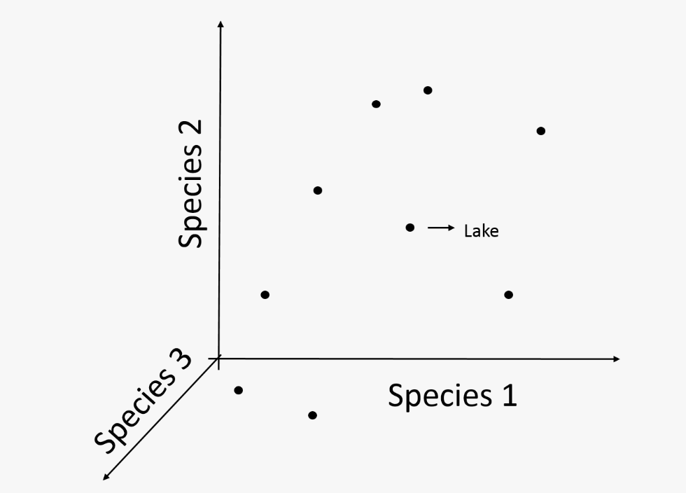
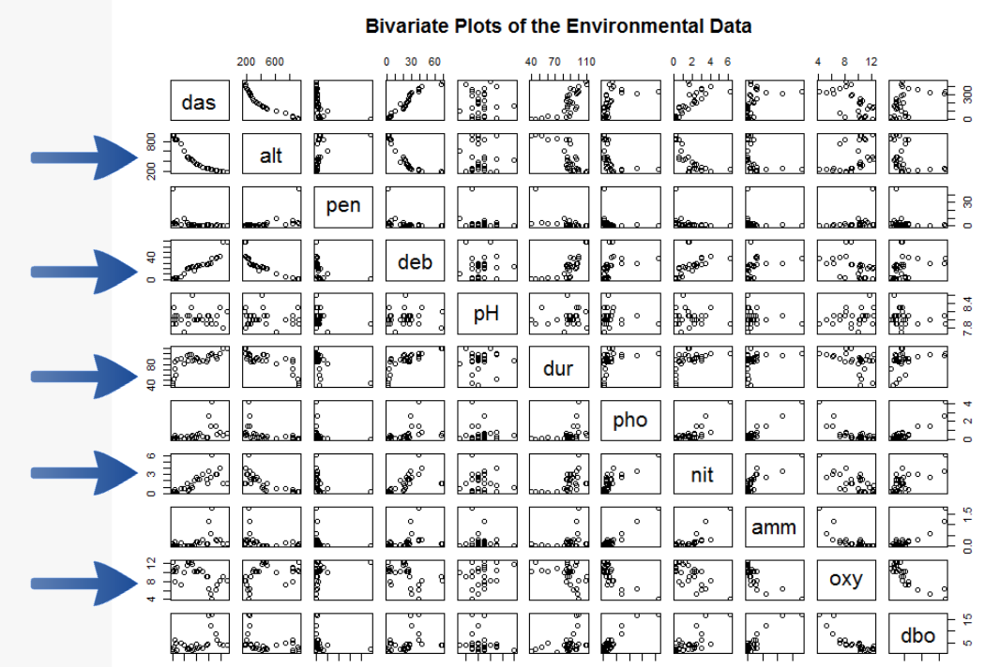
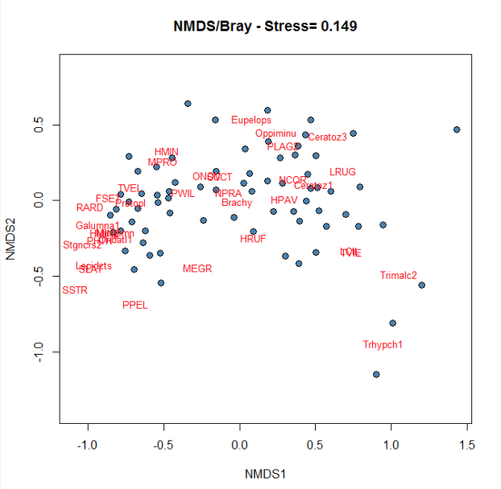

class: inverse, center, middle

```{r setup2, echo = FALSE}
library(knitr)

## Setup for your presentation
knitr::opts_chunk$set(
  eval = TRUE,
  cache = TRUE,
  comment = "#",
  collapse = TRUE,
  warning = FALSE,
  message = FALSE,
  fig.width = 5, fig.height = 5, fig.retina = 3,
  fig.align = 'center'
)

options(repos = structure(
  c(CRAN = "http://cran.r-project.org")
  )
  )

# Install xaringanExtra

if(nzchar(system.file(package = "xaringanExtra")) == FALSE) {remotes::install_github("gadenbuie/xaringanExtra", upgrade = "always")}

# Include copy-to-clipboard icons

htmltools::tagList(
  xaringanExtra::use_clipboard(
    button_text = "<i class=\"fas fa-clipboard\"></i>",
    success_text = "<i class=\"fa fa-check\" style=\"color: #90BE6D\"></i>",
    error_text = "<i class=\"fa fa-times-circle\" style=\"color: #F94144\"></i>"
  ),
  rmarkdown::html_dependency_font_awesome()
)
```

```{r install_pkgs, message=FALSE, warning=FALSE, include=FALSE, results=0}
# Standard procedure to check and install packages and their dependencies, if needed.

list.of.packages <- c("ape", "gclus", "vegan", "GGally", "PlaneGeometry")

new.packages <- list.of.packages[!(list.of.packages %in% installed.packages()[,"Package"])]

if(length(new.packages) > 0) {
  install.packages(new.packages, dependencies = TRUE) 
  print(paste0("The following package was installed:", new.packages)) 
} else if(length(new.packages) == 0) {
    print("All packages were already installed previously")
  }
```

# About this workshop
[](https://github.com/QCBSRworkshops/workshop09)
[](https://wiki.qcbs.ca/r_workshop9)
[](https://qcbsrworkshops.github.io/workshop09/workshop09-en/workshop09-en.html)
[](https://qcbsrworkshops.github.io/workshop09/workshop09-en/workshop09-en.pdf)
[](https://qcbsrworkshops.github.io/workshop09/workshop09-en/workshop09-en.R)


---

<p style="font-size:75%">

.center[
**Contributors to the development of this workshop**

by modifying and improving its content as part of the <br> *Le*arning *a*nd *D*evelopment *A*ward
]


.pull-left[
.right[

 **2022** - **2021** - **2020**


]
]

.pull-right[
.left[
**2019** - **2018** - **2017**


**2016** - **2015** - **2014**


]

]
</p>

---

# Required material

To follow this workshop, you are required to have downloaded and installed the earliest [RStudio](https://rstudio.com/products/rstudio/download/#download) and [R](https://cran.rstudio.com/) versions.

<br>

.pull-left[
You must also use these packages:
1. [ape](https://cran.r-project.org/package=ape)
3. [gclus](https://cran.r-project.org/package=gclus)
4. [vegan](https://cran.r-project.org/package=vegan)
]

.pull-right[


To install them from CRAN, run:

```{r eval = FALSE}
install.packages(
  c("ape", 
    "gclus", 
    "vegan")
)
```

]
---
# Learning objectives

##### Use R to perform an unconstrained ordination

#### Use R to create dendrogram

---

class: inverse, center, middle

# 1. Introduction

## What is ordination?


---
# One Dimension

What if we are interested in this response for different species of algae involved in the algal bloom density?

.center[]


---
# Two Dimensions

.center[]

---
# Three Dimensions

.center[
]


---
# 4,5,6, or more Dimensions

.center[]


---
# Ordination in reduced space

.center[]

---
# Ordination in reduced space


.center[]

- Matrix algebra is complex and hard to understand

- A global understanding is enough in order to use ordination methods adequately


---
# Methods for scientific research

--

- **Questions / Hypothesis**

--

- **Experimental design**

--

- **Data Collection**

--

- **Transformation / Distance**

--

- **Analysis**

--

- **Redaction**

--

- **Communication**


---
class: inverse, center, middle
# 2. Exploring data

---
# Doubs River Fish Dataset

.pull-left[

Verneaux (1973) dataset:
- characterization of fish communities
- 27 different species
- 30 different sites
- 11 environmental variables

]

.pull.right[


]

---
# Doubs River Fish Dataset

Load the Doubs River species data (Doubs.Spe.csv)

```{r}
spe <- read.csv("data/doubsspe.csv", row.names = 1)
spe <-  spe[-8,] # remove site with no data
```

Load the Doubs River environmental data (Doubs.Env.csv)

```{r}
env <- read.csv("data/doubsenv.csv", row.names = 1)
env <- env[-8,] # remove site with no data
```

.alert[Proceed with caution, only execute once]

---
# Expore Doubs Dataset

Explore the content of the fish community dataset

```{r, eval = F}
names(spe) # Names of objects
dim(spe) # dimensions
str(spe) # structure of objects
summary(spe) # summary statistics
head(spe) # first 6 rows
```

```{r, echo = F}
head(spe) # first 6 rows
```

---
# Species Frequencies

Take a look at the distribution of species frequencies

```{r, fig.width=8, echo = -1}
par(mar = c(4,4,.5,.5), cex = 1.5)
ab <- table(unlist(spe))
barplot(ab, las = 1, col = grey(5:0/5),
        xlab = "Abundance class", ylab = "Frequency")
```

.alert[Note the proportion of 0s]

---
# Species Frequencies

How many zeros?

```{r}
sum(spe == 0)
```

What proportion of zeros?

```{r}
sum(spe == 0)/(nrow(spe)*ncol(spe))
```

---
# Total Species Richness

Visualize how many species are present at each site:

```{r, fig.width=10, fig.height=5, echo=-1}
par(mar = c(4,4,1,.5), cex = 1.5)
site.pre <- rowSums(spe > 0)
barplot(site.pre, main = "Species richness",
        xlab = "Sites", ylab = "Number of species",
        col = "grey ", las = 1)
```

---
# Understand your data!

.center[...to choose the appropiate transformation and distance]

- Are there many zeros?

- What do they mean?


.alert[A measured 0 (e.g 0mg/L, 0°C) is not the same than a 0 representing an absence observations]


---
# Before transforming your community data...

.alert[Important considerations:]

--
- relative abundances/counts/presence-absence?

--
- asymmetrical distributions?

--
- many rare species?

--
- overabundance of dominant species?

--
- double Zero problem?

---
# Transforming community data

.center[
]

---
# Transforming your community data

## Examples

Transforming counts into presence - absence
```{r}
library(vegan)
spec.pa <- decostand(spe, method = "pa")
```

Reducing the weight of rare species

```{r}
spec.hel <- decostand(spe, method = "hellinger")
spec.chi <- decostand(spe, method = "chi.square")
```

Reducing the weight of very abundant species

```{r}
spe.pa <- decostand(spe,method = "log")
```


---
# Doubs Environmental Data

```{r, eval = F}
names(env) # Names of objects
dim(env) # dimensions
str(env) # structure of objects
summary(env) # summary statistics
head(env) # first 6 rows
```

```{r, echo = T}
head(env) # first 6 rows
```

Explore colinearity by visualizing correlations between variables

```{r, eval = F}
pairs(env, main = "Bivariate Plots of the Environmental Data")
```


---
# Doubs Environmental Data



---
# Standardization

Standardizing environmental variables is crucial as you cannot compare the effects of variables with different units

```{r, eval = -1}
?decostand
env.z <- decostand(env, method = "standardize")
```

This centers and scales the variables to make your downstream analysis more appropriate

```{r}
apply(env.z, 2, mean)
apply(env.z, 2, sd)
```


---
class: inverse, center, middle
# 3. Similarity / Dissimilarity


---
# Association measures

Matrix algebra is at the heart of all ordinations

.center[]

- Exploring various measures of distance between objects provides some understanding of the engine under the hood

---
# Breaking out of 1D

.pull-left[

- As you have seen, ecological datasets can sometimes be very large matrices

- Ordinations compute the relationships between species or between sites

- We can simplify these relationships using methods of dissimilarity
]

.pull-right[


]


---
# Similarity / Dissimilarity

- Useful to understand your dataset
- Appropriate measure required by some types of ordinations

.center[
Similarity: S = 1 - D
Distance: D = 1-S]


---
# Community distance measures

.pull-left[
- Euclidean
- Manhattan
- Chord
]

.pull-right[
- Hellinger
- Chi-square
- Bray-Curtis
]


--
<br>
<br>
<br>

.alert[Each of these will be useful in different situations]

---
# Comparing Doubs Sites

The `vegdist()` function contains all common distances

```{r, eval = F}
?vegdist
```

How different is the community composition across the 30 sites of the Doubs River?

```{r}
spe.db.pa <- vegdist(spe, method = "bray")
```

---
# Comparing Doubs Sites

.center[]

---
# Comparing Doubs Sites

.center[]

---
# Visualization of distance matrices

.center[]

---
# Challenge #1 

<br>

Discuss with your neighbor:

<br>

.center[**How can we tell how similar objects are when we have multivariate data?**]

<br>

- Make a list of all your suggestions


---
# And what about ordination?


With ordination methods, we order our objects (site) according to their similarity


- The more the sites are similar, the closer they are in the ordination space (smaller distances)


- In Ecology, we usually calculate the similarity between sites according to their species composition or their environmental conditions.


---
# Schematic analysis of multivariate analysis

.center[

]

---
# Clustering

- To highlight structures in the data by partitioning either objects or the descriptors

- Results are represented as dendrograms (trees)

- Not a statistical method

.center[

]

---
# Overview of 3 hierarchical methods

<br>

- Single linkage agglomerative clustering

<br>

- Complete linkage, agglomerative clustering

<br>

- Ward's minimum variance clustering

<br>

- Elements of lower are nested in higher ranking clusters
   - (e.g. species, genus, family, order)

---
# Hierarchical methods

A distance matrix is first sorted in increasing distance order


---
# Single linkage clustering

.pull-left[


]

--

.pull-right[

- The two closest objects merge

- The next two closest objects/clusters merge

- and so on


]

---
# Complete linkage clustering

.pull-left[


]

.pull-right[

- The two closest objects merge

- The next two objects/cluster will agglomerate when linked to the furthest element of the group


]


---
# Comparison

Create a distance matrix from Hellinger transformed Doubs river data and compute the single linkage clustering

```{r, fig.width=7, echo = -1}
par(mar=c(.5,3.8,2,.5), cex = 1.5)
spe.dhe1 <- vegdist(spec.hel, method = "euclidean")
spe.dhe1.single <- hclust(spe.dhe1, method = "single")
plot(spe.dhe1.single)
```


---
# Comparison


.pull-left[

**Single linkage:**

Chains of objects occur (e.g. 19,29,30,26)
]

.pull-right[

**Complete linkage:**
Contrasted groups are formed of objects occur
]

---
# Ward's minimum variance method

- Uses the criterion of least squares to cluster objects into groups
  - At each step, the pair of clusters merging is the one leading to the minimum increase in total within-group sum of squares

---
# Ward's method

Compute the Ward's minimum variance clustering and plot the dendrogram by using the square root of the distances:

```{r, fig.width=9, echo = -1}
par(mar=c(.5,3.8,2,.5), cex = 1.5)
spe.dhel.ward <- hclust(spe.dhe1, method = "ward.D2")
spe.dhel.ward$height <- sqrt(spe.dhel.ward$height)
plot(spe.dhel.ward, hang = -1) # hang = -1 aligns objects at the same level
```

---
# Ward's method

```{r, fig.width=9, echo = F}
par(mar=c(.5,3.8,2,.5), cex = 1.5)
plot(spe.dhel.ward, hang = -1) # hang = -1 aligns objects at the same level
```

Clusters generated using this method tend to be more spherical and to contain similar number of objects

---
# How to choose the right method?

- Depends on the objective
  - highlights gradients? contrasts?
- If more than on method seems appropriate, compare dendrograms
- Again: this is **not** an statistical method
 But! is possible to:
  - determine the optimal number of interpretable clusters
  - compute clustering statistics
  - combine clustering to ordination to distinguish groups of sites


---
## Now, what?

While **cluster analysis** looks for *discontinuities* in a dataset, **ordination** extracts the main trends in the form of continuous axes.

From now, we will look into four types of **unconstrained ordination methods**...

--

.right[...**wait**, what do we mean about **unconstrained ordinations**? *Anyone*?]

--
<br>
.center[*If no one speaks out, choose a "voluntary", presenter!*]

--

<br>
**Unconstrained ordinations** assess relationships within a single set of variables. *No attempt* is made to define the relationship between a set of independent variables and one or more dependent variables.

--

In other words, the interpretation of potential effects of other factors that generated observed patterns can only be made indirectly, because those factors are *not* explicitly included in the analyses.

--

Here, we will explore:

.center[
.pull-left[
**P**rincipal **C**omponent **A**nalysis

**P**rincipal **Co**ordinate **A**nalysis
]

.pull-right[
**C**orrespondence **A**nalysis

**N**on-**M**etric Multi**D**imensional **S**caling
]
]

---
class: inverse, center, middle
# 4. Unconstrained ordination

---

### But first, let us *recap*...


We already understand the meaning of **variance** and **mean**, and how to calculate them:

.pull-left[
$$\sigma_x^2 = \frac{\sum_{i=1}^{n}(x_i - \mu)^2} {n}$$
]

.pull-right[
$$\mu_x = \frac{1}{n} \sum_{i=i}^{n} x_{i}$$
]

These are very useful to understand the *centre* and the *dispersion* of a given variable or dimension.

Nevertheless, we are often interested **in more than one dimension**, and want to measure how much of each dimension vary from the mean with *respect to each other*.

--

**Covariance** is such a measure, which can depict how **two dimensions co-vary**:

.pull-left[
$$var_x = \sigma_x^2 = \frac{\sum_{i=1}^{n}(x_i - \mu)^2} {n}$$
]

.pull-right[
$$cov_{x,y}=\frac{\sum_{i=1}^{N}(x_{i}-\bar{x})(y_{i}-\bar{y})}{N-1}$$
]

---
### But first, let us *recap*...

Intuitively, we can measure the **covariance** between more than two variables. Let us say, between the variables $x$, $y$, and $z$:

.pull-left[
$$cov_{x,y}=\frac{\sum_{i=1}^{N}(x_{i}-\bar{x})(y_{i}-\bar{y})}{N-1}$$
]

.pull-right[
$$cov_{x,z}=\frac{\sum_{i=1}^{N}(x_{i}-\bar{x})(z_{i}-\bar{z})}{N-1}$$
]


$$cov_{z,y}=\frac{\sum_{i=1}^{N}(z_{i}-\bar{z})(y_{i}-\bar{y})}{N-1}$$
We can represent these calculations in a **covariance matrix**:

$${C(x, y, z)} = \left[ \begin{array}{ccc} 
cov_{x,x} & cov_{y,x} & cov_{z,x} \\
cov_{x,y} & cov_{y,y} & cov_{z,y} \\
cov_{x,z} & cov_{y,z} & cov_{z,z}   
\end{array} \right]$$

--

.center[**QUIZ TIME**

*What are the diagonals?* *And, what happens if variables are independent?*
] 

---
#### Still *recapping*...

.center[***What are the diagonals?***]

If, $cov_{x,y}=\frac{\sum_{i=1}^{N}(x_{i}-\bar{x})(y_{i}-\bar{y})}{N-1}$, then:

$$cov_{x,x}=\frac{\sum_{i=1}^{N}(x_{i}-\bar{x})(x_{i}-\bar{x})}{N} = \frac{\sum_{i=1}^{n}(x_i - \bar{x})^2} {N} = var_x$$
So, that:

$${C(x, y, z)} = \left[ \begin{array}{ccc} 
cov_{x,x} & cov_{y,x} & cov_{z,x} \\
cov_{x,y} & cov_{y,y} & cov_{z,y} \\
cov_{x,z} & cov_{y,z} & cov_{z,z}   
\end{array} \right] = \left[ \begin{array}{ccc} 
var_{x} & cov_{y,x} & cov_{z,x} \\
cov_{x,y} & var_{y} & cov_{z,y} \\
cov_{x,z} & cov_{y,z} & var_{z}   
\end{array} \right]$$

 <br>
 
.center[The covariance of a variable with itself is its *variance*!]

---

#### Still *recapping*...

.center[***What happens if the variables are independent?***]

.pull-left[
```{r xyz-norm, echo=TRUE}
x <- rnorm(5000, mean = 0, sd = 1)
y <- rnorm(5000, mean = 0, sd = 1)
z <- rnorm(5000, mean = 0, sd = 1)

xyz <- data.frame(x, y, z)

GGally::ggpairs(xyz) 
```
]

--

.pull-right[
```{r xyz-cov, echo=TRUE, eval = FALSE}
cov(xyz)
```

```{r xyz-cov-2, echo=FALSE, eval = TRUE}
round(cov(xyz), digits = 5)
```


If variables are perfectly independent (or uncorrelated), the covariance matrix $C(x, y, z)$ is:

$${C(x, y, z)} =  \left[ \begin{array}{ccc} 
var_{x} & 0 & 0 \\
0 & var_{y} & 0 \\
0 & 0 & var_{z}   
\end{array} \right]$$

*i*.*e*. a covariance closer to $1$ means that variables are *colinear*.

And, here, $var_{x} = var_{y} = var_{z} = 1$.

]

---
## Linear transformations

We are often interested in observing variables in *different ways*. 

In this process, we create a new variable, let us say $x_{new}$, by multiplying and/or adding the values of the original variable $x$ by constants. For instance:

--

.pull-left[
We can transform a variable of distances measured in kilometres $d_{km}$ into miles, as:
$$d_{mi} = 0.62 \times d_{km}$$
]


.pull-right[
We can also transform Fahrenheit degrees to Celsius degrees as: 

$$T_{C} = 0.5556\times T_{Fahr} - 17.778$$
]

These are examples of **linear transformations**: the transformed variables are linearly related to the original variabels and the shapes of the distribution are not changed.

--

Two types of transformations are very important for us:

.pull-left[
**Centering**, which subtracts the values of a predictor by the mean:

$$x' = x_i - \bar{x}$$
]

.pull-right[
**Scaling**, which divides the predictor variables by their standard deviation:

$$x'' = \frac{x_i}{\sigma_x}$$
]

??? 

Centering is basically a technique where mean of independent variables is subtracted from all the values. It means all independent variables have zero mean. Scaling is similar to centering. Predictor variables are divided by their standard deviation. 

The presenter should mention here that centering brings the mean to zero and scaling brings the standard deviation to one-unit. They also should mention that variables become comparable when scaling, as their unit is lost.

---

## Eigendecomposition

**Square matrices**, such as the **covariance matrix**, can be decomposed into *Eigenvalues* and *Eigenvectors*.

For a square matrix, $A_{n \times n}$, a vector $v$ is an *Eigenvector* of $A$, if there is a *scalar*, $\lambda$, for which:

.center[ 
$A_{n \times n} v_{n \times 1} = \lambda  v_{n \times 1}$, or $\left(\begin{matrix}a_{11}&\cdots&a_{1n}\\\vdots&\ddots&\vdots\\a_{1n}&\cdots&a_{nn}\\\end{matrix}\right)\left(\begin{matrix}v_1\\\vdots\\v_n\\\end{matrix}\right)=\lambda\left(\begin{matrix}v_1\\\vdots\\v_n\\\end{matrix}\right)$ 
]

with the value of $\lambda$ being the corresponding *Eigenvalue*.

--

In other words, the matrix $A$ effectively *stretches* the Eigenvector $v$ by the amount specified by the Eigenvalue (*scalar*) $\lambda$.

An *Eigenvector* is a vector whose direction remains unchanged when a **linear transformation** is applied to it.

<br>

.center[Wait! What do we mean by *unchanged direction*?]

---
## Eigendecomposition

.center[Wait! What do we mean by *unchanged direction*?]
<br>

Let us represent this with this simple example.

We can transform a square into a parallelogram using a single-axis **shear transformation**. 
.pull-left[
Let $S$ be the square with vertices $(0,0),\,(1,0),\,(1,1),\,(1,0)$ that will be shear-transformed to the $P$ parallelogram with vertices $(0,0),\,(1,0),\,(1,1.57),\,(1,0.57)$.

We can see that after the linear transformation, the purple arrow has not changed direction, *i.e.* it is an *Eigenvector* of $S$.

On the other hand, the red arrow changed direction, and thus is *not* an *Eigenvector* of $S$.
]

.pull-right[
```{r echo = FALSE}
library(PlaneGeometry)

P <- c(0, 0) 
w <- c(1, 0) 

ratio <- 1 
angle <- 30

shear <- Shear$new(P, 
                   w, 
                   ratio, 
                   angle)

wt <- ratio * c(-w[2], w[1])

Q <- P + w
R <- Q + wt
S <- P + wt
A <- shear$transform(P)
B <- shear$transform(Q)
C <- shear$transform(R)
D <- shear$transform(S)


plot(0, 0, type = "n", asp = 1, xlim = c(0,1), ylim = c(0,2))

lines(rbind(P, Q, R, S, P), 
      lwd = 2) # unit square

lines(rbind(A, B, C, D, A), 
      lwd = 2, 
      col = "blue") # image by the shear

arrows(x0 = A[1], 
       y0 = A[2], 
       x1 = B[1],
       y1 = B[2],
       col = "red",
       lwd = 2)

arrows(x0 = A[1], 
       y0 = A[2], 
       x1 = D[1],
       y1 = D[2],
       col = "purple",
       lwd = 2)
```
]

---
## Eigendecomposition: implications

.center[
*Keep up with the algebra torture!* 
]

### Orthogonality

A *fabulous* and *simple* property of *symmetric* matrices that we can explain here!

.pull-left[
Let us assume that $x$ is an eigenvector of $A$ corresponding to the eigenvalue $λ_1$ and $y$ an eigenvector of $A$ corresponding to the eigenvalue $λ_2$, with $λ_1≠λ_2$.

$$Ax=\lambda_1x \\
Ay=\lambda_2y$$

Let us multiply each one by the other transposed *Eigenvector*.
$$y^{\intercal}Ax=\lambda_1y^{\intercal}x \\ x^{\intercal}A^{\intercal}y=\lambda_2x^{\intercal}y$$

]

--

.pull-right[
Now subtract the second equation from the first one and use the commutativity of the scalar product:

$y^{\intercal}Ax-x^{\intercal}A^{\intercal}y=\lambda_1y^{\intercal}x - \lambda_2x^{\intercal}y \\ 0 = (\lambda_1 - \lambda_2)y^{\intercal}x$

Because we know that $\lambda_1-\lambda_2\neq 0$, then 
$y^{\intercal}x = 0$, *i*.*e*., $\mathbf{x}\perp\mathbf{y}$, *i*.*e*. are **orthogonal**!

<br>

<br>
*So, what does the Eigendecomposition of a variance-covariance matrix tell us?*
]

???

Hi, Presenter. The explanation of this part is very useful and quite simple, so everyone can understand what orthogonality is. It is a matter of simple equation operations and subtractions. 

---
## Eigendecomposition: implications

.center[
*Keep up with the algebra torture!* 
]

### Maximization

.pull-left[
If $v_i' v_i = 1$, then $Av_i=\lambda_iv_i$ can be written as:
$$v_i' A v_i = \lambda_i$$
In fact, $v' A v$ is the variance of a linear combination with weights in $v$, *i*.*e*. $\text{Var}(v_i'\,A)=v_i'\,\text{Var}(A)\,v_i$.

*Hence, we can connect the dots!*

]

--

.pull-right[
Remember that the *Eigenvalues* in our *variance-covariance matrix* $A$ are directly related to the variance!

Thus, to find a vector $v$ that maximizes the variance, $v' A v$, all we must do is to choose the *Eigenvector* corresponding to the largest *Eigenvalue* $\lambda_i$!

So that the maximum variance is $\lambda_1$!
]

--

The *explained variance* of each *Eigenvector* obeys the order: $\lambda_1 > \lambda_2 > \dots > \lambda_k$.

This allows us to condense a larger number of original variables into a smaller set of selected vectors with minimal loss of information (i.e. ***dimensionallity reduction***).

---
# Unconstrained ordination methods

This is a good startpoint to set us in the direction of the **unconstrained ordination methods** we will study today!

.pull-left[
They allow us to:
- Assess relationships *within* a set of variables (species or environmental variables);

- Find key components of variation among samples, sites, species;

- Reduce the number of dimensions in multivariate data while limiting substantial loss of information;

- Create new variables for use in subsequent analyses.
]

.pull-right[
Here, we will learn:

1. **P**rincipal **C**omponent **A**nalysis;

2. **P**rincipal **Co**ordinate **A**nalysis;

3. **N**on-Metric **M**ulti**d**imensional **S**caling;
]
---
# Principal Component Analysis

The Principal Component Analysis (PCA) is a  *linear*  dimensionality-reduction technique, *i.e.* it reduces strongly correlated data.

In a nutshell, the PCA *linearly* transforms the feature from the original space to a new feature space, containing **principal components** that explain most of the variance in the dataset, i.e. maximize the separation between the data.

--

The *principal component space* can be written as:

$$Z_p = ∑_{j=1}^p ϕ_j * X_j$$
where, 

1. $Z_p$ is the principal component $p$;
2. $ϕ_j$ is the loading vector comprising the $j$ loadings for the $p$ principal component, i.e. the coefficients of the linear combination of the original variables from which the principal components are constructed;
3. $X_j$ is the normalized predictors, i.e. with means equal to zero and standard deviations equal to one.

---
# Principal Component Analysis

PCA can be computed in at least *four* different ways.

For the sake of simplicity, we will focus here on how to obtain principal components from a correlation matrix.

We will learn how to do it from "scratch" and then how to use `R` packages to compute the principal components.


---

# Principal Component Analysis: step-by-step

.pull-left3[
1. Starting point: a matrix $Y$ of $n$ observations and $p$ normally distributed continuous variables;

2. Standardizing observations, as in $Y_{std} = \frac{y_i - \bar{y}}{\sigma_y}$; which is the same as centring, as in $y_c = [y_i - \bar{y}]$, and then scaling, as in $y_s = \frac{y_i}{\sigma_y}$;

3. Compute the variance-covariance matrix $R = cov(Y_{std})$;

4. Perform the Eigendecomposition of the covariance matrix to obtain the matrix $U$ of Eigenvectors, containing the *Principal Components*;

5. Obtain the feature space by multiplying $U$ with the standardized matrix $Y_{std}$, *i*.*e*. the *score matrix* $F$.
]

.pull-right3[
In `R`, from scratch!

```{r}
data(varechem)

str(varechem)
```

]

---

# Principal Component Analysis: step-by-step

.pull-left3[
1. Starting point: a matrix $Y$ of $n$ observations and $p$ normally distributed continuous variables;

2. Standardizing observations, as in $Y_{std} = \frac{y_i - \bar{y}}{\sigma_y}$; which is the same as centring, as in $y_c = [y_i - \bar{y}]$, and then scaling, as in $y_s = \frac{y_i}{\sigma_y}$; 

3. Compute the variance-covariance matrix $R = cov(Y_{std})$;

4. Perform the Eigendecomposition of the covariance matrix to obtain the matrix $U$ of Eigenvectors, containing the *Principal Components*;

5. Obtain the feature space by multiplying $U$ with the standardized matrix $Y_{std}$, *i*.*e*. the *score matrix* $F$.
]

.pull-right3[
In `R`, from scratch!

```{r}
data(varechem)

# Step 1 
Y <- varechem[, 1:2]

head(Y)
```

]

---
# Principal Component Analysis: step-by-step

.pull-left3[
1. Starting point: a matrix $Y$ of $n$ observations and $p$ normally distributed continuous variables;

2. Standardizing observations, as in $Y_{std} = \frac{y_i - \bar{y}}{\sigma_y}$; which is the same as centring, as in $y_c = [y_i - \bar{y}]$, and then scaling, as in $y_s = \frac{y_i}{\sigma_y}$; 

3. Compute the variance-covariance matrix $R = cov(Y_{std})$;

4. Perform the Eigendecomposition of the covariance matrix to obtain the matrix $U$ of Eigenvectors, containing the *Principal Components*;

5. Obtain the feature space by multiplying $U$ with the standardized matrix $Y_{std}$, *i*.*e*. the *score matrix* $F$.
]

.pull-right3[
In `R`, from scratch!

```{r}
data(varechem)

# Step 1 
Y <- varechem[, 1:2]

# Step 2
Y_std <- as.matrix(scale(Y))

head(Y_std)

round(apply(Y_std, 2, mean))
round(apply(Y_std, 2, sd))

```

]

---

# Principal Component Analysis: step-by-step

.pull-left3[
1. Starting point: a matrix $Y$ of $n$ observations and $p$ normally distributed continuous variables;

2. Standardizing observations, as in $Y_{std} = \frac{y_i - \bar{y}}{\sigma_y}$; which is the same as centring, as in $y_c = [y_i - \bar{y}]$, and then scaling, as in $y_s = \frac{y_i}{\sigma_y}$; 

3. Compute the variance-covariance matrix $R = cov(Y_{std})$;

4. Perform the Eigendecomposition of the covariance matrix to obtain the matrix $U$ of Eigenvectors, containing the *Principal Components*;

5. Obtain the feature space by multiplying $U$ with the standardized matrix $Y_{std}$, *i*.*e*. the *score matrix* $F$.
]

.pull-right3[
In `R`, from scratch!

```{r}
data(varechem)

# Step 1 
Y <- varechem[, 1:2]

# Step 2
Y_std <- as.matrix(scale(Y))

# Step 3
Y_R <- cov(Y_std)

# Step 4 
(Eigenvalues <- eigen(Y_R)$values)

(Eigenvectors <- eigen(Y_R)$vectors)
```
]

---
# Principal Component Analysis: step-by-step

The *Eigenvectors* here are the **Principal Components**, and as we have seen, each *Eigenvector* has its corresponding *Eigenvalue*.

.pull-left[

We can represent the distances from the observations to the first Eigenvector (`PC1`, in red).

The first principal component is drawn so that the variation of the values along its line is maximal. 

The arrows on the principal components are obtained by multiplying their *Eigenvalues* by the *Eigenvectors*.
]

.pull-right[
```{r echo=FALSE}
Eigenvectors. <- as.data.frame(Eigenvectors)
row.names(Eigenvectors.) <- c("P", "N")
colnames(Eigenvectors.) <- c("PC1", "PC2")
Eigenvectors.[, 1] <- Eigenvectors.[, 1]*-1
Y_std <- as.data.frame(Y_std)

plot(N ~ P, 
     col = as.factor(rownames(Y_std)), 
     main="Distances to PC1", 
     pch = 19, 
     xlim=c(-2.2, 2.2), 
     ylim = c(-2.2,2.2), 
     data = as.data.frame(Y_std))

abline(v=0 , h=0, 
       col = "dark gray")

#Overlap pertinent evectors

abline(0, 
       Eigenvectors[2, 1]/Eigenvectors[1, 1],
       col='purple')
# abline(0, 
#        Eigenvectors[1, 2]/Eigenvectors[2, 2],
#        col='orange')

arrows(x0 = 0, 
       y0 = 0, 
       x1 = Eigenvalues[1]*Eigenvectors[1, 1],
       y1 = Eigenvalues[1]*Eigenvectors[2, 1],
       col = "purple",
       lwd = 2)

# arrows(x0 = 0, 
#        y0 = 0, 
#        x1 = Eigenvalues[2]*Eigenvectors[1,2], 
#        y1 = Eigenvalues[2]*Eigenvectors[2, 2],
#        col = "orange", 
#        lwd = 2)

# Plot the lines from first evector to points

line1 <- c(0, 
           Eigenvectors[2, 1]/Eigenvectors[1, 1])

perp.segment.coord <- function(x0, y0, line1){
  #finds endpoint for a perpendicular segment from the point (x0,y0) to the line1
  a <- line1[1]  #intercept
  b <- line1[2]  #slope
  x1 <- (x0 + b * y0 - a * b)/(1 + b^2)
  y1 <- a + b * x1
  list(x0 = x0, y0 = y0, 
       x1 = x1, y1 = y1)
}

ss <- perp.segment.coord(Y_std$P, 
                         Y_std$N, 
                         line1)
# do.call(segments, ss)
# which is the same as:

segments(x0 = ss$x0, 
         x1 = ss$x1, 
         y0 = ss$y0, 
         y1 = ss$y1, 
         col = 'purple')

points(N ~ P, 
       col = as.factor(rownames(Y_std)), 
       pch = 19,
       data = Y_std)
with(Y_std,
     text(N ~ P, 
          labels = as.factor(rownames(Y_std)),
                     pos = 1, 
          cex=1.4))
```
]

---
# Principal Component Analysis: step-by-step

The *Eigenvectors* here are the **Principal Components**, and as we have seen, each *Eigenvector* has its corresponding *Eigenvalue*.

.pull-left[
We can then represent the distances from the observations to the second Eigenvector (`PC2`, in orange).

The second principal component is also drawn maximizing the variance of the data.

Note how the principal components are orthogonal!
]

.pull-right[

```{r echo = FALSE}
Eigenvectors. <- as.data.frame(Eigenvectors)
row.names(Eigenvectors.) <- c("P", "N")
colnames(Eigenvectors.) <- c("PC1", "PC2")
Eigenvectors.[, 1] <- Eigenvectors.[, 1]*-1
Y_std <- as.data.frame(Y_std)

plot(N ~ P, 
     col = as.factor(rownames(Y_std)), 
     main="Distances to PC2", 
     pch = 19, 
     xlim=c(-2.2, 2.2), 
     ylim = c(-2.2,2.2), 
     data = as.data.frame(Y_std))

abline(v=0 , h=0, 
       col = "dark gray")

#Overlap pertinent evectors

abline(0, 
       Eigenvectors[2, 1]/Eigenvectors[1, 1],
       col='purple')
abline(0, 
       Eigenvectors[1, 2]/Eigenvectors[2, 2],
       col='orange')

arrows(x0 = 0, 
       y0 = 0, 
       x1 = Eigenvalues[1]*Eigenvectors[1, 1],
       y1 = Eigenvalues[1]*Eigenvectors[2, 1],
       col = "purple",
       lwd = 2)

arrows(x0 = 0, 
       y0 = 0, 
       x1 = Eigenvalues[2]*Eigenvectors[1,2], 
       y1 = Eigenvalues[2]*Eigenvectors[2, 2],
       col = "orange", 
       lwd = 2)


line2 <- c(0, 
           Eigenvectors[1, 2]/Eigenvectors[1, 1])

perp.segment.coord <- function(x0, y0, line2){
  a <- line2[1]  #intercept
  b <- line2[2]  #slope
  x1 <- (x0 + b * y0 - a * b)/(1 + b^2)
  y1 <- a + b * x1
  list(x0 = x0, y0 = y0, 
       x1 = x1, y1 = y1)
}

ss <- perp.segment.coord(Y_std$P, 
                         Y_std$N, 
                         line2)

segments(x0 = ss$x0, 
         x1 = ss$x1, 
         y0 = ss$y0, 
         y1 = ss$y1, 
         col = 'orange')

points(N ~ P, 
       col = as.factor(rownames(Y_std)), 
       pch = 19,
       data = Y_std)

with(Y_std,
     text(N ~ P, 
          labels = as.factor(rownames(Y_std)),
                     pos = 1, 
          cex=1.4)
     )
```

]

--
.pull-left[
*We represented the Eigenvectors, i.e. the principal components!* 

*But, what is the use of the Eigenvalues?*
]

---
# Principal Component Analysis: step-by-step

We have seen that the *Eigenvalues* represent the magnitude (the variance) in the principal components.

.pull-left[
In fact, the sum of all *Eigenvalues* is equal to the sum of variances, which are represented on the diagonal of the variance-covariance matrix.
]

.pull-right[
```{r}
sum(diag(cov(Y_std)))
sum(eigen(cov(Y_std))$values)
```
]

--

Intuitively, one can obtain the relative influence of each *Eigenvector* $v_{k}$ (or $\text{PC}_{k}$)  by dividing their values by the sum of all *Eigenvalues*.

$$\text{Explained variance of}~v_{k} = \frac{\lambda_{v_k}}{\sum^p_{i=1}{\lambda_{v}}}$$

By doing this, we can say that the $\text{PC}1$ explains `r round(eigen(cov_Y_std)$values[1]/sum(eigen(cov_Y_std)$values) * 100)`% of the variance in the data, while $\text{PC}2$ explains `r round(eigen(cov_Y_std)$values[2]/sum(eigen(cov_Y_std)$values) * 100)`% of the variance.

--

Finally, we can proceed to the last step of our computation of principal components!

---

# Principal Component Analysis: step-by-step

.pull-left3[
1. Starting point: a matrix $Y$ of $n$ observations and $p$ normally distributed continuous variables;

2. Standardizing observations, as in $Y_{std} = \frac{y_i - \bar{y}}{\sigma_y}$; which is the same as centring, as in $y_c = [y_i - \bar{y}]$, and then scaling, as in $y_s = \frac{y_i}{\sigma_y}$;

3. Compute the variance-covariance matrix $R = cov(Y_{std})$;

4. Perform the Eigendecomposition of the covariance matrix to obtain the matrix $U$ of Eigenvectors, containing the *Principal Components*;

5. Obtain the feature space by multiplying $U$ with the standardized matrix $Y_{std}$, *i*.*e*. the *score matrix* $F$.
]

.pull-right3[
In `R`, from scratch!

```{r}
# Step 1 
Y <- varechem[, 1:2]

# Step 2
Y_std <- as.matrix(scale(Y))

# Step 3
Y_R <- cov(Y_std)

# Step 4 
Eigenvalues <- eigen(Y_R)$values
Eigenvectors <- eigen(Y_R)$vectors

# Step 5
F_PrComps <- Y_std %*% Eigenvectors
head(F_PrComps)
```
]

---
# Principal Component Analysis: step-by-step

The score matrix, $F$, (object `F_PrComps`) allows one to *rotate* the new data space, so it is represented in relation to the principal components.

.pull-left[
.center[ 
$\text{N}$ ~ $\text{P}$ 
]

```{r echo=FALSE, fig.height = 6.5, fig.width = 3.5}
Eigenvectors. <- as.data.frame(Eigenvectors)
row.names(Eigenvectors.) <- c("P", "N")
colnames(Eigenvectors.) <- c("PC1", "PC2")
Eigenvectors.[, 1] <- Eigenvectors.[, 1]*-1
Y_std <- as.data.frame(Y_std)

op <- par(mfrow = c(2, 1),     # 2x2 layout
    oma = c(2, 2, 0, 0), # two rows of text at the outer left and bottom margin
    mar = c(1, 1, 0, 0), # space for one row of text at ticks and to separate plots
    mgp = c(2, 1, 0)    # axis label at 2 rows distance, tick labels at 1 row
    )       

plot(N ~ P, 
     col = as.factor(rownames(Y_std)),
     pch = 19, 
     xlim=c(-2.2, 2.2), 
     ylim = c(-2.2,2.2), 
     data = as.data.frame(Y_std))

abline(v=0 , h=0, 
       col = "dark gray")

#Overlap pertinent evectors

abline(0, 
       Eigenvectors[2, 1]/Eigenvectors[1, 1],
       col='purple')
# abline(0, 
#        Eigenvectors[1, 2]/Eigenvectors[2, 2],
#        col='orange')

arrows(x0 = 0, 
       y0 = 0, 
       x1 = Eigenvalues[1]*Eigenvectors[1, 1],
       y1 = Eigenvalues[1]*Eigenvectors[2, 1],
       col = "purple",
       lwd = 2)

# arrows(x0 = 0, 
#        y0 = 0, 
#        x1 = Eigenvalues[2]*Eigenvectors[1,2], 
#        y1 = Eigenvalues[2]*Eigenvectors[2, 2],
#        col = "orange", 
#        lwd = 2)

# Plot the lines from first evector to points

line1 <- c(0, 
           Eigenvectors[2, 1]/Eigenvectors[1, 1])

perp.segment.coord <- function(x0, y0, line1){
  a <- line1[1]  #intercept
  b <- line1[2]  #slope
  x1 <- (x0 + b * y0 - a * b)/(1 + b^2)
  y1 <- a + b * x1
  list(x0 = x0, y0 = y0, 
       x1 = x1, y1 = y1)
}

ss <- perp.segment.coord(Y_std$P, 
                         Y_std$N, 
                         line1)
# do.call(segments, ss)
# which is the same as:

segments(x0 = ss$x0, 
         x1 = ss$x1, 
         y0 = ss$y0, 
         y1 = ss$y1, 
         col = 'purple')

points(N ~ P, 
       col = as.factor(rownames(Y_std)), 
       pch = 19,
       data = Y_std)
with(Y_std,
     text(N ~ P, 
          labels = as.factor(rownames(Y_std)),
                     pos = 1, 
          cex=1.4))


plot(N ~ P, 
     col = as.factor(rownames(Y_std)),
     pch = 19, 
     xlim=c(-2.2, 2.2), 
     ylim = c(-2.2,2.2), 
     data = as.data.frame(Y_std))

abline(v=0 , h=0, 
       col = "dark gray")

#Overlap pertinent evectors

abline(0, 
       Eigenvectors[2, 1]/Eigenvectors[1, 1],
       col='purple')
abline(0, 
       Eigenvectors[1, 2]/Eigenvectors[2, 2],
       col='orange')

arrows(x0 = 0, 
       y0 = 0, 
       x1 = Eigenvalues[1]*Eigenvectors[1, 1],
       y1 = Eigenvalues[1]*Eigenvectors[2, 1],
       col = "purple",
       lwd = 2)

arrows(x0 = 0, 
       y0 = 0, 
       x1 = Eigenvalues[2]*Eigenvectors[1,2], 
       y1 = Eigenvalues[2]*Eigenvectors[2, 2],
       col = "orange", 
       lwd = 2)


line2 <- c(0, 
           Eigenvectors[1, 2]/Eigenvectors[1, 1])

perp.segment.coord <- function(x0, y0, line2){
  a <- line2[1]  #intercept
  b <- line2[2]  #slope
  x1 <- (x0 + b * y0 - a * b)/(1 + b^2)
  y1 <- a + b * x1
  list(x0 = x0, y0 = y0, 
       x1 = x1, y1 = y1)
}

ss <- perp.segment.coord(Y_std$P, 
                         Y_std$N, 
                         line2)

segments(x0 = ss$x0, 
         x1 = ss$x1, 
         y0 = ss$y0, 
         y1 = ss$y1, 
         col = 'orange')

points(N ~ P, 
       col = as.factor(rownames(Y_std)), 
       pch = 19,
       data = Y_std)

with(Y_std,
     text(N ~ P, 
          labels = as.factor(rownames(Y_std)),
                     pos = 1, 
          cex=1.4)
     )

title(xlab = "N",
      ylab = "P",
      outer = TRUE, line = 3)

par(op)
```
]

.pull-right[
.center[ 
$\text{PC}1$ ~ $\text{PC}2$ 
]

```{r echo=FALSE, fig.height = 6.5, fig.width = 3.5}
score <- as.data.frame(F_PrComps)

colnames(score) <- c("PC1", "PC2")

op <- par(mfrow = c(2, 1),     # 2x2 layout
          oma = c(2, 2, 0, 0), # two rows of text at the outer left and bottom margin
          mar = c(1, 1, 0, 0), # space for one row of text at ticks and to separate plots
          mgp = c(2, 1, 0)    # axis label at 2 rows distance, tick labels at 1 row
)


plot(PC2 ~ PC1, 
     col = as.factor(rownames(score)), 
     pch = 19, 
     xlim = c(-2.2, 2.2), ylim = c(-2.2,2.2), xlab='PC1', ylab='PC2',data = score)

abline(h = 0, col = 'purple')
abline(v = 0, col='orange')


perp.segment.horiz <- function(x0, y0){
  x1 <- x0
  y1 <- 0
  list(x0 = x0, y0 = y0, x1 = x1, y1 = y1)
}

ss1 <- perp.segment.horiz(score[,1], score[,2])

segments(x0 = ss1$x0, x1 = ss1$x1, y0 = ss1$y0, y1 = ss1$y1, col='purple')


points(PC2 ~ PC1, col=as.factor(rownames(score)), pch = 19, xlab='V1', ylab='V2',data=score)
with(score,text(PC2 ~ PC1, labels=as.factor(rownames(score)), pos = 3, cex=1.4))


plot(PC2 ~ PC1, col=as.factor(rownames(score)), 
     pch = 19, xlim=c(-2.2, 2.2), ylim = c(-2.2,2.2),
     xlab='PC1', ylab='PC2',data=score)

abline(h = 0, col = 'purple')
abline(v = 0, col ='orange')


perp.segment.vert <- function(x0, y0){
  x1 <- 0
  y1 <- y0
  
  list(x0 = x0, y0 = y0, x1 = x1, y1 = y1)
}

ss1a <- perp.segment.vert(score[,1], score[,2])
segments(x0 = ss1a$x0, x1 = ss1a$x1, y0 = ss1a$y0, y1 = ss1a$y1, col='orange')


points(PC2 ~ PC1, col=as.factor(rownames(score)), pch = 19, xlab='V1', ylab='V2',data=score)

with(score,text(PC2 ~ PC1, labels=as.factor(rownames(score)), pos = 3, cex=1.4))

title(xlab = "PC1",
      ylab = "PC2",
      outer = TRUE, 
      line = 3)

par(op)
```
]

???
The axis labels are not being printed. I included them at the top of each plot while this is not fixed.

The presenter here should emphasize the rotation, and speak about what the scores are. This understand will be useful when the participants are going to use the PCA functions that are implemented in R.

---
# Principal Component Analysis: step-by-step

PCA can also be computed using the `stats::prcomp()`, `stats::princomp()`, `vegan::rda()`, and `ade4::dudi.pca()` functions.

.pull-left[
How our PCA from scratch compares

```{r}
data(varechem)

Y <- varechem[, 1:2] 
Y_std <- as.matrix(scale(Y))
Y_R <- cov(Y_std)

Eigenvalues <- eigen(Y_R)$values
Eigenvectors <- eigen(Y_R)$vectors

F_PrComps <- Y_std %*% Eigenvectors

head(F_PrComps)
```
]

.pull-right[
to `stats::prcomp()`?
```{r}
PCA_prcomp <- prcomp(Y, 
                     center = TRUE, 
                     scale = TRUE)

# or PCA_prcomp <- prcomp(Y_std)

head(PCA_prcomp$x)
```
]

---
# Principal Component Analysis: step-by-step

PCA can also be computed using the `stats::prcomp()`, `stats::princomp()`, `vegan::rda()`, and `ade4::dudi.pca()` functions.

.pull-left[
How our PCA from scratch compares

```{r}
data(varechem)

Y <- varechem[, 1:2] 
Y_std <- as.matrix(scale(Y))
Y_R <- cov(Y_std)

Eigenvalues <- eigen(Y_R)$values
Eigenvectors <- eigen(Y_R)$vectors

F_PrComps <- Y_std %*% Eigenvectors

head(F_PrComps)
```
]

.pull-right[
to `stats::princomp()`?
```{r}
PCA_princomp <- princomp(Y_std)

head(PCA_princomp$scores)
```
]

---
# Principal Component Analysis: step-by-step

PCA can also be computed using the `stats::prcomp()`, `stats::princomp()`, `vegan::rda()`, and `ade4::dudi.pca()` functions.

.pull-left[
How our PCA from scratch compares

```{r}
data(varechem)

Y <- varechem[, 1:2] 
Y_std <- as.matrix(scale(Y))
Y_R <- cov(Y_std)

Eigenvalues <- eigen(Y_R)$values
Eigenvectors <- eigen(Y_R)$vectors

F_PrComps <- Y_std %*% Eigenvectors

head(F_PrComps)
```
]

.pull-right[
to `vegan::rda()`?
```{r}
PCA_vegan_rda <- rda(Y_std)

scores(PCA_vegan_rda, 
       display = "sites", 
       scaling = 1,
       choices = seq_len(PCA_vegan_rda$CA$rank),
       const = sqrt(PCA_vegan_rda$tot.chi * (nrow(PCA_vegan_rda$CA$u) - 1)))[1:5, ]
```

`vegan::rda()` is a bit special. It uses alternative scalings. We will not cover them here, but you can study the `vignette("decision-vegan")`.
]

???

Tell participants that the name `rda` refers to a diferent type of constrained ordination technique, but that if we run `rda()` with just one variable, it will execute a PCA.

---
# Principal Component Analysis

We have implemented PCA on a two-variables dataset, for simplicity.

Let us advance and apply it to our fish species dataset.


For this, we will use the `vegan::rda()` function on the *Hellinger-transformed* fish data and summarise the results:

```{r}
spe.h.pca <- rda(spec.hel)

# summary(spe.h.pca)
```

---
# Principal Component Analysis

.pull-left[
The first lines of `summary.rda()` tell us about the *Total variance* and *Unconstrained variance* in our model.
]

.pull-right[

```{r echo=FALSE}
paste(capture.output(summary(spe.h.pca))[5:8])
```
]

--

.pull-left2[

```{r echo=FALSE}
paste(capture.output(summary(spe.h.pca))[c(12:20, 81:88)])
```

]

.pull-right2[

This is followed by the *Eigenvalues*, and their contribution to the variance.


In fact, if we sum all our *Eigenvalues*, we will obtain the amount of uncostrained variance explained by the analysis!

```{r}
sum(spe.h.pca$CA$eig)
```

]

???

Since we have not constrained our ordination, the proportional unconstrained variance is equal to the total variance.

Take a moment to explain the proportion explained, and show that the cummulative proportion will equal to 1 at the 27th PC.

---
# Principal Component Analysis

The next information is related to the *scaling*, to the *species scores*, and to the *site scores*.

```{r echo=FALSE}
paste(capture.output(summary(spe.h.pca))[c(90:93, 95, 96, 98:104, 155, 156, 158:162)])
```
]

---
# Principal Component Analysis

.pull-left[
*Species* refer to your descriptors (i.e. the columns in your dataset), which here are the fish species.

*Scores* refer to the position of every species along the principal components.
]

.pull-right[
```{r echo=FALSE}
paste(capture.output(summary(spe.h.pca))[c(96, 98:104)])
```
]

--

<br>

.pull-left2[
```{r echo=FALSE}
paste(capture.output(summary(spe.h.pca))[c(156, 158:162)])
```
]

.pull-right2[
*Sites* represent the rows in your dataset, which here are the different sites along the *Doubs* river.
]

--

<br>

.pull-left[
This information can be obtained with the `score()` function that we used before:
]

.pull-right[
```{r, eval = FALSE, echo = TRUE}
scores(spe.h.pca,
       display = "species" or "sites")
```

]

---
# Principal Component Analysis: condensing data

Here, we have 27 principal components. However, we can apply algorithms to select the lowest number of principal components that still account for a large variance in the data.

--

#### Kaiser-Guttman criterion

.pull-left[
We can select the principal components that capture more variance than the average explanation of all principal components. We do this by:

1. Extracting the *Eigenvalues* associated to the principal components;

2. Subsetting the *Eigenvalues* above the mean *Eigenvalue*:

```{r}
ev <- spe.h.pca$CA$eig
# ev[ev > mean(ev)]
```
]

.pull-right[
```{r, echo = -1, fig.width=10, fig.height = 5.5}
par(mar=c(4,4,2.5,.5), cex = 1.5)
n <- length(ev)
barplot(ev, main = "Eigenvalues", col = "grey", las = 2)
abline(h = mean(ev), col = "red3", lwd = 2)
legend("topright", "Average eigenvalue",
       lwd = 2, col = "red3" , bty = "n")
```
]

---
# Principal Component Analysis: condensing data

Here, we have 27 principal components. However, we can apply algorithms to select the lowest number of principal components that still account for a large variance in the data.

#### Broken-stick model

.pull-left[
The broken-stick model retains components that explain more variance than would be expected by randomly dividing the variance into $p$ parts.

```{r}
head(bstick(spe.h.pca))
```
]

.pull-right[
```{r, echo = TRUE, fig.width=4.5, fig.height = 4.5}
screeplot(spe.h.pca, 
          bstick = TRUE, type = "lines")
```
]

---
# Principal Component Analysis

All that is left is to discuss *scaling* and to *visualize* our results.

Let us practice and compute a PCA on the standardized environmental variables for the same dataset.

```{r}
env.pca <- rda(env.z)
# summary(env.pca, scaling  = 2)
```

--

Determine our subset of *Eigenvalues* and their corresponding *Eigenvectors*:

.pull-left[
```{r}
ev <- env.pca$CA$eig
```

```{r}
ev[ev>mean(ev)]
```
]

--

.pull-right[
```{r, echo = FALSE, fig.width=8, fig.height = 5}
par(mar=c(4,4,2.5,.5), cex = 1.5)
n <- length(ev)
barplot(ev, main = "Eigenvalues", col = "grey", las = 2)
abline(h = mean(ev), col = "red3", lwd = 2)
legend("topright", "Average eigenvalue",
       lwd = 2, col = "red3" , bty = "n")
```
]

---
# Principal Component Analysis: `plot()`

The information coomputed by the PCA can be represented with *biplots*.

We can produce a *quick and dirty* biplot of the PCA using the function `plot()` in base `R`.

```{r, echo = -1}
par(mar=c(4,4, 0.1,0.1), cex = 1.5)
plot(spe.h.pca)
```


---
# Principal Component Analysis: `biplot()`

`biplot()` from base `R` allows for a better interpretation.

.pull-left2[
```{r, echo = -1, fig.height=6, fig.width=6.5}
par(mar = c(4,4,0.05,0.05), cex = 1.2)
biplot(spe.h.pca)
```
]

.pull-right2[

The arrows are plotted to show the directionality and angle of the descriptors in the ordination.

Descriptors at 180 degrees of each other are negatively correlated;

Descriptors at 90 degrees of each other have zero correlation;

Descriptors at 0 degrees of each other are positively correlated.
]

---
# Principal Component Analysis: *Scaling*

.small[
*Type 2 scaling* (`default`): distances among objects are not approximations of Euclidean distances; angles between descriptor (species) vectors reflect their correlations.
]

.small[
*Type 1 scaling*: attempts to preserve the Euclidean distance (in multidimensional space)
among objects (sites): the angles among descriptor (species) vector are not meaningful.
]

.pull-left[
```{r, echo = -1, fig.height=4, fig.width=4.5}
par(mar = c(4,4,0.05,0.05), cex = 1.2)
biplot(spe.h.pca, scaling = 1)
```
]

.pull-right[
```{r, echo = -1, fig.height=4, fig.width=4.5}
par(mar = c(4,4,0.05,0.05), cex = 1.2)
biplot(spe.h.pca, scaling = 2)
```
]

???
2: **Best for interpreting relationships among descriptors (species)!**


1: **Best for interpreting relationships among objects (sites)!**

---
# Challenge # 3 

Using everything you have learned, compute a PCA on the mite species abundance data

```{r}
data(mite)
```

Be ready to discuss and answer:
- What are the *most relevant* principal components, i.e. subset them?
- Which groups of sites can you identify?
- Which groups of species are related to these groups of sites?

---

# Solution #3

Compute PCA on the Hellinger-transformed species data

```{r}
mite.spe.hel <- decostand(mite, 
                          method = "hellinger")

mite.spe.h.pca <- rda(mite.spe.hel)
```

--

.pull-left[
Apply the Kaiser-Guttman criterion

```{r, eval = F}
ev <- mite.spe.h.pca$CA$eig
ev[ev>mean(ev)]
n <- length(ev)
barplot(ev, main = "Eigenvalues", 
        col = "grey", las = 2)
abline(h = mean(ev),
       col = "red3", lwd = 2)
legend("topright", 
       "Average eigenvalue", 
       lwd = 2, 
       col = "red3", bty = "n")
```
]

.pull-right[
```{r, echo = F, fig.width=5, fig.height=4}
par(mar=c(4,4,2,1), cex = 1.2)
ev <- mite.spe.h.pca$CA$eig
n <- length(ev)
barplot(ev, main = "Eigenvalues", 
        col = "grey", las = 2)
abline(h = mean(ev),
       col = "red3", lwd = 2)
legend("topright", 
       "Average eigenvalue", 
       lwd = 2, col = "red3", 
       bty = "n")
```
]

---
# Solution #3

```{r, echo = -1, fig.height=6.5, fig.width=7}
par(mar = c(4,4,0.05,0.05), cex = 1.5)
biplot(mite.spe.h.pca, 
       col = c("red3", "grey15"))
```

---
# Principal Coordinates Analysis

The **PCoA** is similar in spirit to PCA, but it takes *dissimilarities* as input data! 

It was previously called as *Classical Multidimensional Scaling* (MDS) and it aims at faithfully representing distances with the lowest possible dimensional space.

It begins with the (i) computation of a distance matrix for the $p$ elements, then (ii) the centering of the matrix by rows and columns, and finally, the (iii) *Eigendecomposition* of the centered distance matrix.

--

To compute a PCoA, we can use the `cmdscale()` or the `pcoa()`functions from the **stats** and **ape** packages:

Run a PCoA on the Hellinger distance-transformed fish dataset:

```{r}
spe.h.pcoa <- pcoa(dist(spec.hel))
summary(spe.h.pcoa)
```

---
# Principal Coordinates Analysis

```{r}
head(spe.h.pcoa$values)
```

---
# Principal Coordinates Analysis

We can also see the *Eigenvectors* associated to each *Eigenvalue* containing the coordinates in the Euclidean space for each site.


```{r}
head(spe.h.pcoa$vectors)[, 1:5]
```

---
# Principal Coordinates Analysis: `biplot.pcoa()`

We can display, the distances between sites using the `biplot.pcoa()` function, as well as represent the species associated to each site.

```{r, fig.height=5, fig.width=8}
biplot.pcoa(spe.h.pcoa, spec.hel)
```

---
### Principal Coordinates Analysis: non-metric distances

PCoA can also be used to capture information contained in non-metric distances, such as the popular Bray-Curtis distance. Let us give it a try:

.pull-left[
```{r}
spe.bray.pcoa <- pcoa(spe.db.pa)
```

```{r}
spe.bray.pcoa$values$Eigenvalues
```
]

.pull-right[
Note the negative eigenvalues! 

This is because non-metric distances cannot be represented in Euclidean space without corrections (*see* Legendre & Legendre 2012 for more details on this):

```{r}
spe.bray.pcoa <- pcoa(spe.db.pa, 
                      correction = "cailliez")
```
]

---
### Principal Coordinates Analysis: non-metric distances

.pull-left[
The corrected Eigenvalues are now on a new column!

```{r}
spe.bray.pcoa$values$Corr_eig
```

]

.pull-right[
Use a biplot without the species to represent it!

```{r, fig.width=6, fig.height=5.5, echo = -1}
par(mar=c(3,3,.5,1), cex = 1.2)
biplot.pcoa(spe.bray.pcoa)
```

]


---
# Challenge #5 

Compute a PCoA on the Hellinger-transformed mite species abundance data

Be ready to answer:

- What are the significant *Eigenvectors* and *Eigenvalues*?
- Which groups of sites can you identify?
- Which groups of species are related to these groups of sites
- How do the PCoA results compare with the PCA results?

---
# Solution #5

- Hellinger transform the species data
```{r}
mite.spe <- mite
mite.spe.hel <- decostand(mite.spe, method = "hellinger")
```

- Compute PCoA

```{r}
mite.spe.h.pcoa <- pcoa(dist(mite.spe.hel))
```

---
# Solution #5

- Build a biplot to visualize the data:
```{r, fig.width=6, fig.height=6}
biplot.pcoa(mite.spe.h.pcoa, mite.spe.hel)
```


---
# Non-metric Multidimensional Scaling

- In PCA and PCoA, objects are ordinated in a few number of dimensions (generally > 2);

- 2D-biplots may not represent all the variation within the dataset;

- Sometimes, we aim at representing the data in a specified smaller number of dimensions;

- How can we plot the ordination space to represent the most variation as possible in the data?

--

We can attempt using *non-metric multidimensional scaling*!

* NMDS is the non-metric counterpart of PCoA;
* It uses an iterative optimization algorithm to find the best representation of distances in reduced space;

---
# Non-metric Multidimensional Scaling

- NMDS applies an iterative procedure that tries to position the objects in the requested number of dimensions in such a way as to minimize a stress function (scaled from 0 to 1), which measures the goodness-of-fit of the distance adjustment in the reduced-space configuration.

- Consequently, the lower the stress value, the better the representation of objects in the ordination-space is.

-  nMDS is implemented in `vegan` as `metaMDS()` where:
  - `distance` specifies the distance metric to use;
  - `k` specifies the number of dimensions.

```{r, eval = FALSE, echo = TRUE}
spe.nmds <- metaMDS(spe, distance = 'bray', k = 2)
```

```{r include=FALSE}
spe.nmds <- metaMDS(spe, distance = 'bray', k = 2)
```

---
#### Non-metric Multidimensional Scaling: *goodness-of-fit*

The *Shepard* diagram and stress values can be obtained from `stressplot()`:

```{r}
spe.nmds$stress
stressplot(spe.nmds, main = "Shepard plot")
```

The Shepard plot identifies a strong correlation between observed dissimilarity and ordination distance (R2 > 0.95) highlighting a high goodness of fit of the NMDS.

---
# Non-metric Multidimensional Scaling: `biplot()`

Construct the biplot

```{r, eval = F}
plot(spe.nmds, type = "none",
     main = paste("NMDS/Bray - Stress =",
                  round(spe.nmds$stress, 3)),
     xlab = c("NMDS1"), ylab = "NMDS2")

points(scores(spe.nmds, display = "sites",
              choiches = c(1,2),
              pch = 21,
              col = "black",
              g = "steelblue",
              cex = 1.2))
text(scores(spe.nmds, display = "species", choices = c(1)),
            scores(spe.nmds, display = "species", choices = c(2)),
            labels = rownames(scores(spe.nmds, display = "species")),
            col = "red", cex = 0.8)
```

---
# Non-metric Multidimensional Scaling: `biplot()`

.pull-left[

The biplot of the NMDS shows a group of closed sites characterized by the species BLA, TRU, VAI, LOC, CHA and OMB,
while the other species form a cluster of sites in the upper right part of the graph. 

Four sites in the lower part of the graph are strongly different from the others.
]

.pull-right[
```{r echo=FALSE}
plot(spe.nmds, type = "none",
     main = paste("NMDS/Bray - Stress =",
                  round(spe.nmds$stress, 3)),
     xlab = c("NMDS1"), ylab = "NMDS2")

points(scores(spe.nmds, display = "sites",
              choiches = c(1,2),
              pch = 21,
              col = "black",
              g = "steelblue",
              cex = 1.2))
text(scores(spe.nmds, display = "species", choices = c(1)),
            scores(spe.nmds, display = "species", choices = c(2)),
            labels = rownames(scores(spe.nmds, display = "species")),
            col = "red", cex = 0.8)
```
]

---
# Challenge #6 

<br>

Run the NMDS of the mite species abundances in 2 dimensions based on a Bray-Curtis distance.

Assess the goodness-of-fit of the ordination and interprete the biplot.

---
# Solution #6

.pull-left[

]

.pull-right[
The correlation between observed dissimilarity and ordination distance (R2 > 0.91) and the stress value relatively low, showing together a good accuracy of the NMDS ordination
]

---
# Solution #6

.pull-left[

]

.pull-right[
No cluster of sites can be precisely defined from the NMDS biplot showing that most of the species occurred in most of the sites, i.e. a few sites shelter specific communities
]

---
# Conclusion

.alert[Many ordination techniques exist, but their specificity should guide your choices on which methods to use]

|   | Distance preserved | Variables | Maximum number of axis |
|---|---------|--------------|------|
|PCA| Euclidean | Quantitative data, linear relationships | p |
|CA| Chi2 | Non-negative, quantitative homogeneous data, binary data | p-1 |
|PCoA| User defined | Quantitative, semi-quantitative, mixed data| p-1|
|NMDS| User defined | Quantitative, semi-quantitative, mixed data| User defined|

---
# Prime time 4 quiz time

.alert[What does PCA stand for?]

--

Principal Component Analysis

--

.alert[Which one is the best way to visualize the *distances* between the community composition of many sites?]

--

Principal Coordinate Analysis (PCoA)

--

.alert[What does an eigenvalue represent in PCA?]

--

The proportion of variance explained by a principal component

---
# Prime time 4 quiz time

Spot what is sketchy


--
.alert[
- Data non centered, Yikes!
]

---
# Prime time 4 quiz time

Spot what is sketchy


--

.alert[
- 2 first PCs explain 100% of the variation!
]


---

---
class: inverse, center, bottom

# Thank you for attending this workshop!


---

### Principal Component Analysis: *Improved visualization*

We can build more detailed and aesthetic plots:

```{r, eval = F}
plot(spe.h.pca, scaling  = 1, 
     type = "none",
     xlab = c("PC1 (%)", 
              round(spe.h.pca$CA$eig[1]/sum(spe.h.pca$CAeig)*100,2)),
     ylab = c("PC2 (%)", round(spe.h.pca$CA$eig[2]/sum(spe.h.pca$CA$eig)*100,2)))
points(scores(spe.h.pca, display = "sites", choices = c(1,2), scaling = 1),
       pch=21, col = "black", bg = "steelblue" , cex  = 1.2)
text(scores(spe.h.pca, display = "species", choices = 1, scaling = 1),
     scores(spe.h.pca, display = "species", choices = 2, scaling = 1),
     labels = rownames(scores(spe.h.pca, display = "species", scaling = 1)),
     col = "red", cex = 0.8)
spe.cs <- scores(spe.h.pca, choices = 1:2, scaling = 1 , display = "sp")
arrows(0, 0, spe.cs[,1], spe.cs[,2], length = 0)
```

---

### Principal Component Analysis: *Improved visualization*

```{r, echo = F, fig.width=7,fig.height=7}
par(mar = c(4,4,0.05,0.05), cex = 1.2)
plot(spe.h.pca, scaling  = 1, type = "none",
     xlab = c("PC1 (%)", round(spe.h.pca$CA$eig[1]/sum(spe.h.pca$CAeig)*100,2)),
     ylab = c("PC2 (%)", round(spe.h.pca$CA$eig[2]/sum(spe.h.pca$CA$eig)*100,2)))
points(scores(spe.h.pca, display = "sites", choices = c(1,2), scaling = 1),
       pch=21, col = "black", bg = "steelblue" , cex  = 1.2)
text(scores(spe.h.pca, display="species", choices=c(1), scaling = 1),
     scores(spe.h.pca, display = "species", choices = c(2), scaling = 1),
     labels=rownames(scores(spe.h.pca, display = "species", scaling = 1)),
     col = "red", cex = 0.8)
spe.cs <- scores(spe.h.pca, choices = 1:2, scaling = 1 , display = "sp")
arrows(0,0,spe.cs[,1], spe.cs[,2], length = 0)
```


---
# Correspondence Analysis (CA)

## Euclidean vs Chi<sup>2</sup> distances

- PCA preserves **euclidean distances** between objects, and thus postulates **linear relationships** between species, and between species and environmental gradients.

- ... but in **some cases, species instead present unimodal responses** to environmental gradients

---
# Principles of CA

- In such cases, CA should be preferred compared to PCA as it preserves **Chi2 distances between sites**... and thus better represents uni modal relationships

---
# How to run a CA?

- CA is implemented in the `vegan` package using the function `cca()`:

```{r}
spe.ca <- cca(spe[-8,])
# only take columns which rowsums are > than 0.

```


- CA on fish species abundances

---
# CA: R output

- CA results are presented in the same way as PCA results and can be called using:

```{r}
summary(spe.ca)
```


---
# CA: Interpretation of results

.pull-left2[

]

.pull-right2[

26 CA axes identified

% CA1 = 51.50%

% CA2 = 12.37%
]


---
# CA: biplots

.center[
]

.small[
The group of sites on the left is characterized by the species *GAR*, *TAN*, *PER*, *ROT*, *PSO*, and *CAR*

The group of sites in the upper right corner is characterized by the species *LOC*, *VAI* and *TRU*
The group of sites in the lower right corner is characterized by the species *BLA*, *CHA*, and *OMB*
]


---
# Challenge #4 

Using everything you have learned to execute a CA on the mite species abundance data:

```{r}
mite.spe <- mite
```

- What are the significant axes?
- Which groups of sites can you identify?
- Which groups of species are related to these groups of sites?

---
# Solution #4

- Compute CA:

```{r}
mite.spe.ca <- cca(mite.spe)
```

- Check significant axes using the Guttman-Kaiser criterion

```{r, eval = F}
ev <- mite.spe.ca$CA$eig
ev[ev > mean(ev)]
n <- length(ev)
barplot(ev, main = "Eigenvalues", col = "grey", las = 2)
abline(h = mean(ev), col = "red3", lwd = 2)
legend("topright", "Average eigenvalue", lwd = 2, col = red3, bty = "n")
```

---
# Solution #4

```{r, echo = F, fig.width=10, fig.height=7}
par(mar=c(4,4,2,1), cex = 1.2)
ev <- mite.spe.ca$CA$eig
n <- length(ev)
barplot(ev, main = "Eigenvalues", col = "grey", las = 2)
abline(h = mean(ev), col = "red3", lwd = 2)
legend("topright", "Average eigenvalue", lwd = 2, col = "red3", bty = "n")
```

