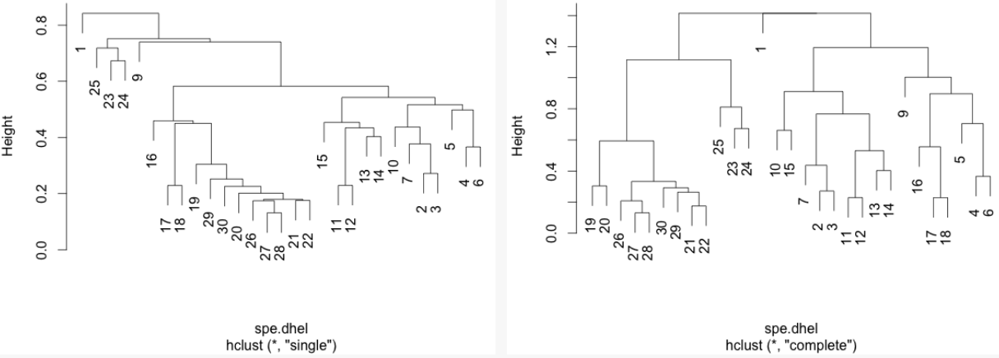

class: inverse, center, middle

```{r setup, echo = FALSE, message=FALSE, warning=FALSE, include = FALSE}
library(knitr)

## Setup for your presentation
knitr::opts_chunk$set(
  eval = TRUE,
  cache = TRUE,
  comment = "#",
  collapse = TRUE,
  warning = FALSE,
  message = FALSE,
  fig.width = 5, fig.height = 5, fig.retina = 3,
  fig.align = 'center'
)

options(repos = structure(
  c(CRAN = "http://cran.r-project.org")
)
)

# Install xaringanExtra

if(nzchar(system.file(package = "xaringanExtra")) == FALSE) {remotes::install_github("gadenbuie/xaringanExtra", upgrade = "always", quiet = TRUE)}

# Include copy-to-clipboard icons

htmltools::tagList(
  xaringanExtra::use_clipboard(
    button_text = "<i class=\"fas fa-clipboard\"></i>",
    success_text = "<i class=\"fa fa-check\" style=\"color: #90BE6D\"></i>",
    error_text = "<i class=\"fa fa-times-circle\" style=\"color: #F94144\"></i>"
  ),
  rmarkdown::html_dependency_font_awesome()
)
```

```{r output-lines, echo = FALSE}
# sometimes cache needs to be set to true in the knitr setup chunk for this to take effect
# in xaringan::infinite_moon_reader()
library(knitr)
hook_output <- knit_hooks$get("output")
knit_hooks$set(output = function(x, options) {
   lines <- options$output.lines
   if (is.null(lines)) {
     return(hook_output(x, options))  # pass to default hook
   }
   x <- unlist(strsplit(x, "\n"))
   more <- "..."
   if (length(lines)==1) {        # first n lines
     if (length(x) > lines) {
       # truncate the output, but add ....
       x <- c(head(x, lines), more)
     }
   } else {
     x <- c(more, x[lines], more)
   }
   # paste these lines together
   x <- paste(c(x, ""), collapse = "\n")
   hook_output(x, options)
 })
```

```{r install_pkgs, message=FALSE, warning=FALSE, include=FALSE, results=0}
# Standard procedure to check and install packages and their dependencies, if needed.

list.of.packages <- c("ape", "ade4", "codep", "gclus", "vegan", "GGally", "PlaneGeometry", "remotes", "matlib")

new.packages <- list.of.packages[!(list.of.packages %in% installed.packages()[,"Package"])]

if(length(new.packages) > 0) {
  install.packages(new.packages, dependencies = TRUE) 
  print(paste0("The following package was installed:", new.packages)) 
} else if(length(new.packages) == 0) {
  print("All packages were already installed previously")
}

# Load all required libraries at once
lapply(list.of.packages, require, character.only = TRUE, quietly = TRUE)
```

# About this workshop

[](https://r.qcbs.ca/workshop09/pres-en/workshop09-pres-en.html)    [](https://r.qcbs.ca/workshop09/book-en/workshop09-script-en.R) 
[](https://r.qcbs.ca/workshop09/book-en/index.html)
[](https://r.qcbs.ca/workshops/r-workshop-09/)
[](https://github.com/QCBSRworkshops/workshop09)


---

<p style="font-size:75%">

.center[
**QCBS members who contributed to this workshop**

by modifying and improving its content as part of the <br> *Le*arning *a*nd *D*evelopment *A*ward
]


.pull-left[
.right[

**2022** - **2021** - **2020**

Pedro Henrique P. Braga

Katherine Hébert

Mi Lin

Linley Sherin

<br>

**2019** - **2018** - **2017**

Gabriel Muñoz

Marie Hélène-Brice

Pedro Henrique P. Braga
]
]

.pull-right[
.left[
**2016** - **2015** - **2014**

Bérenger Bourgeois

Xavier Giroux-Bougard

Amanda Winegardner

Emmanuelle Chrétien

Monica Granados

]
]
</p>

<br>
.center[
__If you would like to contribute too__, visit [r.qcbs.ca/contributing](https://r.qcbs.ca/contributing/) <br> and don't hesitate to [get in touch](mailto:qcbs.csbq.r@gmail.com) with us!
]

---

# Required material

This workshop requires the latest [RStudio](https://rstudio.com/products/rstudio/download/#download) and [R](https://cran.rstudio.com/) versions.

.pull-left[
You must also use these packages:
* [ape](https://cran.r-project.org/package=ape)
* [ade4](https://cran.r-project.org/package=ade4)
* [codep](https://cran.r-project.org/package=codep)
* [gclus](https://cran.r-project.org/package=gclus)
* [vegan](https://cran.r-project.org/package=vegan)
* [GGally](https://cran.r-project.org/package=GGally)
* [PlaneGeometry](https://cran.r-project.org/package=PlaneGeometry)
* [remotes](https://cran.r-project.org/package=remotes)

]

.pull-right[


To install them from CRAN, run:

```{r eval = FALSE}
install.packages(c("ape", 
                   "ade4",
                   "codep",
                   "gclus", 
                   "vegan",
                   "GGally", 
                   "PlaneGeometry", 
                   "remotes"))
```

]

<br>

.pull-left2[
Throughout this workshop, there will be a series of **challenges** that you can recognize by this Rubik's cube.

**During these challenges, do not hesitate to collaborate!**
]

.pull-right2[

.center[

]
]


---
# Learning objectives

1. Learn the basics of multivariate analysis to reveal patterns in community composition data

2. Use `R` to perform an unconstrained ordination

3. Learn about similarity and dissimilarity coefficients and transformations to perform multivariate analysis

4. Use `R` to create dendrograms

5. Learn the following methods:

  * Clustering analysis
  * Principal Component Analysis (PCA)
  * Principal Coordinate Analysis (PCoA)
  * Non-Metric MultiDimensional Scaling (NMDS)

---

class: inverse, center, middle

# 1. Preamble

---

# Recap: Univariate analyses

We have learned a multitude of analyses that allowed us to interpret ecological data while depicting the effects of _one or multiple_ variables in _one_ response variable.

--

.pull-left[
We can recall the:

1. General Linear Models 
  1. `lm()`;
  2. `anova()`;
  3. `t.test()`;
  4. `lmer()`.

2. Generalized Linear Models
  1. `glm()` and `glmer()` with several `family()` link functions.

3. Generalized Additive Models
  1. `gam()`.
]

--

.pull-right[
These models allowed us to ask questions such as:

1. _What are the effects of precipitation and temperature on species richness?_
2. _How does the abundance of microbes change between hosts?_
3. _Do co-occurring fish become more aggressive after being induced to fear?_
]

---

# Multivariate statistics

However, one may be interested in making inferences from ecological data containing _more than one_ outcome or dependent variable.

This interest may be driven by hypothesis testing and modelling, but also be entirely exploratory. 

--

For instance, our research question might be:

1. How does the _bacterial composition_ on maple leaves change along the elevational gradient?

2. What is the _composition dissimilarity_ of bat communities?

3. How _closely-related_ are local spider communities in terms of their _composition_?

???

--

In all these cases, the outcome is composed of several variables, _e.g._ usually a sample-by-species or sample-by-environment matrix.

--

<br>
We will now dive into **multivariate statistics**, a tool set that will allow us to address questions requiring the simultaneous observation or analysis of more than one outcome variable.

---
# Background on multivariate methods

1. Association (or dis-similarity) measures and matrices

2. Classification (or cluster) analysis

3. Unconstrained ordination

4. Constrained (or canonical) ordination

--

<br>

.center[But, before that, we must recall the basics of **matrix algebra**.]

---

# Matrix algebra: a *very brief* summary

Matrix algebra is well-suited for ecology, because most (if not all) _data sets_ we work with are in a _matrix_ format.

--

.pull-left[
Ecological data tables are obtained as object-observations or sampling units, and are often recorded as this: 
<br>

| Objects | $y_1$     | $y_2$  | $\dots$           | $y_n$  |
| :-------------: |:-------------:| :-----:|:-----:|:-----:|
|  $x_1$        | $y_{1,1}$     | $y_{1,2}$  | $\dots$  | $y_{1,n}$  |
|  $x_2$        | $y_{2,1}$     | $y_{2,2}$  | $\dots$  | $y_{2,n}$  |
|  $\vdots$     | $\vdots$     | $\vdots$  | $\ddots$  | $\vdots$  |
|  $x_m$        | $y_{m,1}$     | $y_{m,2}$  | $\dots$  | $y_{m,n}$  |
<br>
where $x_m$ is the sampling unit $m$; and $y_n$ is the ecological descripor that can be, for example, species present in a sampling unit, locality, or a chemical variable.
]

--

.pull-right[

The same ecological data table can be represented in _matrix notation_ like this:

$$Y = [y_{m,n}] =
\begin{bmatrix}
y_{1,1} & y_{1,2} & \cdots & y_{1,n} \\
y_{2,1} & y_{2,2} & \cdots & y_{2,n} \\
\vdots  & \vdots  & \ddots & \vdots  \\
y_{m,1} & y_{m,2} & \cdots & y_{m,n} 
\end{bmatrix}$$

where lowercase letters indicate _elements_, and the subscript letters indicate the _position of these elements_ in the matrix (and in the table!).
]


---

# Matrix algebra: a *very brief* summary

Matrix algebra is well-suited for ecology, because most (if not all) _data sets_ we work with, are in a _matrix_ format.

.pull-left[
Moreover, any subset of a matrix can be recognized!

<br>

.center[_a row matrix_]
$$\begin{bmatrix}
y_{1,1} & y_{1,2} & \cdots & y_{1,n} \\
\end{bmatrix}$$

.center[_a column matrix_]
$$\begin{bmatrix}
y_{1,1} \\ y_{2,1} \\ \vdots \\ y_{m,1}
\end{bmatrix}$$

]

.pull-right[
The same ecological data table can be represented in _matrix notation_ like this:

$$Y = [y_{m,n}] =
\begin{bmatrix}
y_{1,1} & y_{1,2} & \cdots & y_{1,n} \\
y_{2,1} & y_{2,2} & \cdots & y_{2,n} \\
\vdots  & \vdots  & \ddots & \vdots  \\
y_{m,1} & y_{m,2} & \cdots & y_{m,n} 
\end{bmatrix}$$

where lowercase letters indicate _elements_, and the subscript letters indicate the _position of these elements_ in the matrix (and in the table!).

]

---

# Matrix algebra: a *very brief* summary

###### Association matrices

Two important matrices can be derived from the ecological data matrix: the _**association matrix among objects**_ and the _**association matrix among descriptors**_.

--

.pull-left[
Using the data from our matrix $Y$,

<div class="math">
\[ Y = 
\begin{array}{cc}
\begin{array}{ccc}
x_1 \rightarrow\\
x_2 \rightarrow\\
\vdots \\
x_m \rightarrow\\
\end{array}
&
\begin{bmatrix}
y_{1,1} & y_{1,2} & \cdots & y_{1,n} \\
y_{2,1} & y_{2,2} & \cdots & y_{2,n} \\
\vdots  & \vdots  & \ddots & \vdots  \\
y_{m,1} & y_{m,2} & \cdots & y_{m,n} 
\end{bmatrix}
\end{array}
\]
</div>

one can examine the relationship between the first two objects:

<div class="math">
\[x_1 \rightarrow \begin{bmatrix}
y_{1,1} & y_{1,2} & \cdots & y_{1,n} \\
\end{bmatrix}
\]
</div>

<div class="math">
\[x_2 \rightarrow 
\begin{bmatrix}
y_{2,1} & y_{2,2} & \cdots & y_{2,n} \\
\end{bmatrix}
\]
</div>

<p>and obtain \(a_{1,2}\). </p>

]

--

.pull-right[

We can populate the association matrix $A_{n,n}$ with the relationships between all objects from $Y$:

<div class="math">
\[A_{n,n} = 
\begin{bmatrix}
a_{1,1} & a_{1,2} & \cdots & a_{1,n} \\
a_{2,1} & a_{2,2} & \cdots & a_{2,n} \\
\vdots  & \vdots  & \ddots & \vdots  \\
a_{n,1} & a_{n,2} & \cdots & a_{n,n} 
\end{bmatrix}\]
</div>

<p>Because \(A_{n,n}\) has the same number of rows and columns, it is denoted a <i>square matrix</i>.</p> 

<p>Therefore, it has \(n^2\) elements.</p>

]

---

# Matrix algebra: a *very brief* summary

###### Association matrices

Two important matrices can be derived from the ecological data matrix: the _**association matrix among objects**_ and the _**association matrix among descriptors**_.

--

.pull-left[

We can also obtain the relationship between the first two descriptors of $Y$, $y_1$ and $y_2$:

.pull-left[
$$\begin{bmatrix}
y_{1,2} \\
y_{2,2} \\
\vdots  \\
y_{m,2} 
\end{bmatrix}$$
]

.pull-right[
$$\begin{bmatrix}
y_{1,1} \\
y_{2,1} \\
\vdots  \\
y_{m,1} 
\end{bmatrix}$$
]

and store it in $a_{1,2}$.
]

--

.pull-right[

We can populate the association matrix $A_{m,m}$ with the relationships between all descriptors from $Y$:

$$A_{m,m} = 
\begin{bmatrix}
a_{1,1} & a_{1,2} & \cdots & a_{1,m} \\
a_{2,1} & a_{2,2} & \cdots & a_{2,m} \\
\vdots  & \vdots  & \ddots & \vdots  \\
a_{m,1} & a_{m,2} & \cdots & a_{m,m} 
\end{bmatrix}$$

<p>This \(A_{m,m}\) is a <i>square matrix</i>, and it has \(m^2\) elements.</p>

]

---
# Matrix algebra: a *very brief* summary

###### Association matrices

Two important matrices can be derived from the ecological data matrix: the _**association matrix among objects**_ and the _**association matrix among descriptors**_.

These matrices are the basis of **_Q-mode_** and **_R-mode_** analyses in ecology. 

.pull-left[
$$Y_{m,n} = 
\begin{bmatrix}
y_{1,1} & y_{1,2} & \cdots & y_{1,n} \\
y_{2,1} & y_{2,2} & \cdots & y_{2,n} \\
\vdots  & \vdots  & \ddots & \vdots  \\
y_{m,1} & y_{m,2} & \cdots & y_{m,n} 
\end{bmatrix}$$
]

.pull-right[

$$A_{m,m} = 
\begin{bmatrix}
a_{1,1} & a_{1,2} & \cdots & a_{1,m} \\
a_{2,1} & a_{2,2} & \cdots & a_{2,m} \\
\vdots  & \vdots  & \ddots & \vdots  \\
a_{m,1} & a_{m,2} & \cdots & a_{m,m} 
\end{bmatrix}$$

]

.pull-left[

$$A_{n,n} = 
\begin{bmatrix}
a_{1,1} & a_{1,2} & \cdots & a_{1,n} \\
a_{2,1} & a_{2,2} & \cdots & a_{2,n} \\
\vdots  & \vdots  & \ddots & \vdots  \\
a_{n,1} & a_{m,2} & \cdots & a_{n,n} 
\end{bmatrix}$$

]


.pull-right[

.pull-left[
$\leftarrow$ **_R-mode_** analysis 
for descriptors or species
]

.pull-right[
$\uparrow$
**_Q-mode_** analysis
for objects or sites
]

]

---
## Our plans for the next steps...

We will dive into **R-mode** and **Q-mode** analyses, and we will explore:

1. Association coefficients: dissimilarity and similarity
2. Composition data transformation
3. Cluster analyses
3. Ordinations in the reduced space

<br> 

.center[**But, first, let us introduce a real data set.**]

.center[_It will be your time to get your hands dirty!_]

---
exclude: true

###### Association coefficients

_Stepping up our game_, we can use population parameters and sample statistics to reveal the structure of our ecological data.

For example, we can represent in our association matrix $A_{n,n}$

---
# Doubs river fish communities

.pull-left3[
Verneaux (1973) proposed to use fish species to characterize ecological zones along European rivers and streams.

He collected data at **30 localities** along the Doubs river, which runs near the France-Switzerland border, in the Jura Mountains.

He showed that fish communities were biological indicators of these water bodies. 
]

.pull.right3[
.center[]
]

--

.pull-left3[
Their data is split in three matrices:

1. The abundance of 27 fish species across the communities;
2. The environmental variables recorded at each site; and,
3. The geographical coordinates of each site.
]

.pull.right3[
.center[]

<br>
]

.xsmall[Verneaux, J. (1973) _Cours d'eau de Franche-Comté (Massif du Jura). Recherches écologiques sur le réseau hydrographique du Doubs_. Essai de biotypologie. Thèse d'état, Besançon. 1–257.] 

---

# Doubs river fish communities

.pull-left3[

You can download these datasets from [r.qcbs.ca/workshops/r-workshop-09](http://r.qcbs.ca/workshops/r-workshop-09/).

```{r}
spe <- read.csv("data/doubsspe.csv", 
                row.names = 1) 

env <- read.csv("data/doubsenv.csv", 
                row.names = 1)
```

]

--

.pull-right3[

This data can also be retrieved from the `ade4` package:
```{r eval=FALSE, echo = TRUE}
library(ade4)
data(doubs)

spe <- doubs$fish
env <- doubs$env
```

Alternatively, from the `codep` package:
```{r eval=FALSE, echo = TRUE}
library(codep)
data(Doubs)

spe <- Doubs.fish
env <- Doubs.env
```
]

---
# Doubs river environmental data

We can then explore the objects containing our newly loaded data. 

Let us peek into the `env` data:


.pull-left[
```{r, echo = T}
str(env)
```

]

.pull-right[

|Variable |Description|
|:--:|:--|
|das|Distance from the source [km]  |
|alt|Altitude [m a.s.l.]  |
|pen|Slope [per thousand]  |
|deb|Mean min. discharge [m<sup>3</sup>s<sup>-1</sup>]  |
|pH|pH of water  |
|dur|Ca conc. (hardness) [mgL<sup>-1</sup>]  |
|pho|K conc. [mgL<sup>-1</sup>]  |
|nit|N conc. [mgL<sup>-1</sup>]  |
|amn|NH₄⁺ conc. [mgL<sup>-1</sup>]  |
|oxy|Diss. oxygen [mgL<sup>-1</sup>]  |
|dbo|Biol. oxygen demand [mgL<sup>-1</sup>]  |

]

```{r, eval = F}
summary(env) # summary statistics
```


---

# Doubs river fish communities

Let us peek into the `spe` data:

.pull-left[
```{r, echo = T}
head(spe)[, 1:8]
```

```{r, echo = T, output.lines=1:8}
str(spe)
```
]

.pull-right[

```{r, eval = F}
# Try some of these!

names(spe)   # names of objects
dim(spe)     # dimensions

str(spe)     # structure of objects
summary(spe) # summary statistics

head(spe)    # first 6 rows
```

]

---
# (Dis)similarity measures

Community resemblance is almost always assessed on the basis of species composition data in the form of a site-by-species data table $Y_{m,n}$.

We can obtain an association matrix $A_{m,m}$ in the form of pairwise distances or dissimilarities $D_{m,m}$ (or similarities $S_{m,m}$) and then analyse those distances.

--

In `R`, we can compute distance or dissimilarity matrices using `stats::dist()`:

```{r, eval = T, results='show'}
dist(spe)
```

---

# (Dis)similarity measures

For simplicity, we have done this without specifying arguments.

Run `dist(spe)` from your end, note what you observe and see what the commands below show you:

```{r, eval = F}
class(dist(spe))
```

```{r, eval = F}
str(dist(spe))
```

```{r, eval = F}
as.matrix(dist(spe))
```

```{r, eval = F}
dim(as.matrix(dist(spe)))
```

???

If possible, do this part with the participants.

Show them how a dist class object is structured. Highlight that it is a lower-triangular matrix, where the distances between the same objects are hidden.

---

# (Dis)similarity measures

There are three groups of distance coefficients: _metrics_, _..._ , _..._ .

The first group consists of *metrics*, and its coefficients satisfy the following properties:

.pull-left[
1. minimum 0: if species $a$ is equal to species $b$, then $D(a,b)=0$;
2. positiveness: if $a \neq b$, then $D(a,b) > 0$;
3. symmetry: $D(a,b) = D(b,a)$;
4. triangle inequality: $D(a,b) + D(b,c) \geq D(a,c)$. The sum of two sides of a triangle drawn in the Euclidean space is equal or greater than the third side.
]

.pull-right[

We can spot all these properties below:

```{r, eval = T}
as.matrix(dist(spe))[1:3, 1:3]
```

]

???

Highlight the triangular nature of the `dist` class, that it can be converted to a matrix, and the dimensions (noting that it has the same number of species).

---

# (Dis)similarity measures

There are three groups of distance coefficients: _metrics_, _semimetrics_, _..._ .

The second group consists of *semimetrics*, and they violate the _triangle inequality_ property:

.pull-left[
1. minimum 0: if species $a$ is equal to species $b$, then $D(a,b)=0$;
2. positiveness: if $a \neq b$, then $D(a,b) > 0$;
3. symmetry: $D(a,b) = D(b,a)$;
4. ~~triangle inequality~~: ${D(a,b) + D(b,c) \geq or < D(a,c)}$. The sum of two sides of a triangle drawn in the Euclidean space is _not_ equal or greater than the third side.
]

.pull-right[


]

???

Highlight the triangular nature of the `dist` class, that it can be converted to a matrix, and the dimensions (noting that it has the same number of species).

---

# (Dis)similarity measures

There are three groups of distance coefficients: _metrics_, _semimetrics_, _nonmetrics_.

The third group consists of *nonmetrics*, and they violate the _positiveness_ property of metric distances:

.pull-left[
1. minimum 0: if species $a$ is equal to species $b$, then $D(a,b)=0$;
2. ~~positiveness:~~ if $a \neq b$, then $D(a,b) > or < 0$;
3. symmetry: $D(a,b) = D(b,a)$;
4. ~~triangle inequality~~: ${D(a,b) + D(b,c) \geq or < D(a,c)}$. The sum of two sides of a triangle drawn in the Euclidean space is _not_ equal or greater than the third side.
]

.pull-right[


]

???

Highlight the triangular nature of the `dist` class, that it can be converted to a matrix, and the dimensions (noting that it has the same number of species).

---

# (Dis)similarity measures: Euclidean distances

The most common metric distance measure is the _Euclidean distance_.

.pull-left4[
It is computed using the Pythagorean formula:

$$D_{1} (x_1,x_2) = \sqrt{\sum_{j=1}^p(y_{1j} - y_{2j})^2}$$

```{r echo=FALSE}
#setting up the plot
xlim <- c(0,4)
ylim <- c(-1,5)
par(mar=c(1,1,1,1)+.1)
plot(xlim, 
     ylim, type="n", 
     xlab="X1", 
     ylab="X2", 
     asp=1)
grid()
# define some vectors
a=c(4, 0)
b=c(0, 4)
# plot the vectors
vectors(a, labels="D(y21, y11)", pos.lab=3, frac.lab=.5, col="grey")
vectors(a + b, labels="D1(x1,x2)", pos.lab=4, frac.lab=.5, col="red")
# vector a+b starting from a is equal to b.
vectors(a + b, labels="D(y12, y22)", pos.lab=4, frac.lab=.5, origin=a, col="grey")

points(x = 4, y = 0, type = "p")
text(x=4.1, y=-0.2, labels="")

points(x = 0, y = 0, type = "p")
text(x=-0.1, y=-0.2, labels="x1")

points(x = 4, y = 4, type = "p")
text(x=4.1, y=4.2, labels="x2")
```


]

.pull-right4[
Using `stats::dist()`, we can compute it with:

```{r, eval = T}
spe.D.Euclid <- dist(x = spe,  
                     method = "euclidean")
```

And, we can test whether a distance is Euclidean using:

```{r, eval = T}
is.euclid(spe.D.Euclid)
```

]

???

The figure on the side needs to be finished. It is supposed to represent the Euclidean distance between sites x1 and x2 in the 2D Cartesian space. The axes are the descriptors y1 and y2, respectively. The arrow on the bottom is the distance between the position of y21 and y11.

You can use it to recall the Pythagorean theorem that everyone learns in high school, where the length of the hypotenuse and a and b denote the two lengths of the legs of a right triangle.

`method = "euclidean"` is the default parameter

---

# Challenge #1  

**Your turn!** Using the `dist()` function, compute the Euclidean distance matrix $D_{hmm}$ for the species abundances by site matrix $Y_{hmm}$ below:

.pull-left[
```{r, eval = T}
Y.hmm <- data.frame(
  y1 = c(0, 0, 1),
  y2 = c(4, 1, 0),
  y3 = c(8, 1, 0))
```
]

.pull-right[

| Sites | $y_1$ | $y_2$ | $y_3$ |
|:----: | :----:| :---: | :---: |
| $s_1$ | 0 | 4 | 8 |
| $s_2$ | 0 | 1 | 1 |
| $s_3$ | 1 | 0 | 0 |

]

After this, look into the numbers, think critically about them, and be ready to chat! (_5 to 10 minutes_)

--

.pull-left[

**Solution:**

```{r, eval = F}
Y.hmm.DistEu <- dist(x = Y.hmm,  
                     method = "euclidean")

as.matrix(Y.hmm.DistEu)
```

]

.pull-right[

**Output**:

```{r echo=FALSE}
Y.hmm.DistEu <- dist(x = Y.hmm,  
                     method = "euclidean")

as.matrix(Y.hmm.DistEu)
```

]

<br>

.center[
Tip: Look into the composition and the distances between sites $s_2$ and $s_3$ and between $s_1$ and $s_2$.
]

???

---
## Challenge #1 

.pull-left[

**Solution:**

```{r, eval = T}
Y.hmm
```

]

.pull-right[

**Output**:

```{r echo=TRUE}
as.matrix(Y.hmm.DistEu)
```

]

The Euclidean distance between sites $s_2$ and $s_3$, which have no species in common, is smaller than the distance between $s_1$ and $s_2$, which share species $y_2$ and $y_3$ (!).

From an ecological perspective, _this is a problematic_ assessment of the relationship among sites.

--

This issue is known as the **double-zero problem**, _i.e._ double zeroes are treated in the same way as double presences, so that the double zeros shrink the distance between two sites.

Euclidean distances ( $D_1$ ) should thus _not_ be used to compare sites based on species abundances.

---

# (Dis)similarity measures: Chord distances

Orlóci (1967) proposed the _Chord distance_ to analyse community composition.

.pull-left[
It consists of:

1\. Normalizing the data, _i.e._ scaling site vectors to length 1 by dividing species abundances in a given sample by the square-rooted sum of square abundances in all samples as

$$y'_{Uj}=y_{Uj}/\sum^s_{j=1}{y^2_{Uj}}$$


2\. Calculating the Euclidean distances on this normalized data:

$$D_{3} (x_1,x_2) = \sqrt{\sum_{j=1}^p(y'_{1j} - y'_{2j})^2}$$
]

.pull-right[

We can use `vegan::vegdist()` for this one:

```{r, eval = T}
spe.D.Ch <- vegdist(spe,  
                    method = "chord")

as.matrix(spe.D.Ch)[1:3, 1:3]
```

When two sites share the same species in the same proportions of the number of individuals the value of $D_3$ is $0$, and when no species are shared, its value is $\sqrt{2}$. 
 
]

???

`method = "euclidean"` is the default parametre

---

# (Dis)similarity measures: Chord distances

There are many other metric distances of interest, which we can use:

What happens if we compute Chord distances in the same site-by-species matrix $Y_{hmm}$?

.pull-left[

```{r, eval = T}
Y.hmm
```

```{r echo=TRUE}
as.matrix(Y.hmm.DistEu)
```

]

.pull-right[

```{r, eval = T}
Y.hmm.DistCh <- vegdist(Y.hmm,  
                    method = "chord")
```

```{r echo=TRUE}
as.matrix(Y.hmm.DistCh)
```
]

--

Adding any number of double zeroes to a pair of sites does _not_ change the value of $D_3$. 

Hence, _Chord distances_ can be used to compare sites described by species abundances!

???

`method = "euclidean"` is the default parameter

---
# (Dis)similarity measures: Jaccard's

Another popular association coefficient is the _Jaccard similarity coefficient_ (1900).

It is only appropriate for **binary data**, and its distance coefficient is defined with the size of the intersection divided by the size of the union of the sample sets.

$$D_{7}(x_1,x_2) = 1 - \frac{\vert x_1 \cap x_2 \vert}{\vert x_1 \cup x_2 \vert} = 1 - \frac{\vert x_1 \cap x_2 \vert}{\vert x_1 \vert + \vert x_2 \vert - \vert x_1 \cap x_2 \vert} = 1-\frac{a}{a+b+c}$$
  
where,

- $a$ is the number of species shared between $x_1$ and $x_2$ that are coded $1$;
- $b$ is the number of occurrences where $x_1$ and $x_2$ are known to be different;
- $c$ is the number of common absences between $x_1$ and $x_2$, _i.e._ both $0$. 

--

<br>
.pull-left[
For example, for sites $x_1$ and $x_2$:

| $x_1,x_2$ | $y_1$ | $y_2$ | $y_3$ | $y_4$ | $y_5$ |
|:----: | :----:| :---: | :---: | :---: | :---: |
| $x_1$ | 0 | 1 | 0 | 1 | 0 |
| $x_2$ | 0 | 1 | 1 | 1 | 1 |
]

.pull-right[
.pull-left[
So:
- $a$ = 1 + 1 = 2
- $b$ = 1 + 1 = 2
- $c$ = 1

]
.pull-right[
<br>
$D_{7}(x_1,x_2) =$

$1-\frac{2}{2+2+1}=$

$0.6$
]
]

---
# (Dis)similarity measures: Sørensen's

All parameters in _Jaccard's similarity coefficient_ have equal weights.

$$D_{7}(x_1,x_2)=1-\frac{a}{a+b+c}$$

However, you may want to consider that a presence of a species is more informative than its absence.

The distance corresponding to _Sørensen's similarity coefficient_ (1948) gives weight to double presences:

$$D_{13}(x_1,x_2)=1-\frac{2a}{2a+b+c}=\frac{b+c}{2a+b+c}$$

where,

- $a$ is the number of species shared between $x_1$ and $x_2$ that are coded $1$;
- $b$ is the number of occurrences where $x_1$ and $x_2$ are known to be different;
- $c$ is the number of common absences between $x_1$ and $x_2$, _i.e._ both $0$. 

---
# (Dis)similarity measures: Bray-Curtis

The _Bray-Curtis dissimilarity coefficient_ is a modified version of the Sørensen's index and allows for species abundances:

.pull-left[
$$D_{14}(x_1,x_2)=\frac{\sum{\vert y_{1j}-y_{2j}\vert}}{\sum{( y_{1j}+y_{2j})}}=$$

$$D_{14}(x_1,x_2)=1 - \frac{2W}{A+B}$$
where,
- $W$ is the sum of the lowest abundances in each species found between sites $x_1$ and $x_2$;
- $A$ is the sum of all abundances in $x_1$; and,
- $B$ is the sum of all abundances in $x_2$.
]

--

.pull-right[
For example, for sites $x_1$ and $x_2$:

| $x_1,x_2$ | $y_1$ | $y_2$ | $y_3$ | $y_4$ | $y_5$ |
|:----: | :----:| :---: | :---: | :---: | :---: |
| $x_1$ | _2_ | _1_ | _0_ | 5 | 2 |
| $x_2$ | 5 | _1_ | 3 | _1_ | 1 |

<br>

So:
- $W = 2 + 1 + 0 + 1 + 1 = 5$
- $A = 2 + 1 + 0 + 5 + 0 = 8$
- $B = 5 + 1 + 3 + 1 + 2 = 12$

$$D_{14}(x_1,x_2) = 1-\frac{2 \times 5}{8+12}=$$
$$D_{14}(x_1,x_2) = 0.5$$
]

---
##### (Dis)similarity measures: Jaccard's and Sørensen's coefficients

In `R`, you can use use the `vegan::vegdist()` function to calculate the Jaccard's and Sørensen's indices:

.pull-left[

```{r}
spe.D.Jac <- vegdist(spe, 
                     method = "jaccard",
                     binary = TRUE)
```

]

.pull-right[

```{r}
spe.D.Sor <- vegdist(spe, 
                     method = "bray",
                     binary = TRUE)
```
]
<br>
> Because both Jaccard's and Sørensen's are only appropriate for presence-absence data, you must binary-transform abundance data using `binary = TRUE` in `vegdist()`.
<br>

##### Bray-Curtis dissimilarity coefficient

To calculate the _Bray-Curtis dissimilarity coefficient_, which can account for abundances, you need to set `binary = FALSE`.

```{r}
spe.db.pa <- vegdist(spe, 
                      method = "bray",
                      binary = FALSE)
spe.db <- as.matrix(spe.db.pa)
```

---
# (Dis)similarity measures: representation

We can create graphical depictions of association matrices using the `coldiss()` function:

```{r, echo = FALSE}
# coldiss() function
# Color plots of a dissimilarity matrix, without and with ordering
#
# License: GPL-2 
# Author: Francois Gillet, 23 August 2012
#

"coldiss" <- function(D, nc = 4, byrank = TRUE, diag = FALSE)
{
  require(gclus)
  
  if (max(D)>1) D <- D/max(D)
  
  if (byrank) {
    spe.color <- dmat.color(1-D, cm.colors(nc))
  }
  else {
    spe.color <- dmat.color(1-D, byrank=FALSE, cm.colors(nc))
  }
  
  spe.o <- order.single(1-D)
  speo.color <- spe.color[spe.o, spe.o]
  
  op <- par(mfrow=c(1,2), pty="s")
  
  if (diag) {
    plotcolors(spe.color, rlabels=attributes(D)$Labels, 
               main="Dissimilarity Matrix", 
               dlabels=attributes(D)$Labels)
    plotcolors(speo.color, rlabels=attributes(D)$Labels[spe.o], 
               main="Ordered Dissimilarity Matrix", 
               dlabels=attributes(D)$Labels[spe.o])
  }
  else {
    plotcolors(spe.color, rlabels=attributes(D)$Labels, 
               main="Dissimilarity Matrix")
    plotcolors(speo.color, rlabels=attributes(D)$Labels[spe.o], 
               main="Ordered Dissimilarity Matrix")
  }
  
  par(op)
}

# Usage:
# coldiss(D = dissimilarity.matrix, nc = 4, byrank = TRUE, diag = FALSE)
# If D is not a dissimilarity matrix (max(D) > 1), then D is divided by max(D)
# nc 							number of colours (classes)
# byrank= TRUE		equal-sized classes
# byrank= FALSE		equal-length intervals
# diag = TRUE			print object labels also on the diagonal

# Example:
# coldiss(spe.dj, nc=9, byrank=F, diag=T)

```


```{r, fig.height = 8, fig.width = 16}
coldiss(spe.D.Jac)
```

---
# Transformations for community composition data

Communities sampled over homogeneous or short environmental conditions can have species compositions with few zeroes, so that Euclidean distances could be enough to characterize them.

Nevertheless, this is rarely the reality. 

Species may be highly frequent when conditions are favourable, or may be absent from many sites. Sometimes, this skewness may introduce spurious problems to our analyses.

We may then have to transform our composition data to appropriately analyze it.

--

In `R`, we can rely on `vegan::decostand()` for many types of transformations. 

Take a look into the help of this function to see the available options:

```
?decostand()
```

Let us see some of them.

---
## Transformations: presence-absence

We can change the argument `method` to `"pa"` to transform our abundance data into presence-absence data:

.center[
If $y_{ij} \geq 1$, then, $y'_{ij} = 1$.
]

.pull-left[
Let us recall our `spe` data set:

```{r}
spe[1:6, 1:6]
``` 
]

Let us transform `spe` abundances to presence-absences:

```{r}
spe.pa <- decostand(spe, method = "pa")
spe.pa[1:6, 1:6]
```

---
## Transformations: species profiles

Sometimes, one wants to remove the effects of highly abundant units. We can transform the data into profiles of relative species abundances through the following equation:

$$y'_{ij} = \frac{y_{ij}}{y_{i+}}$$

.pull-left[
Let us recall our `spe` dataset:

```{r}
spe[1:5, 1:6]
``` 
]

In `decostand()`:

```{r}
spe.total <- decostand(spe, 
                       method = "total")
spe.total[1:5, 1:6]
```


???

yi+ is used to indicate the sample total count over all j=1,…,m species, for the ith sample.

---
## Transformations: Hellinger

We can take the square-root of the _species profile transformation_ and obtain the _Hellinger transformation_, which has very good mathematical properties and allows us to reduce the effects of $y_{ij}$ values that are extremely large.

$$y'_{ij} = \sqrt{\frac{y_{ij}}{y_{i+}}}$$

.pull-left[
Let us recall our `spe` dataset:

```{r}
spe[1:5, 1:6]
``` 
]

In `decostand()`:

```{r}
spe.total <- decostand(spe, 
                       method = "hellinger")
spe.total[1:5, 1:6]
```


---

## Transformations: Standardization

Standardizing environmental variables is crucial as you cannot compare the effects of variables with different units:

```{r, eval = -1}
?decostand
env.z <- decostand(env, method = "standardize")
```

<Br>
This centres and scales the variables to make your downstream analysis more appropriate:

```{r}
apply(env.z, 2, mean)
apply(env.z, 2, sd)
```

.center[*More on this later!*]

---
exclude: true

# Total Species Richness

Visualize how many species are present at each site:

```{r, fig.width=10, fig.height=5, echo=-1}
par(mar = c(4,4,1,.5), cex = 1.5)
site.pre <- rowSums(spe > 0)
barplot(site.pre, main = "Species richness",
        xlab = "Sites", 
        ylab = "Number of species",
        col = "grey ", las = 1)
```

---
exclude: true

# Visualization of distance matrices


```{r, echo = FALSE}
# coldiss() function
# Color plots of a dissimilarity matrix, without and with ordering
#
# License: GPL-2 
# Author: Francois Gillet, 23 August 2012
#

"coldiss" <- function(D, nc = 4, byrank = TRUE, diag = FALSE)
{
  require(gclus)
  
  if (max(D)>1) D <- D/max(D)
  
  if (byrank) {
    spe.color <- dmat.color(1-D, cm.colors(nc))
  }
  else {
    spe.color <- dmat.color(1-D, byrank=FALSE, cm.colors(nc))
  }
  
  spe.o <- order.single(1-D)
  speo.color <- spe.color[spe.o, spe.o]
  
  op <- par(mfrow=c(1,2), pty="s")
  
  if (diag) {
    plotcolors(spe.color, rlabels=attributes(D)$Labels, 
               main="Dissimilarity Matrix", 
               dlabels=attributes(D)$Labels)
    plotcolors(speo.color, rlabels=attributes(D)$Labels[spe.o], 
               main="Ordered Dissimilarity Matrix", 
               dlabels=attributes(D)$Labels[spe.o])
  }
  else {
    plotcolors(spe.color, rlabels=attributes(D)$Labels, 
               main="Dissimilarity Matrix")
    plotcolors(speo.color, rlabels=attributes(D)$Labels[spe.o], 
               main="Ordered Dissimilarity Matrix")
  }
  
  par(op)
}

# Usage:
# coldiss(D = dissimilarity.matrix, nc = 4, byrank = TRUE, diag = FALSE)
# If D is not a dissimilarity matrix (max(D) > 1), then D is divided by max(D)
# nc 							number of colours (classes)
# byrank= TRUE		equal-sized classes
# byrank= FALSE		equal-length intervals
# diag = TRUE			print object labels also on the diagonal

# Example:
# coldiss(spe.dj, nc=9, byrank=F, diag=T)

```


```{r, fig.width = 10, fig.height = 8}
# the code for the coldiss() function is in the workshop script.
coldiss(spe.db.pa)
```

---
class: inverse, middle, center

# Clustering

---
# Clustering

One application of association matrices is clustering. 

Clustering highlights structures in the data by partitioning either the objects or the descriptors.

One goal of ecologists could be to divide a set of sites into groups with respect to their environmental conditions or their community composition.

Its results can be represented as dendrograms (tree-like diagrams), which describe how closely observations are.

```{r, fig.width=10, echo = FALSE}
# Demonstration of a cluster dendrogram
spe.hel<-decostand(spe, method="hellinger")
spe.dhel <- vegdist(spe.hel,method="euclidean")
spe.dhel.ward <- hclust(spe.dhel, method="ward.D2")
spe.dhel.ward$height<-sqrt(spe.dhel.ward$height)
plot(spe.dhel.ward, hang=-1) # hang=-1 aligns all objets on the same line

```

???
.center[]

---
# Hierarchical clustering methods

Clustering algorithms generally build on this series of steps:

1. calculate an association matrix with all pair-wise similarities among all objects;
2. Join together pairs of objects that are most similar (or dissimilar);
3. Recompute the similarity matrix for that cluster _versus_ all remaining objects;
4. Repeat steps 2 and 3 until all objects are joined.

--

<br>

From the many existing hierarchical clustering algorithms, we will explore:

1. Single linkage agglomerative clustering;
2. Complete linkage, agglomerative clustering;
3. Ward's minimum variance clustering.

--

<br>

In `R`, we will use the functions `hclust()` and `agnes()` to build our dendrograms.

???
In single linkage agglomerative clustering (also called nearest
neighbour sorting), the objects at the closest distances agglomerate.
which often generates long thin clusters or chains of objects. Conversely, in complete linkage agglomerative clustering, an object agglomerates to a group only when linked to the furthest element of the group, which in turn links it to all members of that group. It  will form many small separate groups, and is more appropriate to look for contrasts, discontinuities in the data.
Ward's minimum variance clustering differ from these two methods in that
it clusters objects into groups using the criterion of least squares
(similar to linear models). Its dendogram shows squared distances by default. To compare with other methods, calculate the sqaure root of the distances first. 

---

# Complete linkage clustering

.pull-left4[


]

.pull-right4[

- The objects divided into small groups (1-2, 3-4, 5)

- Connect small groups using the largest distance between their elements 
* (1-3=0.15, 2-4=0.35, 2-3=0.6, select 0.6 to connect group 1-2 and 3-4)


]


---
# Comparison

Create a distance matrix from Hellinger transformed Doubs river data and compute the single linkage clustering:

```{r, fig.width=7, echo = -1}
par(mar=c(.5,3.8,2,.5), cex = 1.5)
spe.dhe1 <- vegdist(spe.hel, method = "euclidean")
spe.dhe1.single <- hclust(spe.dhe1, method = "single")
plot(spe.dhe1.single)
```


---
# Comparison

```{r,fig.width= 15, echo = -1}
par(mfrow=c(1,2), mar=c(.5,2.5,1.5,2.5), cex=1)
spe.dhe1 <- vegdist(spe.hel, method = "euclidean")
spe.dhe1.complete <- hclust(spe.dhe1, method = "complete")
plot(spe.dhe1.single, main="Single linkage clustering", hang =-1)
plot(spe.dhe1.complete, main="Complete linkage clustering", hang=-1)
```

.pull-left[

**Single linkage:**

Chains of objects occur (e.g. 19,29,30,26)
]

.pull-right[

**Complete linkage:**
Contrasted groups are formed of objects occur
]

???


---
# Ward's minimum variance method

.pull-left[
- Uses the criterion of least squares to cluster objects into groups

- At each step, the pair of clusters merging is the one leading to the minimum increase in total within-group sum of squares

- Clusters generated using this method tend to be more spherical and to contain similar number of objects
]
---
# Ward's method

Compute the Ward's minimum variance clustering and plot the dendrogram by using the square root of the distances:

```{r, fig.height=4, echo=-1}
par(mar=c(.5,2.5,1.5,.5), cex = 1)
spe.dhel.ward <- hclust(spe.dhe1, method = "ward.D2")
spe.dhel.ward$height <- sqrt(spe.dhel.ward$height)
plot(spe.dhel.ward, hang = -1) # hang = -1 aligns objects at 0
```

> Ward's clustering algorithm can only be applied with Euclidean distances. Bray-Curtis distances are not Euclidean, so they must be square-rooted first before used with Ward's algorithm.

---
# Important questions to address

- Choosing the 'appropriate' method depends on your objective;
- Do you want to highlight gradients or contrasts?
- This is *not* an statistical method and you may need to rely on complementary methods to support your hypotheses.


However, clustering allows us to:
- Determine the optimal number of interpretable clusters;
- Compute clustering statistics;
- Combine clustering to ordination to distinguish groups of sites.

---
## Now, what?

While **cluster analysis** looks for *discontinuities* in a dataset, **ordination** extracts the main trends in the form of continuous axes.

From now, we will look into four types of **unconstrained ordination methods**...

--

.right[...**wait**, what do we mean about **unconstrained ordinations**? *Anyone*?]

--
<br>
.center[*If no one speaks out, choose a "volunteer", presenter!*]

--

<br>
**Unconstrained ordinations** assess relationships within a single set of variables. *No attempt* is made to define the relationship between a set of independent variables and one or more dependent variables.

--

In other words, the interpretation of potential effects of other factors that generated observed patterns can only be made indirectly, because those factors are *not* explicitly included in the analyses.

--

Here, we will explore:

.center[
.pull-left[
**P**rincipal **C**omponent **A**nalysis

**P**rincipal **Co**ordinate **A**nalysis
]

.pull-right[
**C**orrespondence **A**nalysis

**N**on-**M**etric Multi**D**imensional **S**caling
]
]

---

### But first, let us *recap*...

We already understand the meaning of **variance** and **mean**, and how to calculate them:

.pull-left[
$$\sigma_x^2 = \frac{\sum_{i=1}^{n}(x_i - \mu)^2} {n}$$
]

.pull-right[
$$\mu_x = \frac{1}{n} \sum_{i=i}^{n} x_{i}$$
]

These are very useful to understand the *centre* and the *dispersion* of a given variable or dimension.

Nevertheless, we are often interested **in more than one dimension**, and want to measure how much of each dimension vary from the mean with *respect to each other*.

--

**Covariance** is such a measure, which can depict how **two dimensions co-vary**:

.pull-left[
$$var_x = \sigma_x^2 = \frac{\sum_{i=1}^{n}(x_i - \mu)^2} {n}$$
]

.pull-right[
$$cov_{x,y}=\frac{\sum_{i=1}^{N}(x_{i}-\bar{x})(y_{i}-\bar{y})}{N-1}$$
]

---
### But first, let us *recap*...

Intuitively, we can measure the **covariance** between more than two variables. Let us say, between the variables $x$, $y$, and $z$:

.pull-left[
$$cov_{x,y}=\frac{\sum_{i=1}^{N}(x_{i}-\bar{x})(y_{i}-\bar{y})}{N-1}$$
]

.pull-right[
$$cov_{x,z}=\frac{\sum_{i=1}^{N}(x_{i}-\bar{x})(z_{i}-\bar{z})}{N-1}$$
]


$$cov_{z,y}=\frac{\sum_{i=1}^{N}(z_{i}-\bar{z})(y_{i}-\bar{y})}{N-1}$$
We can represent these calculations in a **covariance matrix**:

$${C(x, y, z)} = \left[ \begin{array}{ccc} 
cov_{x,x} & cov_{y,x} & cov_{z,x} \\
cov_{x,y} & cov_{y,y} & cov_{z,y} \\
cov_{x,z} & cov_{y,z} & cov_{z,z}   
\end{array} \right]$$

--

.center[**QUIZ TIME**

*What are the diagonals?* *And, what happens if variables are independent?*
] 

---
#### Still *recapping*...

.center[***What are the diagonals?***]

If, $cov_{x,y}=\frac{\sum_{i=1}^{N}(x_{i}-\bar{x})(y_{i}-\bar{y})}{N-1}$, then:

$$cov_{x,x}=\frac{\sum_{i=1}^{N}(x_{i}-\bar{x})(x_{i}-\bar{x})}{N} = \frac{\sum_{i=1}^{n}(x_i - \bar{x})^2} {N} = var_x$$
--

So, that:

$${C(x, y, z)} = \left[ \begin{array}{ccc} 
cov_{x,x} & cov_{y,x} & cov_{z,x} \\
cov_{x,y} & cov_{y,y} & cov_{z,y} \\
cov_{x,z} & cov_{y,z} & cov_{z,z}   
\end{array} \right] = \left[ \begin{array}{ccc} 
var_{x} & cov_{y,x} & cov_{z,x} \\
cov_{x,y} & var_{y} & cov_{z,y} \\
cov_{x,z} & cov_{y,z} & var_{z}   
\end{array} \right]$$

<br>

.center[The covariance of a variable with itself is its *variance*!]

---

#### Still *recapping*...

.center[***What happens if the variables are independent?***]

.pull-left[
```{r xyz-norm, echo=TRUE}
x <- rnorm(5000, mean = 0, sd = 1)
y <- rnorm(5000, mean = 0, sd = 1)
z <- rnorm(5000, mean = 0, sd = 1)

xyz <- data.frame(x, y, z)

GGally::ggpairs(xyz) 
```
]

--

.pull-right[
```{r xyz-cov, echo=TRUE, eval = FALSE}
cov(xyz)
```

```{r xyz-cov-2, echo=FALSE, eval = TRUE}
round(cov(xyz), digits = 5)
```


If variables are perfectly independent (or uncorrelated), the covariance matrix $C(x, y, z)$ is:

$${C(x, y, z)} =  \left[ \begin{array}{ccc} 
var_{x} & 0 & 0 \\
0 & var_{y} & 0 \\
0 & 0 & var_{z}   
\end{array} \right]$$

*i*.*e*. a covariance closer to $1$ means that variables are *colinear*.

And, here, $var_{x} = var_{y} = var_{z} = 1$.

]

---
## Linear transformations

We are often interested in observing variables in *different ways*. 

In this process, we create a new variable, let us say $x_{new}$, by multiplying and/or adding the values of the original variable $x$ by constants. For instance:

--

.pull-left[
We can transform a variable of distances measured in kilometres $d_{km}$ into miles, as:
$$d_{mi} = 0.62 \times d_{km}$$
]


.pull-right[
We can also transform Fahrenheit degrees to Celsius degrees as: 

$$T_{C} = 0.5556\times T_{Fahr} - 17.778$$
]

These are examples of **linear transformations**: the transformed variables are linearly related to the original variables and the shapes of the distribution are not changed.

--

Two types of transformations are very important for us:

.pull-left[
**Centering**, which subtracts the values of a predictor by the mean:

$$x' = x_i - \bar{x}$$
]

.pull-right[
**Scaling**, which divides the predictor variables by their standard deviation:

$$x'' = \frac{x_i}{\sigma_x}$$
]

??? 

Centering is basically a technique where the mean of independent variables is subtracted from all the values. It means all independent variables have zero mean. Scaling is similar to centering. Predictor variables are divided by their standard deviation. 

The presenter should mention here that centering brings the mean to zero and scaling brings the standard deviation to one-unit. They also should mention that variables become comparable when scaling, as their unit is lost.

---

## Eigendecomposition

**Square matrices**, such as the **covariance matrix**, can be decomposed into *Eigenvalues* and *Eigenvectors*.

For a square matrix, $A_{n \times n}$, a vector $v$ is an *Eigenvector* of $A$, if there is a *scalar*, $\lambda$, for which:

.center[ 
$A_{n \times n} v_{n \times 1} = \lambda  v_{n \times 1}$, or $\left(\begin{matrix}a_{11}&\cdots&a_{1n}\\\vdots&\ddots&\vdots\\a_{1n}&\cdots&a_{nn}\\\end{matrix}\right)\left(\begin{matrix}v_1\\\vdots\\v_n\\\end{matrix}\right)=\lambda\left(\begin{matrix}v_1\\\vdots\\v_n\\\end{matrix}\right)$ 
]

with the value of $\lambda$ being the corresponding *Eigenvalue*.

--

In other words, the matrix $A$ effectively *stretches* the Eigenvector $v$ by the amount specified by the Eigenvalue (*scalar*) $\lambda$.

An *Eigenvector* is a vector whose direction remains unchanged when a **linear transformation** is applied to it.

<br>

.center[Wait! What do we mean by *unchanged direction*?]

---
## Eigendecomposition

.center[Wait! What do we mean by *unchanged direction*?]
<br>

Let us represent this with this simple example.

We can transform a square into a parallelogram using a single-axis **shear transformation**. 

--

.pull-left[
Let $S$ be the square with vertices $(0,0),\,(1,0),\,(1,1),\,(1,0)$ that will be shear-transformed to the $P$ parallelogram with vertices $(0,0),\,(1,0),\,(1,1.57),\,(1,0.57)$.

We can see that after the linear transformation, the purple arrow has not changed direction, *i.e.* it is an *Eigenvector* of $S$.

On the other hand, the red arrow changed direction, and thus is *not* an *Eigenvector* of $S$.
]

.pull-right[
```{r echo = FALSE}
library(PlaneGeometry)

P <- c(0, 0) 
w <- c(1, 0) 

ratio <- 1 
angle <- 30

shear <- Shear$new(P, 
                   w, 
                   ratio, 
                   angle)

wt <- ratio * c(-w[2], w[1])

Q <- P + w
R <- Q + wt
S <- P + wt
A <- shear$transform(P)
B <- shear$transform(Q)
C <- shear$transform(R)
D <- shear$transform(S)


plot(0, 0, type = "n", asp = 1, xlim = c(0,1), ylim = c(0,2))

lines(rbind(P, Q, R, S, P), 
      lwd = 2) # unit square

lines(rbind(A, B, C, D, A), 
      lwd = 2, 
      col = "blue") # image by the shear

arrows(x0 = A[1], 
       y0 = A[2], 
       x1 = B[1],
       y1 = B[2],
       col = "red",
       lwd = 2)

arrows(x0 = A[1], 
       y0 = A[2], 
       x1 = D[1],
       y1 = D[2],
       col = "purple",
       lwd = 2)
```
]

---
## Eigendecomposition: implications

.center[
*Keep up with the algebra torture!* 
]

### Orthogonality

A *fabulous* and *simple* property of *symmetric* matrices that we can explain here!

.pull-left[
Let us assume that $x$ is an eigenvector of $A$ corresponding to the eigenvalue $λ_1$ and $y$ an eigenvector of $A$ corresponding to the eigenvalue $λ_2$, with $λ_1≠λ_2$.

$$Ax=\lambda_1x \\
Ay=\lambda_2y$$

Let us multiply each one by the other transposed *Eigenvector*.
$$y^{\intercal}Ax=\lambda_1y^{\intercal}x \\ x^{\intercal}A^{\intercal}y=\lambda_2x^{\intercal}y$$

]

--

.pull-right[
Now subtract the second equation from the first one and use the commutativity of the scalar product:

$y^{\intercal}Ax-x^{\intercal}A^{\intercal}y=\lambda_1y^{\intercal}x - \lambda_2x^{\intercal}y \\ 0 = (\lambda_1 - \lambda_2)y^{\intercal}x$

Because we know that $\lambda_1-\lambda_2\neq 0$, then 
$y^{\intercal}x = 0$, *i*.*e*., $\mathbf{x}\perp\mathbf{y}$, *i*.*e*. are **orthogonal**!

<br>

<br>
*So, what does the Eigendecomposition of a variance-covariance matrix tell us?*
]

???

Hi, Presenter. The explanation of this part is very useful and quite simple, so everyone can understand what orthogonality is. It is a matter of simple equation operations and subtractions. 

---
## Eigendecomposition: implications

.center[
*Keep up with the algebra torture!* 
]

### Maximization

.pull-left[
If $v_i' v_i = 1$, then $Av_i=\lambda_iv_i$ can be written as:
$$v_i' A v_i = \lambda_i$$
In fact, $v' A v$ is the variance of a linear combination with weights in $v$, *i*.*e*. $\text{Var}(v_i'\,A)=v_i'\,\text{Var}(A)\,v_i$.

*Hence, we can connect the dots!*

]

--

.pull-right[
Remember that the *Eigenvalues* in our *variance-covariance matrix* $A$ are directly related to the variance!

Thus, to find a vector $v$ that maximizes the variance, $v' A v$, all we must do is to choose the *Eigenvector* corresponding to the largest *Eigenvalue* $\lambda_i$!

So that the maximum variance is $\lambda_1$!
]

--

The *explained variance* of each *Eigenvector* obeys the order: $\lambda_1 > \lambda_2 > \dots > \lambda_k$.

This allows us to condense a larger number of original variables into a smaller set of selected vectors with minimal loss of information (i.e. ***dimensionallity reduction***).

---
# Unconstrained ordination methods

This is a good startpoint to set us in the direction of the **unconstrained ordination methods** we will study today!

.pull-left[
They allow us to:
- Assess relationships *within* a set of variables (species or environmental variables);

- Find key components of variation among samples, sites, species;

- Reduce the number of dimensions in multivariate data while limiting substantial loss of information;

- Create new variables for use in subsequent analyses.
]

.pull-right[
Here, we will learn:

1. **P**rincipal **C**omponent **A**nalysis;

2. **P**rincipal **Co**ordinate **A**nalysis;

3. **N**on-Metric **M**ulti**d**imensional **S**caling;
]
---
# Principal Component Analysis

The Principal Component Analysis (PCA) is a  *linear*  dimensionality-reduction technique, *i.e.* it reduces strongly correlated data.

In a nutshell, the PCA *linearly* transforms the feature from the original space to a new feature space, containing **principal components** that explain most of the variance in the dataset, i.e. maximize the separation between the data.

--

The *principal component space* can be written as:

$$Z_p = ∑_{j=1}^p ϕ_j * X_j$$
where, 

1. $Z_p$ is the principal component $p$;
2. $ϕ_j$ is the loading vector comprising the $j$ loadings for the $p$ principal component, i.e. the coefficients of the linear combination of the original variables from which the principal components are constructed;
3. $X_j$ is the normalized predictors, i.e. with means equal to zero and standard deviations equal to one.

???

That is: the reconstruction for the data can be given by a simple linear complination of the components.


Future versions of this should include a figure (such as a heatmap) with the original standardized data on a left side, and on the right side, a heatmap of the loadings times a heatmap of the components (which can be thought as equal to the sum of rank-one matrices) being equal to the heatmap of the reconstructed data.

---
# Principal Component Analysis

PCA can be computed in at least *four* different ways.

For the sake of simplicity, we will focus here on how to obtain principal components from a correlation matrix.

We will learn how to do it from "scratch" and then how to use `R` packages to compute the principal components.

---

# Principal Component Analysis: step-by-step

.pull-left3[
1. Starting point: a matrix $Y$ of $n$ observations and $p$ normally distributed continuous variables;
]

.pull-right3[
In `R`, from scratch!

```{r}
data(varechem)

str(varechem)
```

]

---

# Principal Component Analysis: step-by-step

.pull-left3[
1. Starting point: a matrix $Y$ of $n$ observations and $p$ normally distributed continuous variables;
]

.pull-right3[
In `R`, from scratch!

```{r}
data(varechem)

# Step 1 
Y <- varechem[, 1:2]

head(Y)
```

]

---
# Principal Component Analysis: step-by-step

.pull-left3[
1. Starting point: a matrix $Y$ of $n$ observations and $p$ normally distributed continuous variables;

2. Standardizing observations, as in $Y_{std} = \frac{y_i - \bar{y}}{\sigma_y}$; which is the same as centring, as in $y_c = [y_i - \bar{y}]$, and then scaling, as in $y_s = \frac{y_i}{\sigma_y}$;
]

.pull-right3[
In `R`, from scratch!

```{r}
data(varechem)

# Step 1 
Y <- varechem[, 1:2]

# Step 2
Y_std <- as.matrix(scale(Y))

head(Y_std)

round(apply(Y_std, 2, mean))
round(apply(Y_std, 2, sd))

```

]

???

The presenter may recall here or even ask the participants what the standardization is doing.

---

# Principal Component Analysis: step-by-step

.pull-left3[
1. Starting point: a matrix $Y$ of $n$ observations and $p$ normally distributed continuous variables;

2. Standardizing observations, as in $Y_{std} = \frac{y_i - \bar{y}}{\sigma_y}$; which is the same as centring, as in $y_c = [y_i - \bar{y}]$, and then scaling, as in $y_s = \frac{y_i}{\sigma_y}$; 

3. Compute the variance-covariance matrix $R = cov(Y_{std})$;
]

.pull-right3[
In `R`, from scratch!

```{r}
data(varechem)

# Step 1 
Y <- varechem[, 1:2]

# Step 2
Y_std <- as.matrix(scale(Y))

# Step 3
(Y_R <- cov(Y_std))
```
]

---

# Principal Component Analysis: step-by-step

.pull-left3[
1. Starting point: a matrix $Y$ of $n$ observations and $p$ normally distributed continuous variables;

2. Standardizing observations, as in $Y_{std} = \frac{y_i - \bar{y}}{\sigma_y}$; which is the same as centring, as in $y_c = [y_i - \bar{y}]$, and then scaling, as in $y_s = \frac{y_i}{\sigma_y}$; 

3. Compute the variance-covariance matrix $R = cov(Y_{std})$;

4. Perform the Eigendecomposition of the covariance matrix to obtain the matrix $U$ of Eigenvectors, containing the *Principal Components*;
]

.pull-right3[
In `R`, from scratch!

```{r}
data(varechem)

# Step 1 
Y <- varechem[, 1:2]

# Step 2
Y_std <- as.matrix(scale(Y))

# Step 3
Y_R <- cov(Y_std)

# Step 4 
(Eigenvalues <- eigen(Y_R)$values)

(Eigenvectors <- eigen(Y_R)$vectors)
```
]

---
# Principal Component Analysis: step-by-step

The *Eigenvectors* here are the **Principal Components**, and as we have seen, each *Eigenvector* has its corresponding *Eigenvalue*.

.pull-left[

We can represent the distances from the observations to the first Eigenvector (`PC1`, in red).

The first principal component is drawn so that the variation of the values along its line is maximal. 

The arrows on the principal components are obtained by multiplying their *Eigenvalues* by the *Eigenvectors*.
]

.pull-right[
```{r echo=FALSE}
Eigenvectors. <- as.data.frame(Eigenvectors)
row.names(Eigenvectors.) <- c("P", "N")
colnames(Eigenvectors.) <- c("PC1", "PC2")
Eigenvectors.[, 1] <- Eigenvectors.[, 1]*-1
Y_std <- as.data.frame(Y_std)

plot(N ~ P, 
     col = as.factor(rownames(Y_std)), 
     main="Distances to PC1", 
     pch = 19, 
     xlim=c(-2.2, 2.2), 
     ylim = c(-2.2,2.2), 
     data = as.data.frame(Y_std))

abline(v=0 , h=0, 
       col = "dark gray")

#Overlap pertinent evectors

abline(0, 
       Eigenvectors[2, 1]/Eigenvectors[1, 1],
       col='purple')
# abline(0, 
#        Eigenvectors[1, 2]/Eigenvectors[2, 2],
#        col='orange')

arrows(x0 = 0, 
       y0 = 0, 
       x1 = Eigenvalues[1]*Eigenvectors[1, 1],
       y1 = Eigenvalues[1]*Eigenvectors[2, 1],
       col = "purple",
       lwd = 2)

# arrows(x0 = 0, 
#        y0 = 0, 
#        x1 = Eigenvalues[2]*Eigenvectors[1,2], 
#        y1 = Eigenvalues[2]*Eigenvectors[2, 2],
#        col = "orange", 
#        lwd = 2)

# Plot the lines from first evector to points

line1 <- c(0, 
           Eigenvectors[2, 1]/Eigenvectors[1, 1])

perp.segment.coord <- function(x0, y0, line1){
  #finds endpoint for a perpendicular segment from the point (x0,y0) to the line1
  a <- line1[1]  #intercept
  b <- line1[2]  #slope
  x1 <- (x0 + b * y0 - a * b)/(1 + b^2)
  y1 <- a + b * x1
  list(x0 = x0, y0 = y0, 
       x1 = x1, y1 = y1)
}

ss <- perp.segment.coord(Y_std$P, 
                         Y_std$N, 
                         line1)
# do.call(segments, ss)
# which is the same as:

segments(x0 = ss$x0, 
         x1 = ss$x1, 
         y0 = ss$y0, 
         y1 = ss$y1, 
         col = 'purple')

points(N ~ P, 
       col = as.factor(rownames(Y_std)), 
       pch = 19,
       data = Y_std)
with(Y_std,
     text(N ~ P, 
          labels = as.factor(rownames(Y_std)),
          pos = 1, 
          cex=1.4))
```
]

???

In this first representation, we can observe that a first direction (or the first linear component) is drawn attempting to maximize the variance of the data.

Participants may ask you how different this is from a linear regression. One key difference is on the how the error squares are inimized perpendicularly to the straight line (90 degrees; making it orthogonal), while in the linear regression, the error squares are minimized towards the y-direction.

---
# Principal Component Analysis: step-by-step

The *Eigenvectors* here are the **Principal Components**, and as we have seen, each *Eigenvector* has its corresponding *Eigenvalue*.

.pull-left[
We can then represent the distances from the observations to the second Eigenvector (`PC2`, in orange).

The second principal component is also drawn maximizing the variance of the data.

Note how the principal components are orthogonal!
]

.pull-right[

```{r echo = FALSE}
Eigenvectors. <- as.data.frame(Eigenvectors)
row.names(Eigenvectors.) <- c("P", "N")
colnames(Eigenvectors.) <- c("PC1", "PC2")
Eigenvectors.[, 1] <- Eigenvectors.[, 1]*-1
Y_std <- as.data.frame(Y_std)

plot(N ~ P, 
     col = as.factor(rownames(Y_std)), 
     main="Distances to PC2", 
     pch = 19, 
     xlim=c(-2.2, 2.2), 
     ylim = c(-2.2,2.2), 
     data = as.data.frame(Y_std))

abline(v=0 , h=0, 
       col = "dark gray")

#Overlap pertinent evectors

abline(0, 
       Eigenvectors[2, 1]/Eigenvectors[1, 1],
       col='purple')
abline(0, 
       Eigenvectors[1, 2]/Eigenvectors[2, 2],
       col='orange')

arrows(x0 = 0, 
       y0 = 0, 
       x1 = Eigenvalues[1]*Eigenvectors[1, 1],
       y1 = Eigenvalues[1]*Eigenvectors[2, 1],
       col = "purple",
       lwd = 2)

arrows(x0 = 0, 
       y0 = 0, 
       x1 = Eigenvalues[2]*Eigenvectors[1,2], 
       y1 = Eigenvalues[2]*Eigenvectors[2, 2],
       col = "orange", 
       lwd = 2)


line2 <- c(0, 
           Eigenvectors[1, 2]/Eigenvectors[1, 1])

perp.segment.coord <- function(x0, y0, line2){
  a <- line2[1]  #intercept
  b <- line2[2]  #slope
  x1 <- (x0 + b * y0 - a * b)/(1 + b^2)
  y1 <- a + b * x1
  list(x0 = x0, y0 = y0, 
       x1 = x1, y1 = y1)
}

ss <- perp.segment.coord(Y_std$P, 
                         Y_std$N, 
                         line2)

segments(x0 = ss$x0, 
         x1 = ss$x1, 
         y0 = ss$y0, 
         y1 = ss$y1, 
         col = 'orange')

points(N ~ P, 
       col = as.factor(rownames(Y_std)), 
       pch = 19,
       data = Y_std)

with(Y_std,
     text(N ~ P, 
          labels = as.factor(rownames(Y_std)),
          pos = 1, 
          cex=1.4)
)
```

]

--
.pull-left[
*We represented the Eigenvectors, i.e. the principal components!* 

*But, what is the use of the Eigenvalues?*
]

???

Here, the a second direction (or the second linear component) is drawn such as that the variance of the data is maximized with respect to this second component.

---
# Principal Component Analysis: step-by-step

We have seen that the *Eigenvalues* represent the magnitude (the variance) in the principal components.

.pull-left[
In fact, the sum of all *Eigenvalues* is equal to the sum of variances, which are represented on the diagonal of the variance-covariance matrix.
]

.pull-right[
```{r}
sum(diag(cov(Y_std)))
sum(eigen(cov(Y_std))$values)
```
]

--

Intuitively, one can obtain the relative influence of each *Eigenvector* $v_{k}$ (or $\text{PC}_{k}$)  by dividing their values by the sum of all *Eigenvalues*.

$$\text{Explained variance of}~v_{k} = \frac{\lambda_{v_k}}{\sum^p_{i=1}{\lambda_{v}}}$$

By doing this, we can say that the $\text{PC}1$ explains `r round(eigen(cov(Y_std))$values[1]/sum(eigen(cov(Y_std))$values) * 100)`% of the variance in the data, while $\text{PC}2$ explains `r round(eigen(cov(Y_std))$values[2]/sum(eigen(cov(Y_std))$values) * 100)`% of the variance.

--

Finally, we can proceed to the last step of our computation of principal components!

---

# Principal Component Analysis: step-by-step

.pull-left3[
1. Starting point: a matrix $Y$ of $n$ observations and $p$ normally distributed continuous variables;

2. Standardizing observations, as in $Y_{std} = \frac{y_i - \bar{y}}{\sigma_y}$; which is the same as centring, as in $y_c = [y_i - \bar{y}]$, and then scaling, as in $y_s = \frac{y_i}{\sigma_y}$;

3. Compute the variance-covariance matrix $R = cov(Y_{std})$;

4. Perform the Eigendecomposition of the covariance matrix to obtain the matrix $U$ of Eigenvectors, containing the *Principal Components*;

5. Obtain the feature space by multiplying $U$ with the standardized matrix $Y_{std}$, *i*.*e*. the *score matrix* $F$.
]

.pull-right3[
In `R`, from scratch!

```{r}
# Step 1 
Y <- varechem[, 1:2]

# Step 2
Y_std <- as.matrix(scale(Y))

# Step 3
Y_R <- cov(Y_std)

# Step 4 
Eigenvalues <- eigen(Y_R)$values
Eigenvectors <- eigen(Y_R)$vectors

# Step 5
F_PrComps <- Y_std %*% Eigenvectors
head(F_PrComps)
```
]

---
# Principal Component Analysis: step-by-step

The score matrix, $F$, (object `F_PrComps`) allows one to *rotate* the new data space, so it is represented in relation to the principal components.

.pull-left[
.center[ 
$\text{N}$ ~ $\text{P}$ 
]

```{r echo=FALSE, fig.height = 6.5, fig.width = 3.5}
Eigenvectors. <- as.data.frame(Eigenvectors)
row.names(Eigenvectors.) <- c("P", "N")
colnames(Eigenvectors.) <- c("PC1", "PC2")
Eigenvectors.[, 1] <- Eigenvectors.[, 1]*-1
Y_std <- as.data.frame(Y_std)

op <- par(mfrow = c(2, 1),     # 2x2 layout
          oma = c(2, 2, 0, 0), # two rows of text at the outer left and bottom margin
          mar = c(1, 1, 0, 0), # space for one row of text at ticks and to separate plots
          mgp = c(2, 1, 0)    # axis label at 2 rows distance, tick labels at 1 row
)       

plot(N ~ P, 
     col = as.factor(rownames(Y_std)),
     pch = 19, 
     xlim=c(-2.2, 2.2), 
     ylim = c(-2.2,2.2), 
     data = as.data.frame(Y_std))

abline(v=0 , h=0, 
       col = "dark gray")

#Overlap pertinent evectors

abline(0, 
       Eigenvectors[2, 1]/Eigenvectors[1, 1],
       col='purple')
# abline(0, 
#        Eigenvectors[1, 2]/Eigenvectors[2, 2],
#        col='orange')

arrows(x0 = 0, 
       y0 = 0, 
       x1 = Eigenvalues[1]*Eigenvectors[1, 1],
       y1 = Eigenvalues[1]*Eigenvectors[2, 1],
       col = "purple",
       lwd = 2)

# arrows(x0 = 0, 
#        y0 = 0, 
#        x1 = Eigenvalues[2]*Eigenvectors[1,2], 
#        y1 = Eigenvalues[2]*Eigenvectors[2, 2],
#        col = "orange", 
#        lwd = 2)

# Plot the lines from first evector to points

line1 <- c(0, 
           Eigenvectors[2, 1]/Eigenvectors[1, 1])

perp.segment.coord <- function(x0, y0, line1){
  a <- line1[1]  #intercept
  b <- line1[2]  #slope
  x1 <- (x0 + b * y0 - a * b)/(1 + b^2)
  y1 <- a + b * x1
  list(x0 = x0, y0 = y0, 
       x1 = x1, y1 = y1)
}

ss <- perp.segment.coord(Y_std$P, 
                         Y_std$N, 
                         line1)
# do.call(segments, ss)
# which is the same as:

segments(x0 = ss$x0, 
         x1 = ss$x1, 
         y0 = ss$y0, 
         y1 = ss$y1, 
         col = 'purple')

points(N ~ P, 
       col = as.factor(rownames(Y_std)), 
       pch = 19,
       data = Y_std)
with(Y_std,
     text(N ~ P, 
          labels = as.factor(rownames(Y_std)),
          pos = 1, 
          cex=1.4))


plot(N ~ P, 
     col = as.factor(rownames(Y_std)),
     pch = 19, 
     xlim=c(-2.2, 2.2), 
     ylim = c(-2.2,2.2), 
     data = as.data.frame(Y_std))

abline(v=0 , h=0, 
       col = "dark gray")

#Overlap pertinent evectors

abline(0, 
       Eigenvectors[2, 1]/Eigenvectors[1, 1],
       col='purple')
abline(0, 
       Eigenvectors[1, 2]/Eigenvectors[2, 2],
       col='orange')

arrows(x0 = 0, 
       y0 = 0, 
       x1 = Eigenvalues[1]*Eigenvectors[1, 1],
       y1 = Eigenvalues[1]*Eigenvectors[2, 1],
       col = "purple",
       lwd = 2)

arrows(x0 = 0, 
       y0 = 0, 
       x1 = Eigenvalues[2]*Eigenvectors[1,2], 
       y1 = Eigenvalues[2]*Eigenvectors[2, 2],
       col = "orange", 
       lwd = 2)


line2 <- c(0, 
           Eigenvectors[1, 2]/Eigenvectors[1, 1])

perp.segment.coord <- function(x0, y0, line2){
  a <- line2[1]  #intercept
  b <- line2[2]  #slope
  x1 <- (x0 + b * y0 - a * b)/(1 + b^2)
  y1 <- a + b * x1
  list(x0 = x0, y0 = y0, 
       x1 = x1, y1 = y1)
}

ss <- perp.segment.coord(Y_std$P, 
                         Y_std$N, 
                         line2)

segments(x0 = ss$x0, 
         x1 = ss$x1, 
         y0 = ss$y0, 
         y1 = ss$y1, 
         col = 'orange')

points(N ~ P, 
       col = as.factor(rownames(Y_std)), 
       pch = 19,
       data = Y_std)

with(Y_std,
     text(N ~ P, 
          labels = as.factor(rownames(Y_std)),
          pos = 1, 
          cex=1.4)
)

title(xlab = "N",
      ylab = "P",
      outer = TRUE, line = 3)

par(op)
```
]

.pull-right[
.center[ 
$\text{PC}1$ ~ $\text{PC}2$ 
]

```{r echo=FALSE, fig.height = 6.5, fig.width = 3.5}
score <- as.data.frame(F_PrComps)

colnames(score) <- c("PC1", "PC2")

op <- par(mfrow = c(2, 1),     # 2x2 layout
          oma = c(2, 2, 0, 0), # two rows of text at the outer left and bottom margin
          mar = c(1, 1, 0, 0), # space for one row of text at ticks and to separate plots
          mgp = c(2, 1, 0)    # axis label at 2 rows distance, tick labels at 1 row
)


plot(PC2 ~ PC1, 
     col = as.factor(rownames(score)), 
     pch = 19, 
     xlim = c(-2.2, 2.2), ylim = c(-2.2,2.2), xlab='PC1', ylab='PC2',data = score)

abline(h = 0, col = 'purple')
abline(v = 0, col='orange')


perp.segment.horiz <- function(x0, y0){
  x1 <- x0
  y1 <- 0
  list(x0 = x0, y0 = y0, x1 = x1, y1 = y1)
}

ss1 <- perp.segment.horiz(score[,1], score[,2])

segments(x0 = ss1$x0, x1 = ss1$x1, y0 = ss1$y0, y1 = ss1$y1, col='purple')


points(PC2 ~ PC1, col=as.factor(rownames(score)), pch = 19, xlab='V1', ylab='V2',data=score)
with(score,text(PC2 ~ PC1, labels=as.factor(rownames(score)), pos = 3, cex=1.4))


plot(PC2 ~ PC1, col=as.factor(rownames(score)), 
     pch = 19, xlim=c(-2.2, 2.2), ylim = c(-2.2,2.2),
     xlab='PC1', ylab='PC2',data=score)

abline(h = 0, col = 'purple')
abline(v = 0, col ='orange')


perp.segment.vert <- function(x0, y0){
  x1 <- 0
  y1 <- y0
  
  list(x0 = x0, y0 = y0, x1 = x1, y1 = y1)
}

ss1a <- perp.segment.vert(score[,1], score[,2])
segments(x0 = ss1a$x0, x1 = ss1a$x1, y0 = ss1a$y0, y1 = ss1a$y1, col='orange')


points(PC2 ~ PC1, col=as.factor(rownames(score)), pch = 19, xlab='V1', ylab='V2',data=score)

with(score,text(PC2 ~ PC1, labels=as.factor(rownames(score)), pos = 3, cex=1.4))

title(xlab = "PC1",
      ylab = "PC2",
      outer = TRUE, 
      line = 3)

par(op)
```
]

???

The axis labels are not being printed. I included them at the top of each plot while this is not fixed.

The presenter here should emphasize the rotation, and speak about what the scores are. You can hover the points and show them what was the position of the points in the "de-rotated" plots, and now in the "rotated" ones, highlighting that now, the "new axes" are PC1 and PC2.

This understand will be useful when the participants are going to use the PCA functions that are implemented in R.

---
# Principal Component Analysis: step-by-step

PCA can also be computed using the `stats::prcomp()`, `stats::princomp()`, `vegan::rda()`, and `ade4::dudi.pca()` functions.

.pull-left[
How our PCA from scratch compares

```{r}
data(varechem)

Y <- varechem[, 1:2] 
Y_std <- as.matrix(scale(Y))
Y_R <- cov(Y_std)

Eigenvalues <- eigen(Y_R)$values
Eigenvectors <- eigen(Y_R)$vectors

F_PrComps <- Y_std %*% Eigenvectors

head(F_PrComps)
```
]

.pull-right[
to `stats::prcomp()`?
```{r}
PCA_prcomp <- prcomp(Y, 
                     center = TRUE, 
                     scale = TRUE)

# or PCA_prcomp <- prcomp(Y_std)

head(PCA_prcomp$x)
```
]

---
# Principal Component Analysis: step-by-step

PCA can also be computed using the `stats::prcomp()`, `stats::princomp()`, `vegan::rda()`, and `ade4::dudi.pca()` functions.

.pull-left[
How our PCA from scratch compares

```{r}
data(varechem)

Y <- varechem[, 1:2] 
Y_std <- as.matrix(scale(Y))
Y_R <- cov(Y_std)

Eigenvalues <- eigen(Y_R)$values
Eigenvectors <- eigen(Y_R)$vectors

F_PrComps <- Y_std %*% Eigenvectors

head(F_PrComps)
```
]

.pull-right[
to `stats::princomp()`?
```{r}
PCA_princomp <- princomp(Y_std)

head(PCA_princomp$scores)
```
]

---
# Principal Component Analysis: step-by-step

PCA can also be computed using the `stats::prcomp()`, `stats::princomp()`, `vegan::rda()`, and `ade4::dudi.pca()` functions.

.pull-left[
How our PCA from scratch compares

```{r}
data(varechem)

Y <- varechem[, 1:2] 
Y_std <- as.matrix(scale(Y))
Y_R <- cov(Y_std)

Eigenvalues <- eigen(Y_R)$values
Eigenvectors <- eigen(Y_R)$vectors

F_PrComps <- Y_std %*% Eigenvectors

head(F_PrComps)
```
]

.pull-right[
to `vegan::rda()`?
```{r}
PCA_vegan_rda <- rda(Y_std)

scores(PCA_vegan_rda, 
       display = "sites", 
       scaling = 1,
       choices = seq_len(PCA_vegan_rda$CA$rank),
       const = sqrt(PCA_vegan_rda$tot.chi * (nrow(PCA_vegan_rda$CA$u) - 1)))[1:5, ]
```

`vegan::rda()` is a bit special. It uses alternative scalings. We will not cover them here, but you can study the `vignette("decision-vegan")`.
]

???

Tell participants that the name `rda` refers to a diferent type of constrained ordination technique, but that if we run `rda()` with just one variable, it will execute a PCA.

---
# Principal Component Analysis

We have implemented PCA on a two-variables dataset, for simplicity.

Let us advance and apply it to our fish species dataset.


For this, we will use the `vegan::rda()` function on the *Hellinger-transformed* fish data and summarise the results:

```{r}
spe.h.pca <- rda(spe.hel)

# summary(spe.h.pca)
```

---
# Principal Component Analysis

.pull-left[
The first lines of `summary.rda()` tell us about the *Total variance* and *Unconstrained variance* in our model.
]

.pull-right[

```{r echo=FALSE}
paste(capture.output(summary(spe.h.pca))[5:8])
```
]

--

.pull-left2[

```{r echo=FALSE}
paste(capture.output(summary(spe.h.pca))[c(12:16, 21:24)])
```

]

.pull-right2[

This is followed by the *Eigenvalues*, and their contribution to the variance.


In fact, if we sum all our *Eigenvalues*, we will obtain the amount of uncostrained variance explained by the analysis!

```{r}
sum(spe.h.pca$CA$eig)
```

]

???

Since we have not constrained our ordination, the proportional unconstrained variance is equal to the total variance.

Take a moment to explain the proportion explained, and show that the cummulative proportion will equal to 1 at the 27th PC.

---
# Principal Component Analysis

The next information is related to the *scaling*, to the *species scores*, and to the *site scores*.

```{r echo=FALSE}
paste(capture.output(summary(spe.h.pca))[c(26:29, 31:32, 34:40, 63:64, 66:72)])
```
]

---
# Principal Component Analysis

.pull-left[
*Species* refer to your descriptors (i.e. the columns in your dataset), which here are the fish species.

*Scores* refer to the position of every species along the principal components.
]

.pull-right[
```{r echo=FALSE}
paste(capture.output(summary(spe.h.pca))[c(32, 34:40)])
```
]

--

<br>

.pull-left2[
```{r echo=FALSE}
paste(capture.output(summary(spe.h.pca))[c(64, 66:72)])
```
]

.pull-right2[
*Sites* represent the rows in your dataset, which here are the different sites along the *Doubs* river.
]

--

<br>

.pull-left[
This information can be obtained with the `score()` function that we used before:
]

.pull-right[

```{r, eval = FALSE, echo = TRUE}
scores(spe.h.pca,
       display = "species" or "sites")
```

]

---
# Principal Component Analysis: condensing data

Here, we have 27 principal components. However, we can apply algorithms to select the lowest number of principal components that still account for a large variance in the data.

--

#### Kaiser-Guttman criterion

.pull-left[
We can select the principal components that capture more variance than the average explanation of all principal components. We do this by:

1. Extracting the *Eigenvalues* associated to the principal components;

2. Subsetting the *Eigenvalues* above the mean *Eigenvalue*:

```{r}
ev <- spe.h.pca$CA$eig
# ev[ev > mean(ev)]
```
]

.pull-right[
```{r, echo = -1, fig.width=10, fig.height = 5.5}
par(mar=c(4,4,2.5,.5), cex = 1.5)
n <- length(ev)
barplot(ev, main = "Eigenvalues", col = "grey", las = 2)
abline(h = mean(ev), col = "red3", lwd = 2)
legend("topright", "Average eigenvalue",
       lwd = 2, col = "red3" , bty = "n")
```
]

---
# Principal Component Analysis: condensing data

Here, we have 27 principal components. However, we can apply algorithms to select the lowest number of principal components that still account for a large variance in the data.

#### Broken-stick model

.pull-left[
The broken-stick model retains components that explain more variance than would be expected by randomly dividing the variance into $p$ parts.

```{r}
head(bstick(spe.h.pca))
```
]

.pull-right[
```{r, echo = TRUE, fig.width=4.5, fig.height = 4.5}
screeplot(spe.h.pca, 
          bstick = TRUE, type = "lines")
```
]

---
# Principal Component Analysis

All that is left is to discuss *scaling* and to *visualize* our results.

Let us practice and compute a PCA on the standardized environmental variables for the same dataset.

```{r}
env.pca <- rda(env.z)
# summary(env.pca, scaling  = 2)
```

--

Determine our subset of *Eigenvalues* and their corresponding *Eigenvectors*:

.pull-left[
```{r}
ev <- env.pca$CA$eig
```

```{r}
ev[ev>mean(ev)]
```
]

--

.pull-right[
```{r, echo = FALSE, fig.width=8, fig.height = 5}
par(mar=c(4,4,2.5,.5), cex = 1.5)
n <- length(ev)
barplot(ev, main = "Eigenvalues", col = "grey", las = 2)
abline(h = mean(ev), col = "red3", lwd = 2)
legend("topright", "Average eigenvalue",
       lwd = 2, col = "red3" , bty = "n")
```
]

---
# Principal Component Analysis: `plot()`

The information computed by the PCA can be represented with *biplots*.

We can produce a *quick and dirty* biplot of the PCA using the function `plot()` in base `R`.

```{r, echo = -1}
par(mar=c(4,4, 0.1,0.1), cex = 1.5)
plot(spe.h.pca)
```


---
# Principal Component Analysis: `biplot()`

`biplot()` from `base` `R` allows for a better interpretation.

.pull-left2[
```{r, echo = -1, fig.height=6, fig.width=6.5}
par(mar = c(4,4,0.05,0.05), cex = 1.2)
biplot(spe.h.pca)
```
]

.pull-right2[

The arrows are plotted to show the directionality and angle of the descriptors in the ordination.

Descriptors at 180 degrees of each other are negatively correlated;

Descriptors at 90 degrees of each other have zero correlation;

Descriptors at 0 degrees of each other are positively correlated.
]

---
# Principal Component Analysis: *Scaling*

.small[
*Type 2 scaling* (`default`): distances among objects are not approximations of Euclidean distances; angles between descriptor (species) vectors reflect their correlations.
]

.small[
*Type 1 scaling*: attempts to preserve the Euclidean distance (in multidimensional space)
among objects (sites): the angles among descriptor (species) vector are not meaningful.
]

.pull-left[
```{r, echo = -1, fig.height=4, fig.width=4.5}
par(mar = c(4,4,0.05,0.05), cex = 1.2)
biplot(spe.h.pca, scaling = 1)
```
]

.pull-right[
```{r, echo = -1, fig.height=4, fig.width=4.5}
par(mar = c(4,4,0.05,0.05), cex = 1.2)
biplot(spe.h.pca, scaling = 2)
```
]

???
2: **Best for interpreting relationships among descriptors (species)!**


1: **Best for interpreting relationships among objects (sites)!**

---
# Challenge #2 

Using everything you have learned, compute a PCA on the mite species abundance data

```{r}
data(mite)
```

Be ready to discuss and answer:
- What are the *most relevant* principal components, i.e. subset them?
- Which groups of sites can you identify?
- Which groups of species are related to these groups of sites?

---

# Challenge #2: Solution

Compute PCA on the Hellinger-transformed species data

```{r}
mite.spe.hel <- decostand(mite, 
                          method = "hellinger")

mite.spe.h.pca <- rda(mite.spe.hel)
```

--

.pull-left[
Apply the Kaiser-Guttman criterion

```{r, eval = F}
ev <- mite.spe.h.pca$CA$eig
ev[ev>mean(ev)]
n <- length(ev)
barplot(ev, main = "Eigenvalues", 
        col = "grey", las = 2)
abline(h = mean(ev),
       col = "red3", lwd = 2)
legend("topright", 
       "Average eigenvalue", 
       lwd = 2, 
       col = "red3", bty = "n")
```
]

.pull-right[
```{r, echo = F, fig.width=5, fig.height=4}
par(mar=c(4,4,2,1), cex = 1.2)
ev <- mite.spe.h.pca$CA$eig
n <- length(ev)
barplot(ev, main = "Eigenvalues", 
        col = "grey", las = 2)
abline(h = mean(ev),
       col = "red3", lwd = 2)
legend("topright", 
       "Average eigenvalue", 
       lwd = 2, col = "red3", 
       bty = "n")
```
]

---
# Challenge #2: Solution

```{r, echo = -1, fig.height=6.5, fig.width=7}
par(mar = c(4,4,0.05,0.05), cex = 1.5)
biplot(mite.spe.h.pca, 
       col = c("red3", "grey15"))
```

---
# Principal Coordinates Analysis

The **PCoA** is similar in spirit to PCA, but it takes *dissimilarities* as input data! 

It was previously called as *Classical Multidimensional Scaling* (MDS) and it aims at faithfully representing distances with the lowest possible dimensional space.

It begins with the (i) computation of a distance matrix for the $p$ elements, then (ii) the centering of the matrix by rows and columns, and finally, the (iii) *Eigendecomposition* of the centered distance matrix.

--

To compute a PCoA, we can use the `cmdscale()` or the `pcoa()`functions from the `stats` and `ape` packages:

Run a PCoA on the Hellinger distance-transformed fish dataset:

```{r}
library(ape)
spe.h.pcoa <- pcoa(dist(spe.hel))
summary(spe.h.pcoa)
```

---
# Principal Coordinates Analysis

```{r}
head(spe.h.pcoa$values)
```

---
# Principal Coordinates Analysis

We can also see the *Eigenvectors* associated to each *Eigenvalue* containing the coordinates in the Euclidean space for each site.


```{r}
head(spe.h.pcoa$vectors)[, 1:5]
```

---
# Principal Coordinates Analysis: `biplot.pcoa()`

We can display, the distances between sites using the `biplot.pcoa()` function, as well as represent the species associated to each site.

```{r, fig.height=5.5, fig.width=8}
biplot.pcoa(spe.h.pcoa, spe.hel)
```

---
### Principal Coordinates Analysis: non-metric distances

PCoA can also be used to capture information contained in non-metric distances, such as the popular Bray-Curtis distance. Let us give it a try:

.pull-left[
```{r}
spe.bray.pcoa <- pcoa(spe.db.pa)
```

```{r}
spe.bray.pcoa$values$Eigenvalues
```
]

.pull-right[
Note the negative eigenvalues! 

This is because non-metric distances cannot be represented in Euclidean space without corrections (*see* Legendre & Legendre 2012 for more details on this):

```{r}
spe.bray.pcoa <- pcoa(spe.db.pa, 
                      correction = "cailliez")
```
]

---
### Principal Coordinates Analysis: non-metric distances

.pull-left[
The corrected Eigenvalues are now on a new column!

```{r}
spe.bray.pcoa$values$Corr_eig
```

]

.pull-right[
Use a biplot without the species to represent it!

```{r, fig.width=6, fig.height=5.5, echo = -1}
par(mar=c(3,3,.5,1), cex = 1.2)
biplot.pcoa(spe.bray.pcoa)
```

]

---
# Challenge #3 

Compute a PCoA on the Hellinger-transformed mite species abundance data

Be ready to answer:

- What are the significant *Eigenvectors* and *Eigenvalues*?
- Which groups of sites can you identify?
- Which groups of species are related to these groups of sites
- How do the PCoA results compare with the PCA results?

---
# Challenge #3: Solution

- Hellinger transform the species data

```{r}
mite.spe <- mite
mite.spe.hel <- decostand(mite.spe, method = "hellinger")
```

- Compute PCoA

```{r}
mite.spe.h.pcoa <- pcoa(dist(mite.spe.hel))
```

---
# Challenge #3: Solution

- Build a biplot to visualize the results:

```{r, fig.width=6, fig.height=6}
biplot.pcoa(mite.spe.h.pcoa, mite.spe.hel)
```


---
# Non-metric Multidimensional Scaling

- In PCA and PCoA, objects are ordinated in a few number of dimensions (generally > 2);

- 2D-biplots may not represent all the variation within the dataset;

- Sometimes, we aim at representing the data in a specified smaller number of dimensions;

- How can we plot the ordination space to represent the most variation as possible in the data?

--

We can attempt using *non-metric multidimensional scaling*!

* NMDS is the non-metric counterpart of PCoA;
* It uses an iterative optimization algorithm to find the best representation of distances in reduced space;

---
# Non-metric Multidimensional Scaling

- NMDS applies an iterative procedure that tries to position the objects in the requested number of dimensions in such a way as to minimize a stress function (scaled from 0 to 1), which measures the goodness-of-fit of the distance adjustment in the reduced-space configuration.

- Consequently, the lower the stress value, the better the representation of objects in the ordination-space is.

-  nMDS is implemented in `vegan` as `metaMDS()` where:
- `distance` specifies the distance metric to use;
- `k` specifies the number of dimensions.

```{r, eval = FALSE, echo = TRUE}
spe.nmds <- metaMDS(spe, distance = 'bray', k = 2)
```

```{r, include=FALSE}
spe.nmds <- metaMDS(spe, distance = 'bray', k = 2)
```

---
#### Non-metric Multidimensional Scaling: *goodness-of-fit*

The *Shepard* diagram and stress values can be obtained from `stressplot()`:

```{r}
spe.nmds$stress
stressplot(spe.nmds, main = "Shepard plot")
```

The Shepard plot identifies a strong correlation between observed dissimilarity and ordination distance (R2 > 0.95) highlighting a high goodness of fit of the NMDS.

---
# Non-metric Multidimensional Scaling: `biplot()`

Construct the biplot

```{r, eval = F}
plot(spe.nmds, type = "none",
     main = paste("NMDS/Bray - Stress =",
                  round(spe.nmds$stress, 3)),
     xlab = c("NMDS1"), ylab = "NMDS2")

points(scores(spe.nmds, display = "sites",
              choices = c(1,2)),
              pch = 21,
              col = "black",
              bg = "steelblue",
              cex = 1.2)
text(scores(spe.nmds, display = "species", choices = c(1)),
     scores(spe.nmds, display = "species", choices = c(2)),
     labels = rownames(scores(spe.nmds, display = "species")),
     col = "red", cex = 0.8)
```

---
# Non-metric Multidimensional Scaling: `biplot()`

.pull-left[

The biplot of the NMDS shows a group of closed sites characterized by the species BLA, TRU, VAI, LOC, CHA and OMB,
while the other species form a cluster of sites in the upper right part of the graph. 

Four sites in the lower part of the graph are strongly different from the others.
]

.pull-right[
```{r echo=FALSE}
plot(spe.nmds, type = "none",
     main = paste("NMDS/Bray - Stress =",
                  round(spe.nmds$stress, 3)),
     xlab = c("NMDS1"), ylab = "NMDS2")

points(scores(spe.nmds, display = "sites",
              choices = c(1,2)),
              pch = 21,
              col = "black",
              bg = "steelblue",
              cex = 1.2)
text(scores(spe.nmds, display = "species", choices = c(1)),
     scores(spe.nmds, display = "species", choices = c(2)),
     labels = rownames(scores(spe.nmds, display = "species")),
     col = "red", cex = 0.8)
```
]

---
# Challenge #4 

<br>

Run the NMDS of the `mite.spe` species abundances in 2 dimensions based on a Bray-Curtis distance.

Assess the goodness-of-fit of the ordination and interpret the biplot.

Recall these helpful functions:

```{r, eval = F}
?metaMDS
?stressplot
```

---
# Challenge #4: Solution

Run the NMDS of the `mite` species abundances in 2 dimensions based on a Bray-Curtis distance:

```{r, results='hide'}
mite.nmds <- metaMDS(mite.spe, distance = 'bray', k = 2)
```

---
# Challenge #4: Solution

```{r, eval = F}
plot(mite.nmds, type = "none",
     main = paste("NMDS/Bray - Stress =",
                  round(mite.nmds$stress, 3)),
     xlab = c("NMDS1"), ylab = "NMDS2")

points(scores(mite.nmds, display = "sites",
              choices = c(1,2)),
              pch = 21,
              col = "black",
              bg = "steelblue",
              cex = 1.2)
text(scores(mite.nmds, display = "species", choices = c(1)),
     scores(mite.nmds, display = "species", choices = c(2)),
     labels = rownames(scores(mite.nmds, display = "species")),
     col = "red", cex = 0.8)
```

---
# Challenge #4: Solution

```{r, eval = TRUE, echo = FALSE, fig.height = 6, fig.width = 7}
plot(mite.nmds, type = "none",
     main = paste("NMDS/Bray - Stress =",
                  round(mite.nmds$stress, 3)),
     xlab = c("NMDS1"), ylab = "NMDS2")

points(scores(mite.nmds, display = "sites",
              choices = c(1,2)),
              pch = 21,
              col = "black",
              bg = "steelblue",
              cex = 1.2)
text(scores(mite.nmds, display = "species", choices = c(1)),
     scores(mite.nmds, display = "species", choices = c(2)),
     labels = rownames(scores(mite.nmds, display = "species")),
     col = "red", cex = 0.8)
```

There is not really any obvious clustering of sites in the NMDS biplot. This tells us that the species occurred in most of the sites. Only a few sites shelter specific communities.

---
# Challenge #4: Solution

```{r}
stressplot(mite.nmds, main = "Shepard plot")
```

The observed dissimilarity is highly correlated with ordination distance, and the NMDS stress value is relatively low, which tells us that the NMDS ordination is relatively accurate.

---
# Conclusion

.alert[Many ordination techniques exist, but their specificity should guide your choices on which methods to use]

|   | Distance preserved | Variables | Maximum number of axis |
|---|---------|--------------|------|
|PCA| Euclidean | Quantitative data, linear relationships | p |
|CA| Chi2 | Non-negative, quantitative homogeneous data, binary data | p-1 |
|PCoA| User defined | Quantitative, semi-quantitative, mixed data| p-1|
|NMDS| User defined | Quantitative, semi-quantitative, mixed data| User defined|

---
# Quiz time!

.alert[What does PCA stand for?]

--

Principal Component Analysis

--

.alert[Which one is the best way to visualize the *distances* between the community composition of many sites?]

--

Principal Coordinate Analysis (PCoA)

--

.alert[What does an eigenvalue represent in PCA?]

--

The proportion of variance explained by a principal component

---
# Quiz time!

What is wrong with this plot?


--
.alert[
- The data is not centred. Yikes!
]

--

.alert[
- The first two principal components explain 100% of the variation!
]

---
class: inverse, center, bottom

# Thank you for attending this workshop!


---
exclude: true

### Principal Component Analysis: *Improved visualization*

We can build more detailed and aesthetic plots:

```{r, eval = F}
plot(spe.h.pca, scaling  = 1, 
     type = "none",
     xlab = c("PC1 (%)", 
              round(spe.h.pca$CA$eig[1]/sum(spe.h.pca$CAeig)*100,2)),
     ylab = c("PC2 (%)", round(spe.h.pca$CA$eig[2]/sum(spe.h.pca$CA$eig)*100,2)))
points(scores(spe.h.pca, display = "sites", choices = c(1,2), scaling = 1),
       pch=21, col = "black", bg = "steelblue" , cex  = 1.2)
text(scores(spe.h.pca, display = "species", choices = 1, scaling = 1),
     scores(spe.h.pca, display = "species", choices = 2, scaling = 1),
     labels = rownames(scores(spe.h.pca, display = "species", scaling = 1)),
     col = "red", cex = 0.8)
spe.cs <- scores(spe.h.pca, choices = 1:2, scaling = 1 , display = "sp")
arrows(0, 0, spe.cs[,1], spe.cs[,2], length = 0)
```

---
exclude: true

### Principal Component Analysis: *Improved visualization*

```{r, echo = F, fig.width=7,fig.height=7}
par(mar = c(4,4,0.05,0.05), cex = 1.2)
plot(spe.h.pca, scaling  = 1, type = "none",
     xlab = c("PC1 (%)", round(spe.h.pca$CA$eig[1]/sum(spe.h.pca$CAeig)*100,2)),
     ylab = c("PC2 (%)", round(spe.h.pca$CA$eig[2]/sum(spe.h.pca$CA$eig)*100,2)))
points(scores(spe.h.pca, display = "sites", choices = c(1,2), scaling = 1),
       pch=21, col = "black", bg = "steelblue" , cex  = 1.2)
text(scores(spe.h.pca, display="species", choices=c(1), scaling = 1),
     scores(spe.h.pca, display = "species", choices = c(2), scaling = 1),
     labels=rownames(scores(spe.h.pca, display = "species", scaling = 1)),
     col = "red", cex = 0.8)
spe.cs <- scores(spe.h.pca, choices = 1:2, scaling = 1 , display = "sp")
arrows(0,0,spe.cs[,1], spe.cs[,2], length = 0)
```


---
exclude: true

# Correspondence Analysis (CA)

## Euclidean vs Chi<sup>2</sup> distances

- PCA preserves **euclidean distances** between objects, and thus postulates **linear relationships** between species, and between species and environmental gradients.

- ... but in **some cases, species instead present unimodal responses** to environmental gradients

---
exclude: true

# Principles of CA

- In such cases, CA should be preferred compared to PCA as it preserves **Chi2 distances between sites**... and thus better represents uni modal relationships

---
exclude: true

# How to run a CA?

- CA is implemented in the `vegan` package using the function `cca()`:

```{r}
spe.ca <- cca(spe[-8,])
# only take columns which rowsums are > than 0.

```


- CA on fish species abundances

---
exclude: true

# CA: R output

- CA results are presented in the same way as PCA results and can be called using:

```{r}
summary(spe.ca)
```


---
exclude: true

# CA: Interpretation of results

.pull-left2[

]

.pull-right2[

26 CA axes identified

% CA1 = 51.50%

% CA2 = 12.37%
]


---
exclude: true

# CA: biplots

.center[
]

.small[
The group of sites on the left is characterized by the species *GAR*, *TAN*, *PER*, *ROT*, *PSO*, and *CAR*

The group of sites in the upper right corner is characterized by the species *LOC*, *VAI* and *TRU*
The group of sites in the lower right corner is characterized by the species *BLA*, *CHA*, and *OMB*
]


---
exclude: true

# Challenge #4 

Using everything you have learned to execute a CA on the mite species abundance data:

```{r}
mite.spe <- mite
```

- What are the significant axes?
- Which groups of sites can you identify?
- Which groups of species are related to these groups of sites?

---
exclude: true

# Solution #4

- Compute CA:

```{r}
mite.spe.ca <- cca(mite.spe)
```

- Check significant axes using the Guttman-Kaiser criterion

```{r, eval = F}
ev <- mite.spe.ca$CA$eig
ev[ev > mean(ev)]
n <- length(ev)
barplot(ev, main = "Eigenvalues", col = "grey", las = 2)
abline(h = mean(ev), col = "red3", lwd = 2)
legend("topright", "Average eigenvalue", lwd = 2, col = red3, bty = "n")
```

---
exclude: true

# Solution #4

```{r, echo = F, fig.width=10, fig.height=7}
par(mar=c(4,4,2,1), cex = 1.2)
ev <- mite.spe.ca$CA$eig
n <- length(ev)
barplot(ev, main = "Eigenvalues", col = "grey", las = 2)
abline(h = mean(ev), col = "red3", lwd = 2)
legend("topright", "Average eigenvalue", lwd = 2, col = "red3", bty = "n")
```

