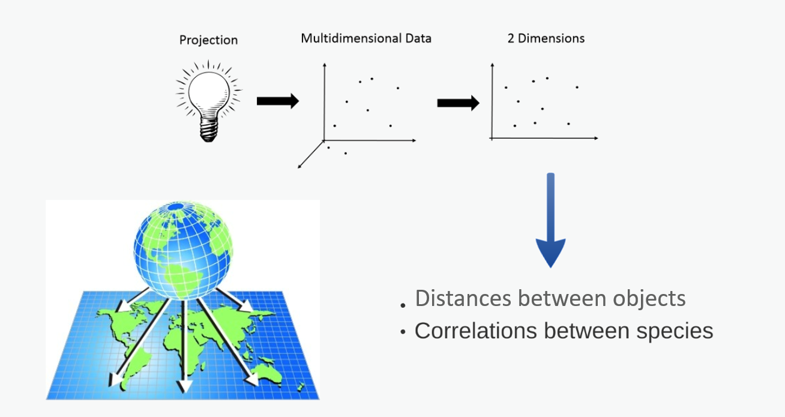
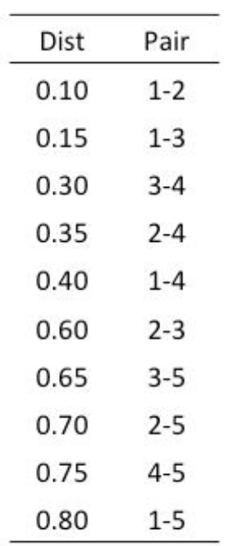
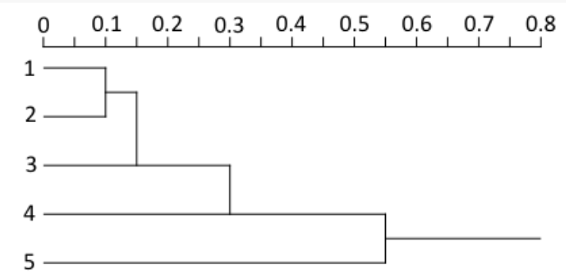
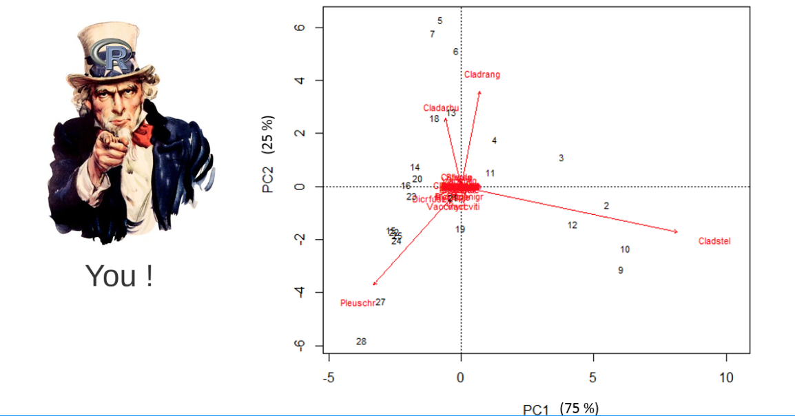

class: inverse, center, middle

```{r setup, echo = FALSE, message=FALSE, warning=FALSE, include = FALSE}
library(knitr)

## Setup for your presentation
knitr::opts_chunk$set(
  eval = TRUE,
  cache = TRUE,
  comment = "#",
  collapse = TRUE,
  warning = FALSE,
  message = FALSE,
  fig.width = 5, fig.height = 5, fig.retina = 3,
  fig.align = 'center'
)

options(repos = structure(
  c(CRAN = "http://cran.r-project.org")
  )
  )

# Install xaringanExtra

if(nzchar(system.file(package = "xaringanExtra")) == FALSE) {remotes::install_github("gadenbuie/xaringanExtra", upgrade = "always", quiet = TRUE)}

# Include copy-to-clipboard icons

htmltools::tagList(
  xaringanExtra::use_clipboard(
    button_text = "<i class=\"fas fa-clipboard\"></i>",
    success_text = "<i class=\"fa fa-check\" style=\"color: #90BE6D\"></i>",
    error_text = "<i class=\"fa fa-times-circle\" style=\"color: #F94144\"></i>"
  ),
  rmarkdown::html_dependency_font_awesome()
)
```

```{r install_pkgs, message=FALSE, warning=FALSE, include=FALSE, results=0}
# Standard procedure to check and install packages and their dependencies, if needed.

list.of.packages <- c("ape", "gclus", "vegan", "GGally", "PlaneGeometry", "remotes")

new.packages <- list.of.packages[!(list.of.packages %in% installed.packages()[,"Package"])]

if(length(new.packages) > 0) {
  install.packages(new.packages, dependencies = TRUE) 
  print(paste0("The following package was installed:", new.packages)) 
} else if(length(new.packages) == 0) {
    print("All packages were already installed previously")
}

# Load all required libraries at once
lapply(list.of.packages, require, character.only = TRUE, quietly = TRUE)
```

# À propos de cet atelier

[](https://github.com/QCBSRworkshops/workshop09)
[](https://wiki.qcbs.ca/r_workshop9)
[](https://qcbsrworkshops.github.io/workshop09/pres-fr/workshop09-pres-fr.html)
[](https://qcbsrworkshops.github.io/workshop09/pres-fr/workshop09-pres-fr.pdf)
[](https://qcbsrworkshops.github.io/workshop09/book-fr/workshop09-script-fr.R)


---

<p style="font-size:75%">

.center[
**Contributeurs et contributrices au développement de cet atelier**

en modifiant et en améliorant son contenu dans le cadre du <br>Prix d'apprentissage et du développement (*Le*arning *a*nd *D*evelopment *A*ward*).
]

.pull-left[
.right[

 **2022** - **2021** - **2020**

[Pedro Henrique P. Braga]()

[Katherine Hébert]()

[Mi Lin]()

[Linley Sherin]()

]
]

.pull-right[
.left[
**2019** - **2018** - **2017**

[Gabriel Muñoz](https://github.com/fgabriel1891)

[Marie Hélène-Brice]()

[Pedro Henrique P. Braga]()

<br>

**2016** - **2015** - **2014**

[Bérenger Bourgeois]()

[Xavier Giroux-Bougard]()

[Amanda Winegardner]()

[Emmanuelle Chrétien]()

[Monica Granados]()

]
]
</p>

---
<p style="font-size:75%">

.center[
**Contributeurs et contributrices au développement de cet atelier**

en modifiant et en améliorant son contenu dans le cadre du <br> Prix d'apprentissage et de développement (*Le*arning *a*nd *D*evelopment *A*ward)
]


.pull-left[
.right[

 **2022** - **2021** - **2020**


]
]

.pull-right[
.left[
**2019** - **2018** - **2017**


**2016** - **2015** - **2014**


]

]
</p>

---

# Matériel requis

Pour suivre cet atelier, vous devez avoir téléchargé et installé les dernières versions de [RStudio](https://rstudio.com/products/rstudio/download/#download) et de [R](https://cran.rstudio.com/).

.pull-left[
Vous devez également avoir installé ces paquets:
* [ape](https://cran.r-project.org/package=ape)
* [gclus](https://cran.r-project.org/package=gclus)
* [vegan](https://cran.r-project.org/package=vegan)
* [GGally](https://cran.r-project.org/package=GGally)
* [PlaneGeometry](https://cran.r-project.org/package=PlaneGeometry)
* [remotes](https://cran.r-project.org/package=remotes)

]

.pull-right[


Pour les installer à partir de CRAN, roulez:

```{r eval = FALSE}
install.packages(c("ape", 
                   "gclus", 
                   "vegan",
                   "GGally", 
                   "PlaneGeometry", 
                   "remotes"))
```
]


<br>

.pull-left2[
Au cours de cet atelier, il y aura une série de **défis** que vous pouvez reconnaître par ce cube de Rubix.

**Pendant ces défis, n'hésitez pas à collaborer!**
]

.pull-right2[

.center[


]
]

---
# Objectifs d'apprentissage

**Apprendre les bases de l'analyse multivariée pour découvrir des patrons dans les données de composition des communautés.

**2.** Utiliser `R` pour effectuer une ordination sans contrainte.

**3.** Choisir les mesures de distance et les transformations appropriées pour effectuer une analyse multivariée.

* Analyse de regroupement
* Analyse en composantes principales (ACP)
* Analyse en coordonnées principales (ACoP)
* Échelle multidimensionnelle non métrique (PMnM).

**4.** Utilisez `R` pour créer un dendrogramme.

---

class: inverse, center, middle

# 1. Introduction
## Qu'est-ce que l'ordination?

---
# Une dimension

Imaginons que nous voulons mieux comprendre cette réponse pour différentes espèces d'algues impliquées dans la densité de l'efflorescence algale ?

.center[]


---
# Deux dimensions

.center[]

---
# Trois dimensions

.center[
]


---
# 4, 5, 6, ou plus de dimensions

.center[]

<br>

.center[ **?** ]

???

En écologie, plusieurs descripteurs sont généralement observés pour chaque objet étudié. Dans la plupart des cas, les écologistes sont intéressés par la caractérisation des principales tendances de variation des objets par rapport à tous les descripteurs, et pas seulement à quelques-uns d'entre eux. L'examen des diagrammes de dispersion des objets par rapport à toutes les paires possibles de descripteurs est une approche fastidieuse, qui n'apporte généralement pas beaucoup de lumière sur le problème à résoudre.
Même avec une approche multivariée, il n'est pas possible de dessiner un tel diagramme sur un papier à plus de trois dimensions, même s'il s'agit d'une construction mathématique parfaitement valable.

---

# Ordination en espace réduit

.center[]

- L'ordination est la représentation d'objets (sites, stations, relevés, etc.) sous forme de données ponctuelles le long d'un ou plusieurs axes de référence.

- L'ordination répond à la problématique de la projection de la dispersion des objets écologiques, qui sont situés dans l'espace multidimensionnel des descripteurs, dans un plus petit nombre de dimensions. 

- Espace réduit : espace dont la dimensionnalité est réduite par rapport à l'ensemble des données d'origine.

???

Ref: https://doi.org/10.1016/B978-0-444-53868-0.50009-5

---

# Ordination en espace réduit


.center[]

- Pour les besoins d'analyses, les écologistes projettent la dispersion multidimensionnelle de l'espace multidimensionnel en un nombre plus restreint de dimensions de descripteurs. 

- Les axes représentent une grande fraction de la variabilité de la matrice de données multidimensionnelle.

???
Proposition de scénario : Pour les besoins de leur étude, les écologistes projettent généralement le diagramme de dispersion multidimensionnel sur des graphiques bivariés dont les axes sont connus pour leur intérêt particulier. Les axes de ces graphiques sont choisis pour représenter une grande partie de la variabilité de la matrice de données multidimensionnelle, dans un espace de dimensionnalité réduite (c'est-à-dire plus faible) par rapport à l'ensemble de données original. Les méthodes d'ordination dans un espace réduit permettent également d'obtenir des informations quantitatives sur la qualité des projections, et d'étudier les relations entre les descripteurs ainsi qu'entre les objets.

---
exclude: true

# Méthodes pour la recherche scientifique

- **Questions / Hypothèses**
- **Design expérimental**
- **Collecte de données**
- **Transformation / Distance**
- **Analyses**
- **Rédaction**
- **Communication**

---
class: inverse, center, middle
# 2. Exploration des données

---
# Données de poissons de la rivière Doubs

.pull-left[

Données de Verneaux (1973) :
- caractérisation des communautés de poissons
- 27 espèces
- 30 sites
- 11 variables environnementales

]

.pull.right[

]

---
# Données de poissons de la rivière Doubs

Chargement des données espèces (`doubsspe.csv`)

```{r}
spe <- read.csv("data/doubsspe.csv", row.names = 1) # cette ligne dépend d'où vous avez enregistré les données
spe <-  spe[-8,] # supprimer le site sans données

# pour des plus grands jeux de données:
row_sub = apply(spe, 1, function(row) any(row !=0 ))
# trouver les lignes où il n'y a aucun zéro
spe <- spe[row_sub,]
# garder les lignes qui n'ont aucun zéro  
```

Chargement des données environnementales (`doubsenv.csv`)

```{r}
env <- read.csv("data/doubsenv.csv", row.names = 1)
env <- env[-8,] # supprimer le site vide
```

.alert[Attention, n'exécuter qu'une seule fois]


---
# Exporation des données

Explorer le contenu des données espèces :

```{r, eval = FALSE}
names(spe) # noms des objets
dim(spe) # dimensions
str(spe) # structure des objets
summary(spe) # résumé statistique
head(spe) # 6 premières lignes
```

```{r, echo = FALSE}
head(spe) # 6 premières lignes
```

---
# Fréquences des espèces

Observer la distribution de fréquence des espèces :

```{r, fig.width=8, echo = -1}
par(mar = c(4,4,.5,.5), cex = 1.5)
ab <- table(unlist(spe))
barplot(ab, las = 1, col = grey(5:0/5),
        xlab = "Abondance des classes", ylab = "Fréquence")
```

.alert[Notez la proportion de 0]

---
# Fréquences des espèces

Combien de zéros?

```{r}
sum(spe == 0)
```

Quelle proportion de zéros?

```{r}
sum(spe == 0)/(nrow(spe)*ncol(spe))
```

---
# Richesse totale en espèce

Observer le nombre d'espèces présentes dans chaque site :

```{r, fig.width=10, fig.height=5, echo=-1}
par(mar = c(4,4,1,.5), cex = 1.5)
site.pre <- rowSums(spe > 0)
barplot(site.pre, main = "Richesse spécifique",
        xlab = "Sites", ylab = "Nombre d'espèces",
        col = "grey ", las = 1)
```

---
# Comprenez vos données!

.center[...pour choisir la transformation et la distance appropriée]


- Y-a-t-il beaucoup de zéros?

- Que veulent-ils dire?


.alert[Une mesure de 0 (e.g 0mg/L, 0°C) n'est pas équivalent à un 0 représentant une absence d'observation.]


---
# Avant de transformer vos données de composition des communautés...

.alert[Considérations importantes:]

--
- abondances/comptes/présence-absence relatives?

--
- distributions asymmétriques ?

--
- beaucoup d'espèces rares?

--
- surabondance d'espèces dominantes?

--
- problème de double Zéro?

---
# Transformer les données de composition des communautés

.center[
]

---
# Transformer les données de composition des communautés

## Exemples

Transformer des comptes en présence - absence
```{r}
library(vegan)
spec.pa <- decostand(spe, method = "pa")
```

Réduire le poids des espèces rares

```{r}
spec.hel <- decostand(spe, method = "hellinger")
spec.chi <- decostand(spe, method = "chi.square")
```

Réduire le poids des espèces abondantes

```{r}
spe.pa <- decostand(spe, method = "log")
```

---
# Données sur l'environnement

```{r, eval = FALSE}
names(env) # Names of objects
dim(env) # dimensions
str(env) # structure of objects
summary(env) # summary statistics
head(env) # first 6 rows
```

```{r}
head(env) # first 6 rows
```

Explorer la colinéarité en visualisant les corrélations entre les variables:

```{r, eval = F, purl = FALSE}
library(GGally)
ggpairs(env, main="Bivariate Plots of the Environmental Data")
```

---
# Données sur l'environnement

```{r, echo = F, fig.align='center', fig.height = 8, fig.width = 10}
library(GGally)
ggpairs(env, main="Graphiques bivariés des données environnementales")
```

---
# Standardisation

Standardiser les variables environnementales est indispensable car il est impossible de comparer des variables d'unités différentes :

```{r, eval = -1}
?decostand
env.z <- decostand(env, method = "standardize")
```

<Br>
Cette fonction centre-réduit les données pour assurer la fiabilité des analyses:

```{r}
apply(env.z, 2, mean)
apply(env.z, 2, sd)
```


---
class: inverse, center, middle
# 3. Similarité / Dissimilarité


---
# Mesure d'association

L'algébre matricielle est au coeur de plusieurs méthodes d'analyses multivariées

$$
\begin{bmatrix}
    a_{1,1} & a_{1,2} & a_{1,3} & \dots  & a_{1,n} \\
    a_{2,1} & a_{2,2} & a_{2,3} & \dots  & a_{2,n} \\
    a_{3,1} & a_{3,2} & a_{3,3} & \dots  & a_{3,n} \\
    \vdots & \vdots & \vdots & \ddots & \vdots \\
    a_{m,1} & a_{m,2} & a_{m,3} & \dots  & a_{m,n}
\end{bmatrix}
$$

- Explorer différentes mesures de distance entre objets permet de mieux comprendre le fonctionnement de l'ordination

???
.center[]
---
# Au-délà de la 1ère dimension

.pull-left[

- Les jeux de données écologiques correspondent souvent à de grandes matrices.

- L'ordination calcule les relations entre espèces, ou entre objets.

- Ces relations peuvent être simplifiées par des mesures de dissimilarités.
]

.pull-right[


]


---
# Similarité / Dissimilarité

- Utile pour comprendre vos données
- Certains types d'ordination ou de groupement nécessitent des mesures appropriées

.center[
Similarité: S = 1 - D
Distance: D = 1-S]


---
# Mesures de distance des communautés

.pull-left[
- **Euclidienne**  
  $d_{jk} = \sqrt(\sum((x_{ij}-x_{ik})^2))$  
  Utilisé en PCA et RDA.
  <br><br>
- **Manhattan**
  $d_{jk} = \sum(abs(x_{ij} - x_{ik}))$  
  Similaire à l'Euclidienne, mais sensible au problème de doubles zéros.
  <br><br>
- **Corde**  
  Distance Euclidienne calculée pour une matrix standardisée par rangées.
  <br><br>
]

.pull-right[
- **Hellinger**  
  Racines carrées de probabilités conditionnelles.  
  S'exécute bien en ordination linéaire.
  <br><br>
- **Khi-carré**  
  $d_{jk} = \sum(\frac{(x_{ij}-x_{ik})^2}{(x_{ij}+x_{ik})} ) / 2$   
  Utilisé en CA.
  <br><br>
- **Bray-Curtis** (Semimétrique) 
  $d_{jk} = \frac{\sum(abs(x_{ij}-x_{ik}))}{(\sum (x_{ij}+x_{ik}))}$  
  Utilisé en PCoA et NMDS.
]
<br>
.center[

*Où $x_{ij}$ $x_{ik}$ sont le nombre d'espèces (colonnes) $i$ dans les sites (rangées) $j$ et $k$.*]

--

.alert[Chacune de ces distances peut être appropriée pour différentes situations.]

???
Notes: Ref: 
https://sites.google.com/site/mb3gustame/reference/dissimilarity
Euclidienne : Une métrique simple et symétrique utilisant la formule de Pythagore. Plus il y a de variables dans un ensemble de données, plus on peut s'attendre à ce que les distances euclidiennes soient grandes. En plus, les doubles zéros entraînent une diminution des distances. Cette propriété rend la distance euclidienne inadaptée à de nombreux ensembles de données écologiques et des transformations à motivation écologique doivent être envisagées.  L'analyse en composantes principales et l'analyse de la redondance ordonnent les objets en utilisant les distances euclidiennes.

---
# Comparaison des sites de la rivière Doubs

La fonction `vegdist()` comprend les mesures de distances communes :

```{r, eval = FALSE}
?vegdist
```
Comment la composition des communautés diffère-t-elle entre les 30 sites de la rivière Doubs?

```{r}
spe.db.pa <- vegdist(spe, method = "bray")
spe.db <- as.matrix(spe.db.pa)

#         1         2         3         4         5         6         7         9
# 1  0.0000000 0.6000000 0.6842105 0.7500000 0.8918919 0.7500000 0.6842105 1.0000000
# 2  0.6000000 0.0000000 0.1428571 0.3333333 0.6956522 0.3939394 0.1428571 0.6923077
# 3  0.6842105 0.1428571 0.0000000 0.1891892 0.6800000 0.2972973 0.1250000 0.7333333
#...

```

--
<br>  
- La diagonale est composée de zéros (chaque site est comparée à lui-même).  
- Sites 3 et 7 sont les plus similaires (*plus petite distance*).  
- Sites 1 et 9 sont les plus dissimilaires (1 = *complètement* dissimilaire).

---
exclude: true

# Comparaison des sites

.center[]

---
exclude: true 

# Comparaison des sites

.center[]

---
# Visualisation d'une matrice de distances

```{r, echo = FALSE}
# coldiss() function
# Color plots of a dissimilarity matrix, without and with ordering
#
# License: GPL-2 
# Author: Francois Gillet, 23 August 2012
#

"coldiss" <- function(D, nc = 4, byrank = TRUE, diag = FALSE)
{
	require(gclus)

	if (max(D)>1) D <- D/max(D)

	if (byrank) {
		spe.color <- dmat.color(1-D, cm.colors(nc))
	}
	else {
		spe.color <- dmat.color(1-D, byrank=FALSE, cm.colors(nc))
	}

	spe.o <- order.single(1-D)
	speo.color <- spe.color[spe.o, spe.o]
	
	op <- par(mfrow=c(1,2), pty="s")

	if (diag) {
		plotcolors(spe.color, rlabels=attributes(D)$Labels, 
			main="Dissimilarity Matrix", 
			dlabels=attributes(D)$Labels)
		plotcolors(speo.color, rlabels=attributes(D)$Labels[spe.o], 
			main="Ordered Dissimilarity Matrix", 
			dlabels=attributes(D)$Labels[spe.o])
	}
	else {
		plotcolors(spe.color, rlabels=attributes(D)$Labels, 
			main="Dissimilarity Matrix")
		plotcolors(speo.color, rlabels=attributes(D)$Labels[spe.o], 
			main="Ordered Dissimilarity Matrix")
	}

	par(op)
}

# Usage:
# coldiss(D = dissimilarity.matrix, nc = 4, byrank = TRUE, diag = FALSE)
# If D is not a dissimilarity matrix (max(D) > 1), then D is divided by max(D)
# nc 							number of colours (classes)
# byrank= TRUE		equal-sized classes
# byrank= FALSE		equal-length intervals
# diag = TRUE			print object labels also on the diagonal

# Example:
# coldiss(spe.dj, nc=9, byrank=F, diag=T)
```


```{r, fig.width = 10, fig.height = 8}
# Le code pour créer la fonction coldiss() est dans le script de l'atelier.
coldiss(spe.db.pa)
```


---
# Défi #1 

<br/>

Discuter en groupes:

<br/>

.center[**Comment savoir si deux objets caractérisés par des données multidimensionnelles sont similaires?**]

<br/>

- Faites une liste de vos suggestions


---
# Et qu'en est-il de l'ordination?

Avec des méthodes d'ordination, nous ordonnons vos objets (sites) en fonction de leur similarité

- Plus les sites sont similaires, plus ils sont proches dans l'espace d'ordination (plus petites distances)

- En écologie, on calcule habituellement la similarité entre sites en fonction de leur composition en espèces ou de leur conditions environnementales.


---
# Analyse schématique des analyses multivariées

.center[]

???
Note: re-added the picture, rename it as Schema 2.

---
# Groupement

- Permet de mettre en lumière des structures dans les données en partitionnant les objets

- Les résultats sont représentés sous forme de dendrogramme (arbre)

- Pas une méthode statistique!

```{r, fig.width=10, echo = FALSE}
# Démonstration d'un dendrogramme
spe.hel<-decostand(spe, method="hellinger")
spe.dhel<-vegdist(spe.hel,method="euclidean")
spe.dhel.ward<-hclust(spe.dhel, method="ward.D2")
spe.dhel.ward$height<-sqrt(spe.dhel.ward$height)
plot(spe.dhel.ward, hang=-1) # hang=-1 aligns all objets on the same line
```

???
.center[
]

---
# Aperçu de 3 méthodes hiérarchiques

<br>

**1.** Groupement agglomératif à liens simples ("single").

<br>

**2.** Liens complets, groupement agglomératif ("complete")

<br>

**3.** Groupement à variance minimale de Ward ("ward.D2")

<br>

Les éléments de rang(s) inférieur(s) sont imbriqués dans des clusters de rang supérieur. Par exemple, les espèces sont regroupées par genre, famille, ordre, et ainsi de suite.

???
Dans le clustering agglomératif à liens simples (également appelé tri par plus proches voisins), les objets à l'emplacement de l'objet sont classés par ordre de priorité et les objets les plus proches s'agglomèrent.
Ceci génère souvent de longues et fines grappes ou chaînes d'objets. À l'inverse, dans le clustering agglomératif à liens complets, un objet ne s'agglomère à un groupe que lorsqu'il est lié à l'élément le plus éloigné du groupe, qui le lie à son tour à tous les membres de ce groupe. Il formera de nombreux petits groupes séparés, et est plus approprié pour rechercher des contrastes, des discontinuités dans les données.
Le clustering à variance minimale de Ward diffère de ces deux méthodes en ce que
elle regroupe les objets en groupes en utilisant le critère des moindres carrés
(similaire aux modèles linéaires). Son dendogramme montre par défaut les distances au carré. Pour comparer avec les autres méthodes, calculez d'abord la racine carrée des distances. 

---
# Groupement hiérarchique

À partir d'une matrice de distances, on classe les objets en ordre croissant


---
# Groupement à liens simples

.pull-left[


--

]

.pull-right[

- Les deux objets les plus proches se regroupent

- Ensuite les deux objets les plus proches suivants

- et ainsi de suite.



]

---
# Groupement à liens complet

.pull-left[


]

.pull-right[

- Les deux objets les plus proches se regroupent

- Ensuite les groupes se lient à la distance à laquelle les objets qu'ils contiennent sont tous liés


]


---
# Comparaison

Créer une matrice de distance à partir des données de la rivière Doubs transformées Hellinger et faire le groupement à liens simples :

```{r, fig.width=7, echo = -1}
par(mar=c(.5,3.8,2,.5), cex = 1.5)
spe.dhe1 <- vegdist(spec.hel, method = "euclidean")
spe.dhe1.single <- hclust(spe.dhe1, method = "single")
plot(spe.dhe1.single)
```

---
# Comparaison

```{r,fig.width= 15, echo = -1}
par(mfrow=c(1,2), mar=c(.5,2.5,1.5,2.5), cex=1)
spe.dhe1 <- vegdist(spec.hel, method = "euclidean")
spe.dhe1.complete <- hclust(spe.dhe1, method = "complete")
plot(spe.dhe1.single, main="Single linkage clustering", hang =-1)
plot(spe.dhe1.complete, main="Complete linkage clustering", hang=-1)
```

.pull-left[

**Liens simples :**

Les objets ont tendance à s'enchaîner (e.g. 19,29,30,26).
]

.pull-right[

**Liens complets :**  

Les groupes sont plus distincts.
]

---
# Groupement de Ward

Le groupement de Ward utilise la méthode des moindres carrés pour lier les objets.
- Les groupes fusionnent de façon à minimiser la variance intragroupe.
- C'est-à-dire qu'à chaque étape, la paire de groupes qui résulte à la plus petite augmentation de la somme des carrés des écarts intra-groupes est celle qui fusionne.


---
# Groupement de Ward

Faire le groupement de Ward et dessiner le dendrogramme en utilisant la racine carrée des distances :

```{r, fig.width=9, echo = -1}
par(mar=c(.5,3.8,2,.5), cex = 1.5)
spe.dhel.ward <- hclust(spe.dhe1, method = "ward.D2")
spe.dhel.ward$height <- sqrt(spe.dhel.ward$height)
plot(spe.dhel.ward, hang = -1) # hang = -1 aligns objects at the same level
```

---
# Groupement de Ward

```{r, fig.width=9, echo = FALSE}
par(mar=c(.5,3.8,2,.5), cex = 1.5)
plot(spe.dhel.ward, hang = -1) # hang = -1 permet d'afficher les objets sur la même ligne
```

Les objets ont tendance à former des groupes plus homogènes (en termes du nombdre d'objets inclus dans chaque groupe).

---
# Comment choisir la bonne méthode ?

- Choisir une méthode appropriée dépend de votre objectif.
  - Démontrer des gradients? des contrastes?
- Si plus d'une méthode semble adéquate, comparer les dendrogrammes.
- Encore une fois : ceci **n'est pas** une méthode statistique! 

Mais, le groupement permet de:
- Déterminer un nombre de groupes optimal.
- Faire des tests statistiques sur le groupement résultant.
- Combiner le groupement à l'ordination pour distinguer des groupes de sites.

---

#### Et maintenant ?

Alors que l'**analyse de regroupements** remonte les *discontinuités* dans un ensemble de données, l'**ordination** extrait les principales tendances sous la forme d'axes continus.

Nous allons examiner maintenant trois types de **méthodes d'ordination sans contrainte**...

--

.right[...**attendez**, qu'est-ce qu'on entend par **ordination sans contrainte** ? *Quelqu'un* ?]

--
<br>
.center[*Si personne ne s'exprime, choisissez une personne "volontaire" !*]

--

**Les ordinations non contraintes** évaluent les relations chez un seul ensemble de variables. *Aucune tentative* n'est faite pour définir la relation entre un ensemble de variables indépendantes et une ou plusieurs variables dépendantes.

--

L'interprétation des effets potentiels d'autres facteurs sur les patrons observés ne peut se faire qu'indirectement, car ces facteurs ne sont *pas* explicitement inclus dans les analyses !

--

Ici, nous allons explorer :
.small[
.center[
.pull-left2[
**A**nalyse des **C**omposants **P**rincipales 

**A**nalyse des **Co**ordonnées **P**rincipales
]

.pull-right2[
**É**chelonnement **M**ultidimensionnel **N**on-**M**étrique
]
]
]


---
### Mais d'abord, faisons un *récapitulatif*...

Nous avons déjà compris la signification de **variance** et **moyenne**, et comment les calculer :


.pull-left[
$$\sigma_x^2 = \frac{\sum_{i=1}^{n}(x_i - \mu)^2} {n}$$
]

.pull-right[
$$\mu_x = \frac{1}{n} \sum_{i=i}^{n} x_{i}$$
]

Elles sont très utiles pour comprendre le *centre* et la *dispersion* d'une variable ou d'une dimension donnée.

Néanmoins, nous sommes souvent intéressés **par plus d'une dimension**, et nous voulons mesurer dans quelle mesure chaque dimension varie de la moyenne *par rapport aux autres*.

--

La **covariance** est une telle mesure, qui peut décrire comment **deux dimensions co-varient** :

.pull-left[
$$var_x = \sigma_x^2 = \frac{\sum_{i=1}^{n}(x_i - \mu)^2} {n}$$
]

.pull-right[
$$cov_{x,y}=\frac{\sum_{i=1}^{N}(x_{i}-\bar{x})(y_{i}-\bar{y})}{N-1}$$
]

---

### Mais d'abord, faisons un *récapitulatif*...

Intuitivement, nous pouvons mesurer la **covariance** entre plus de deux variables. Disons, entre les variables $x$, $y$, et $z$ :

.pull-left[
$$cov_{x,y}=\frac{\sum_{i=1}^{N}(x_{i}-\bar{x})(y_{i}-\bar{y})}{N-1}$$
]

.pull-right[
$$cov_{x,z}=\frac{\sum_{i=1}^{N}(x_{i}-\bar{x})(z_{i}-\bar{z})}{N-1}$$
]

$$cov_{z,y}=\frac{\sum_{i=1}^{N}(z_{i}-\bar{z})(y_{i}-\bar{y})}{N-1}$$
Nous pouvons représenter ces calculs dans une **matrice de covariance** :

$${C(x, y, z)} = \left[ \begin{array}{ccc} 
cov_{x,x} & cov_{y,x} & cov_{z,x} \\
cov_{x,y} & cov_{y,y} & cov_{z,y} \\
cov_{x,z} & cov_{y,z} & cov_{z,z}   
\end{array} \right]$$

--

**QUIZ TIME**: *Que sont les diagonales ?* *Et, que se passe-t-il si les variables sont indépendantes ?*

---

##### Toujours en train de *récapituler*...

.center[***Que sont les diagonales ?***]

Si, $cov_{x,y}=\frac{\sum_{i=1}^{N}(x_{i}-\bar{x})(y_{i}-\bar{y})}{N-1}$, alors:

$$cov_{x,x}=\frac{\sum_{i=1}^{N}(x_{i}-\bar{x})(x_{i}-\bar{x})}{N} = \frac{\sum_{i=1}^{n}(x_i - \bar{x})^2} {N} = var_x$$
--

Afin que :

$${C(x, y, z)} = \left[ \begin{array}{ccc} 
cov_{x,x} & cov_{y,x} & cov_{z,x} \\
cov_{x,y} & cov_{y,y} & cov_{z,y} \\
cov_{x,z} & cov_{y,z} & cov_{z,z}   
\end{array} \right] = \left[ \begin{array}{ccc} 
var_{x} & cov_{y,x} & cov_{z,x} \\
cov_{x,y} & var_{y} & cov_{z,y} \\
cov_{x,z} & cov_{y,z} & var_{z}   
\end{array} \right]$$

 <br>
 
.center[La covariance d'une variable avec elle-même est sa *variance* !]

---

##### Toujours en train de *récapituler*...

.center[***Que se passe-t-il si les variables sont indépendantes ?***]

.pull-left[
```{r xyz-norm, echo=TRUE}
x <- rnorm(5000, mean = 0, sd = 1)
y <- rnorm(5000, mean = 0, sd = 1)
z <- rnorm(5000, mean = 0, sd = 1)

xyz <- data.frame(x, y, z)

GGally::ggpairs(xyz) 
```
]

--

.pull-right[
```{r xyz-cov, echo=TRUE, eval = FALSE}
cov(xyz)
```

```{r xyz-cov-2, echo=FALSE, eval = TRUE}
round(cov(xyz), digits = 5)
```

Si les variables sont parfaitement indépendantes (ou non corrélées), la matrice de covariance $C(x, y, z)$ est :

$${C(x, y, z)} =  \left[ \begin{array}{ccc} 
var_{x} & 0 & 0 \\
0 & var_{y} & 0 \\
0 & 0 & var_{z}   
\end{array} \right]$$

*i*.*e*. une covariance plus proche de $1$ signifie que les variables sont *colinéaires*.

Et ici, $var_{x} = var_{y} = var_{z} = 1$.

]

---
## Transformations linéaires

Nous sommes souvent intéressés à l'observation des variables d'autres *formes*. 

Pour cela, nous créons une nouvelle variable, disons $x_{new}$, en utilisant des constantes pour modifier la variable originale $x$. Par exemple :

--

.pull-left[
On peut transformer des distances mesurées en kilomètres $d_{km}$ en miles :
$$d_{mi} = 0.62 \times d_{km}$$
]

.pull-right[
On peut aussi transformer des degrés Fahrenheit en degrés Celsius : 

$$T_{C} = 0.5556\times T_{Fahr} - 17.778$$
]

Ces exemples sont des **transformations linéaires** car les variables transformées sont liées linéairement aux variables d'origine et les formes de la distribution ne sont pas modifiées.

--

Deux types de transformations sont très importantes pour nous :

.pull-left[
**Centrage**, qui soustrait les valeurs d'un prédicteur de la moyenne :

$$x' = x_i - \bar{x}$$
]

.pull-right[
**Réduction**, qui divise chaque valeur d'une variable par son écart-type:

$$x'' = \frac{x_i}{\sigma_x}$$
]

??? 

Le centrage est essentiellement une technique où la moyenne des variables indépendantes est soustraite de toutes les valeurs. Cela signifie que toutes les variables indépendantes ont une moyenne nulle. La réduction est complementaire au centrage. Les variables prédictives sont divisées par leur écart type.

Le présentateur doit mentionner ici que le centrage amène la moyenne à zéro et la mise à l'échelle amène l'écart type à une unité. Ils doivent également mentionner que les variables deviennent comparables lors de la mise à l'échelle, car leur unité est perdue.

---

### Décomposition des matrices en éléments propres

**Les matrices carrées**, telles que la **matrice de covariance**, peuvent être décomposées en *valeurs propres* et en *vecteurs propres*.

Pour une matrice carrée, $A_{n \times n}$, un vecteur $v$ est un *vecteur propre* de $A$ s'il y a un *scalaire*, $\lambda$, pour lequel :

.center[ 
$A_{n \times n} v_{n \times 1} = \lambda  v_{n \times 1}$, or $\left(\begin{matrix}a_{11}&\cdots&a_{1n}\\\vdots&\ddots&\vdots\\a_{1n}&\cdots&a_{nn}\\\end{matrix}\right)\left(\begin{matrix}v_1\\\vdots\\v_n\\\end{matrix}\right)=\lambda\left(\begin{matrix}v_1\\\vdots\\v_n\\\end{matrix}\right)$ 
]

la valeur de $\lambda$ étant la *valeur propre* correspondante.

--

C'est-à-dire que la matrice $A$ *étire* effectivement le vecteur propre $v$ par la quantité spécifiée par la valeur propre (*scalaire*) $\lambda$.

Un *vecteur propre* est un vecteur dont la direction reste inchangée lorsqu'on lui applique une **transformation linéaire**.

<br>

.center[Attendez ! Qu'entendons-nous par *direction inchangée* ?]

---

### Décomposition des matrices en éléments propres

.center[Attendez ! Qu'entendons-nous par *direction inchangée* ?]

<br>

Représentons cela avec cet exemple simple.

Nous pouvons transformer un carré en un parallélogramme à l'aide d'une **transformation affine** à axe unique.

--

.pull-left[
Soit $S$ le carré de vertices $(0,0),\,(1,0),\,(1,1),\,(1,0)$ qui sera transformé par cisaillement en parallélogramme $P$ de vertices $(0,0),\,(1,0),\,(1,1.57),\,(1,0.57)$.

Nous pouvons voir qu'après la transformation linéaire, la flèche violette n'a pas changé de direction, c'est-à-dire qu'elle est un *vecteur propre* de $S$.

En revanche, la flèche rouge a changé de direction, et *n'est donc pas* un *vecteur propre* de $S$.
]

.pull-right[
```{r echo = FALSE}
library(PlaneGeometry)

P <- c(0, 0) 
w <- c(1, 0) 

ratio <- 1 
angle <- 30

shear <- Shear$new(P, 
                   w, 
                   ratio, 
                   angle)

wt <- ratio * c(-w[2], w[1])

Q <- P + w
R <- Q + wt
S <- P + wt
A <- shear$transform(P)
B <- shear$transform(Q)
C <- shear$transform(R)
D <- shear$transform(S)


plot(0, 0, type = "n", asp = 1, xlim = c(0,1), ylim = c(0,2))

lines(rbind(P, Q, R, S, P), 
      lwd = 2) # unit square

lines(rbind(A, B, C, D, A), 
      lwd = 2, 
      col = "blue") # image by the shear

arrows(x0 = A[1], 
       y0 = A[2], 
       x1 = B[1],
       y1 = B[2],
       col = "red",
       lwd = 2)

arrows(x0 = A[1], 
       y0 = A[2], 
       x1 = D[1],
       y1 = D[2],
       col = "purple",
       lwd = 2)
```
]

---

##### Décomposition des matrices en éléments propres : implications

.center[
*Suivons avec la torture algébrique !* 
]

### Orthogonalité

Une propriété *fabuleuse* et *simple* des matrices *symétriques* que nous pouvons expliquer ici !

.pull-left[
Supposons que $x$ soit un vecteur propre de $A$ correspondant à la valeur propre $λ_1$ et $y$ un vecteur propre de $A$ correspondant à la valeur propre $λ_2$, avec $λ_1≠λ_2$.

$$Ax=\lambda_1x \\
Ay=\lambda_2y$$

Multiplions chacun d'eux par l'autre *vecteur propre* transposé.
$$y^{\intercal}Ax=\lambda_1y^{\intercal}x \\ x^{\intercal}A^{\intercal}y=\lambda_2x^{\intercal}y$$

]

--

.pull-right[

Maintenant, soustrayons la deuxième équation de la première et utilisons la commutativité du produit scalaire :

$y^{\intercal}Ax-x^{\intercal}A^{\intercal}y=\lambda_1y^{\intercal}x - \lambda_2x^{\intercal}y \\ 0 = (\lambda_1 - \lambda_2)y^{\intercal}x$

Parce que nous savons que $\lambda_1-\lambda_2\neq 0$, alors 
$y^{\intercal}x = 0$, *c-*.*à*.*-d*., $\mathbf{x}\perp\mathbf{y}$, *c-*.*à*.*-d*. sont **orthogonaux** !

*Alors, que révèle la décomposition de la matrice de variance-covariance en elements propres ?*
]

???

L'explication de cette partie est très utile et assez simple, afin que chacun puisse comprendre ce qu'est l'orthogonalité. Il s'agit d'opérations simples d'équations et de soustractions.  

---
##### Décomposition des matrices en éléments propres : implications

.center[
*Suivons avec la torture algébrique !* 
]

### Maximisation

.pull-left[
Si $v_i' v_i = 1$, alors $Av_i=\lambda_iv_i$ peut être écrite comme :
$$v_i' A v_i = \lambda_i$$
En effet, $v' A v$ 
est la variance d'une combinaison linéaire avec des poids en $v$, *i*.*e*. $\text{Var}(v_i'\,A)=v_i'\,\text{Var}(A)\,v_i$.

*Donc, on peut relier les points !*

]

--

.pull-right[
Rappelez-vous que les *valeurs propres* de notre *matrice de variance-covariance* $A$ sont directement liées à la variance !

Pour trouver un vecteur $v$ qui maximise la variance, $v' A v$, il suffit de choisir le *vecteur propre* correspondant à la plus grande *valeur propre* $\lambda_i$ !

De sorte que la variance maximale soit de $\lambda_1$ !
]

--

La *variance expliquée* de chaque *vecteur propre* obéit à l'ordre : $\lambda_1 > \lambda_2 > \dots > \lambda_k$.

Cela nous permet de condenser un plus grand nombre de variables originales en un ensemble plus petit de vecteurs sélectionnés avec une perte minimale d'informations (c'est-à-dire **une réduction de la dimensionnalité**).

---
# Méthodes d'ordination sans contrainte

Ceci est un bon point de départ pour nous mettre sur la voie des **méthodes d'ordination sans contrainte** que nous allons étudier aujourd'hui !

.pull-left[
Ils nous permettent de :
- Évaluer les relations *dans* un ensemble de variables (espèces ou variables environnementales);
- Trouver les composantes clés de la variation entre les échantillons, les sites, les espèces ;
- Réduire le nombre de dimensions dans les données multivariées tout en limitant la perte substantielle d'informations ;
- Créer de nouvelles variables à utiliser dans des analyses ultérieures.
]

.pull-right[
Ici, nous apprendrons :

1. **P**rincipal **C**omponent **A**nalysis;

2. **P**rincipal **Co**ordinate **A**nalysis;

3. **N**on-Metric **M**ulti**d**imensional **S**caling;
]
---
# Analyse en Composantes Principales

.small[
L'analyse en composantes principales (ACP) est une technique de réduction de la dimensionnalité *linéaire*, c'est-à-dire qu'elle réduit les données fortement corrélées.

En bref, l'ACP transforme *linéairement* des variables originales vers des nouvelles variables contenant des **composantes principales**, qui expliquent la plupart de la variance dans l'ensemble de données, c'est-à-dire qui maximisent la séparation entre les données.
]

--
.pull-left[

.small[L'espace des *composants principaux* peut être écrit comme suit :]

$$Z_p = ∑_{j=1}^p ϕ_j * X_j$$
]
.small[
où, 
1. $Z_p$ est la composante principale $p$ ;
2. $ϕ_j$ est le vecteur de charge comprenant les $j$ charges pour la composante principale $p$, c'est-à-dire les coefficients de la combinaison linéaire des variables originales à partir desquelles les composantes principales sont construites ;
3. $X_j$ est le prédicteur normalisé, c'est-à-dire avec une moyenne égale à zéro et un écart-type égal à un.
]

???

C'est-à-dire que la reconstruction des données peut être donnée par une simple combinaison linéaire des composantes.


Les futures versions de ce document devraient inclure une figure (telle qu'une carte thermique) avec les données normalisées originales sur le côté gauche, et sur le côté droit, une carte thermique des chargements fois une carte thermique des composants (qui peut être considérée comme égale à la somme des matrices de rang un) étant égale à la carte thermique des données reconstruites.

---
# Analyse en Composantes Principales

L'ACP peut être calculée d'au moins *quatre* façons différentes.

Pour des raisons de simplicité, nous nous concentrerons ici sur la façon d'obtenir des composantes principales à partir d'une matrice de corrélation.

Nous apprendrons à le faire à partir de rien, puis à utiliser les paquets `R` pour calculer les composantes principales.

---

### Analyse en composantes principales : étape par étape

.pull-left3[
1. Point de départ : une matrice $Y$ de $n$ observations et $p$ variables continues normalement distribuées ;
]

.pull-right3[
Dans `R`, à partir de zéro !

```{r}
data(varechem)

str(varechem)
```

]

---

#### Analyse en composantes principales : étape par étape

.pull-left3[
1. Point de départ : une matrice $Y$ de $n$ observations et $p$ variables continues normalement distribuées ;
]

.pull-right3[
Dans `R`, à partir de zéro !

```{r}
data(varechem)

# Étape 1 
Y <- varechem[, 1:2]

head(Y)
```

]

---
#### Analyse en composantes principales : étape par étape

.pull-left3[
1. Point de départ : une matrice $Y$ de $n$ observations et $p$ variables continues normalement distribuées ;

2. Normalisation des observations, comme dans $Y_{std} = \frac{y_i - \bar{y}}{\sigma_y}$ ; ce qui revient à centrer, comme dans $y_c = [y_i - \bar{y}]$, puis à mettre à l'échelle, comme dans $y_s = \frac{y_i}{\sigma_y}$ ;
]

.pull-right3[
Dans `R`, à partir de zéro !

```{r}
data(varechem)

# Étape 1 
Y <- varechem[, 1:2]

# Étape 2
Y_std <- as.matrix(scale(Y))

head(Y_std)

round(apply(Y_std, 2, mean))
round(apply(Y_std, 2, sd))

```

]

---

#### Analyse en composantes principales : étape par étape

.pull-left3[
1. Point de départ : une matrice $Y$ de $n$ observations et $p$ variables continues normalement distribuées ;

2. Normalisation des observations, comme dans $Y_{std} = \frac{y_i - \bar{y}}{\sigma_y}$ ; ce qui revient à centrer, comme dans $y_c = [y_i - \bar{y}]$, puis à mettre à l'échelle, comme dans $y_s = \frac{y_i}{\sigma_y}$ ;

3. Calculer la matrice de variance-covariance $R = cov(Y_{std})$ ;
]

.pull-right3[
Dans `R`, à partir de zéro !

```{r}
data(varechem)

# Étape 1 
Y <- varechem[, 1:2]

# Étape 2
Y_std <- as.matrix(scale(Y))

# Étape 3
(Y_R <- cov(Y_std))
```
]

---

#### Analyse en composantes principales : étape par étape

.pull-left3[
1. Point de départ : une matrice $Y$ de $n$ observations et $p$ variables continues normalement distribuées ;

2. Normalisation des observations, comme dans $Y_{std} = \frac{y_i - \bar{y}}{\sigma_y}$ ; ce qui revient à centrer, comme dans $y_c = [y_i - \bar{y}]$, puis à mettre à l'échelle, comme dans $y_s = \frac{y_i}{\sigma_y}$ ;

3. Calculer la matrice de variance-covariance $R = cov(Y_{std})$ ;

4. Effectuer la décomposition de la matrice de covariance pour obtenir la matrice $U$ des vecteurs propres, contenant les *composantes principales* ;
]

.pull-right3[
Dans `R`, à partir de zéro !

```{r}
data(varechem)

# Étape 1
Y <- varechem[, 1:2]

# Étape 2
Y_std <- as.matrix(scale(Y))

# Étape 3
Y_R <- cov(Y_std)

# Étape 4
(Eigenvalues <- eigen(Y_R)$values)

(Eigenvectors <- eigen(Y_R)$vectors)
```
]

---

### Analyse en composantes principales : étape par étape

Les *vecteurs propres* sont ici les **composantes principales**, et comme nous l'avons vu, à chaque *vecteur propre* correspond une *valeur propre*.

.pull-left[

Nous pouvons représenter les distances des observations au premier vecteur propre (`PC1`, en rouge).

La première composante principale est dessinée de façon à ce que la variation des valeurs le long de sa ligne soit maximale. 

Les flèches sur les composantes principales sont obtenues en multipliant leurs *valeurs propres* par les *vecteurs propres*.
]

.pull-right[
```{r echo=FALSE}
Eigenvectors. <- as.data.frame(Eigenvectors)
row.names(Eigenvectors.) <- c("P", "N")
colnames(Eigenvectors.) <- c("PC1", "PC2")
Eigenvectors.[, 1] <- Eigenvectors.[, 1]*-1
Y_std <- as.data.frame(Y_std)

plot(N ~ P, 
     col = as.factor(rownames(Y_std)), 
     main="Distances to PC1", 
     pch = 19, 
     xlim=c(-2.2, 2.2), 
     ylim = c(-2.2,2.2), 
     data = as.data.frame(Y_std))

abline(v=0 , h=0, 
       col = "dark gray")

#Overlap pertinent evectors

abline(0, 
       Eigenvectors[2, 1]/Eigenvectors[1, 1],
       col='purple')
# abline(0, 
#        Eigenvectors[1, 2]/Eigenvectors[2, 2],
#        col='orange')

arrows(x0 = 0, 
       y0 = 0, 
       x1 = Eigenvalues[1]*Eigenvectors[1, 1],
       y1 = Eigenvalues[1]*Eigenvectors[2, 1],
       col = "purple",
       lwd = 2)

# arrows(x0 = 0, 
#        y0 = 0, 
#        x1 = Eigenvalues[2]*Eigenvectors[1,2], 
#        y1 = Eigenvalues[2]*Eigenvectors[2, 2],
#        col = "orange", 
#        lwd = 2)

# Plot the lines from first evector to points

line1 <- c(0, 
           Eigenvectors[2, 1]/Eigenvectors[1, 1])

perp.segment.coord <- function(x0, y0, line1){
  #finds endpoint for a perpendicular segment from the point (x0,y0) to the line1
  a <- line1[1]  #intercept
  b <- line1[2]  #slope
  x1 <- (x0 + b * y0 - a * b)/(1 + b^2)
  y1 <- a + b * x1
  list(x0 = x0, y0 = y0, 
       x1 = x1, y1 = y1)
}

ss <- perp.segment.coord(Y_std$P, 
                         Y_std$N, 
                         line1)
# do.call(segments, ss)
# which is the same as:

segments(x0 = ss$x0, 
         x1 = ss$x1, 
         y0 = ss$y0, 
         y1 = ss$y1, 
         col = 'purple')

points(N ~ P, 
       col = as.factor(rownames(Y_std)), 
       pch = 19,
       data = Y_std)
with(Y_std,
     text(N ~ P, 
          labels = as.factor(rownames(Y_std)),
                     pos = 1, 
          cex=1.4))
```
]

???

Dans cette première représentation, nous pouvons observer qu'une première direction (ou la première composante linéaire) est tracée en essayant de maximiser la variance des données.

Les participants peuvent vous demander en quoi cela est différent d'une régression linéaire. L'une des principales différences réside dans la façon dont les carrés d'erreurs sont minimisés perpendiculairement à la ligne droite (90 degrés, ce qui la rend orthogonale), alors que dans la régression linéaire, les carrés d'erreurs sont minimisés dans la direction des ordonnées.

---

### Analyse en composantes principales : étape par étape

Les *vecteurs propres* sont ici les **composantes principales**, et comme nous l'avons vu, à chaque *vecteur propre* correspond une *valeur propre*.

.pull-left[
Nous pouvons alors représenter les distances des observations au deuxième vecteur propre (`PC2`, en orange).

La deuxième composante principale est également dessinée en maximisant la variance des données.

Notez comment les composantes principales sont orthogonales !
]

.pull-right[

```{r echo = FALSE}
Eigenvectors. <- as.data.frame(Eigenvectors)
row.names(Eigenvectors.) <- c("P", "N")
colnames(Eigenvectors.) <- c("PC1", "PC2")
Eigenvectors.[, 1] <- Eigenvectors.[, 1]*-1
Y_std <- as.data.frame(Y_std)

plot(N ~ P, 
     col = as.factor(rownames(Y_std)), 
     main="Distances to PC2", 
     pch = 19, 
     xlim=c(-2.2, 2.2), 
     ylim = c(-2.2,2.2), 
     data = as.data.frame(Y_std))

abline(v=0 , h=0, 
       col = "dark gray")

#Overlap pertinent evectors

abline(0, 
       Eigenvectors[2, 1]/Eigenvectors[1, 1],
       col='purple')
abline(0, 
       Eigenvectors[1, 2]/Eigenvectors[2, 2],
       col='orange')

arrows(x0 = 0, 
       y0 = 0, 
       x1 = Eigenvalues[1]*Eigenvectors[1, 1],
       y1 = Eigenvalues[1]*Eigenvectors[2, 1],
       col = "purple",
       lwd = 2)

arrows(x0 = 0, 
       y0 = 0, 
       x1 = Eigenvalues[2]*Eigenvectors[1,2], 
       y1 = Eigenvalues[2]*Eigenvectors[2, 2],
       col = "orange", 
       lwd = 2)


line2 <- c(0, 
           Eigenvectors[1, 2]/Eigenvectors[1, 1])

perp.segment.coord <- function(x0, y0, line2){
  a <- line2[1]  #intercept
  b <- line2[2]  #slope
  x1 <- (x0 + b * y0 - a * b)/(1 + b^2)
  y1 <- a + b * x1
  list(x0 = x0, y0 = y0, 
       x1 = x1, y1 = y1)
}

ss <- perp.segment.coord(Y_std$P, 
                         Y_std$N, 
                         line2)

segments(x0 = ss$x0, 
         x1 = ss$x1, 
         y0 = ss$y0, 
         y1 = ss$y1, 
         col = 'orange')

points(N ~ P, 
       col = as.factor(rownames(Y_std)), 
       pch = 19,
       data = Y_std)

with(Y_std,
     text(N ~ P, 
          labels = as.factor(rownames(Y_std)),
                     pos = 1, 
          cex=1.4)
     )
```

]

--
.pull-left[
*Nous avons représenté les vecteurs propres, c'est-à-dire les composantes principales !* 

*Mais, quelle est l'utilité des valeurs propres ?*
]

???

Ici, la deuxième direction (ou la deuxième composante linéaire) est tracée de manière à ce que la variance des données soit maximisée par rapport à cette deuxième composante.

---

#### Analyse en composantes principales : étape par étape

Nous avons vu que les *valeurs propres* représentent la magnitude (la variance) des composantes principales.

.pull-left[
En fait, la somme de toutes les *valeurs propres* est égale à la somme des variances, qui sont représentées sur la diagonale de la matrice de variance-covariance.
]

.pull-right[
```{r}
sum(diag(cov(Y_std)))
sum(eigen(cov(Y_std))$values)
```
]

--

Intuitivement, on peut obtenir l'influence relative de chaque *vecteur propre* $v_{k}$ (ou $\text{PC}_{k}$) en divisant leurs valeurs par la somme de toutes les *valeurs propres*.

$$\text{Variance expliquée de}~v_{k} = \frac{\lambda_{v_k}}{\sum^p_{i=1}{\lambda_{v}}}$$

En faisant cela, nous pouvons dire que le $\text{PC}1$ explique `r round(eigen(cov(Y_std))$values[1]/sum(eigen(cov(Y_std))$values) * 100)`% de la variance dans les données, tandis que $\text{PC}2$ explique `r round(eigen(cov(Y_std))$values[2]/sum(eigen(cov(Y_std))$values) * 100)`% de la variance.

--

Enfin, nous pouvons procéder à la dernière étape de notre analyse des composantes principales !

---

#### Analyse en composantes principales : étape par étape

.pull-left3[
1. Point de départ : une matrice $Y$ de $n$ observations et $p$ variables continues normalement distribuées ;

2. Normalisation des observations, comme dans $Y_{std} = \frac{y_i - \bar{y}}{\sigma_y}$ ; ce qui revient à centrer, comme dans $y_c = [y_i - \bar{y}]$, puis à mettre à l'échelle, comme dans $y_s = \frac{y_i}{\sigma_y}$ ;

3. Calculer la matrice de variance-covariance $R = cov(Y_{std})$ ;

4. Effectuer la décomposition de la matrice de covariance pour obtenir la matrice $U$ des vecteurs propres, contenant les *composantes principales* ;

5. Obtenir la *matrice des coordonnées* $F$ en multipliant $U$ par la matrice normalisée $Y_{std}$.
]

.pull-right3[
En `R`, à partir de zéro !

```{r}
# Étape 1 
Y <- varechem[, 1:2]

# Étape 2
Y_std <- as.matrix(scale(Y))

# Étape 3
Y_R <- cov(Y_std)

# Étape 4 
Eigenvalues <- eigen(Y_R)$values
Eigenvectors <- eigen(Y_R)$vectors

# Étape 5
F_PrComps <- Y_std %*% Eigenvectors
head(F_PrComps)
```
]

---

### Analyse en composantes principales : étape par étape

La *matrice des coordonnées*, $F$, (objet `F_PrComps`) permet de *rotationner* le nouvel espace de données, afin qu'il soit représenté par rapport aux composantes principales.

.pull-left[
.center[ 
$\text{N}$ ~ $\text{P}$ 
]

```{r echo=FALSE, fig.height = 6.5, fig.width = 3.5}
Eigenvectors. <- as.data.frame(Eigenvectors)
row.names(Eigenvectors.) <- c("P", "N")
colnames(Eigenvectors.) <- c("PC1", "PC2")
Eigenvectors.[, 1] <- Eigenvectors.[, 1]*-1
Y_std <- as.data.frame(Y_std)

op <- par(mfrow = c(2, 1),     # 2x2 layout
    oma = c(2, 2, 0, 0), # two rows of text at the outer left and bottom margin
    mar = c(1, 1, 0, 0), # space for one row of text at ticks and to separate plots
    mgp = c(2, 1, 0)    # axis label at 2 rows distance, tick labels at 1 row
    )       

plot(N ~ P, 
     col = as.factor(rownames(Y_std)),
     pch = 19, 
     xlim=c(-2.2, 2.2), 
     ylim = c(-2.2,2.2), 
     data = as.data.frame(Y_std))

abline(v=0 , h=0, 
       col = "dark gray")

#Overlap pertinent evectors

abline(0, 
       Eigenvectors[2, 1]/Eigenvectors[1, 1],
       col='purple')
# abline(0, 
#        Eigenvectors[1, 2]/Eigenvectors[2, 2],
#        col='orange')

arrows(x0 = 0, 
       y0 = 0, 
       x1 = Eigenvalues[1]*Eigenvectors[1, 1],
       y1 = Eigenvalues[1]*Eigenvectors[2, 1],
       col = "purple",
       lwd = 2)

# arrows(x0 = 0, 
#        y0 = 0, 
#        x1 = Eigenvalues[2]*Eigenvectors[1,2], 
#        y1 = Eigenvalues[2]*Eigenvectors[2, 2],
#        col = "orange", 
#        lwd = 2)

# Plot the lines from first evector to points

line1 <- c(0, 
           Eigenvectors[2, 1]/Eigenvectors[1, 1])

perp.segment.coord <- function(x0, y0, line1){
  a <- line1[1]  #intercept
  b <- line1[2]  #slope
  x1 <- (x0 + b * y0 - a * b)/(1 + b^2)
  y1 <- a + b * x1
  list(x0 = x0, y0 = y0, 
       x1 = x1, y1 = y1)
}

ss <- perp.segment.coord(Y_std$P, 
                         Y_std$N, 
                         line1)
# do.call(segments, ss)
# which is the same as:

segments(x0 = ss$x0, 
         x1 = ss$x1, 
         y0 = ss$y0, 
         y1 = ss$y1, 
         col = 'purple')

points(N ~ P, 
       col = as.factor(rownames(Y_std)), 
       pch = 19,
       data = Y_std)
with(Y_std,
     text(N ~ P, 
          labels = as.factor(rownames(Y_std)),
                     pos = 1, 
          cex=1.4))


plot(N ~ P, 
     col = as.factor(rownames(Y_std)),
     pch = 19, 
     xlim=c(-2.2, 2.2), 
     ylim = c(-2.2,2.2), 
     data = as.data.frame(Y_std))

abline(v=0 , h=0, 
       col = "dark gray")

#Overlap pertinent evectors

abline(0, 
       Eigenvectors[2, 1]/Eigenvectors[1, 1],
       col='purple')
abline(0, 
       Eigenvectors[1, 2]/Eigenvectors[2, 2],
       col='orange')

arrows(x0 = 0, 
       y0 = 0, 
       x1 = Eigenvalues[1]*Eigenvectors[1, 1],
       y1 = Eigenvalues[1]*Eigenvectors[2, 1],
       col = "purple",
       lwd = 2)

arrows(x0 = 0, 
       y0 = 0, 
       x1 = Eigenvalues[2]*Eigenvectors[1,2], 
       y1 = Eigenvalues[2]*Eigenvectors[2, 2],
       col = "orange", 
       lwd = 2)


line2 <- c(0, 
           Eigenvectors[1, 2]/Eigenvectors[1, 1])

perp.segment.coord <- function(x0, y0, line2){
  a <- line2[1]  #intercept
  b <- line2[2]  #slope
  x1 <- (x0 + b * y0 - a * b)/(1 + b^2)
  y1 <- a + b * x1
  list(x0 = x0, y0 = y0, 
       x1 = x1, y1 = y1)
}

ss <- perp.segment.coord(Y_std$P, 
                         Y_std$N, 
                         line2)

segments(x0 = ss$x0, 
         x1 = ss$x1, 
         y0 = ss$y0, 
         y1 = ss$y1, 
         col = 'orange')

points(N ~ P, 
       col = as.factor(rownames(Y_std)), 
       pch = 19,
       data = Y_std)

with(Y_std,
     text(N ~ P, 
          labels = as.factor(rownames(Y_std)),
                     pos = 1, 
          cex=1.4)
     )

title(xlab = "N",
      ylab = "P",
      outer = TRUE, line = 3)

par(op)
```
]

.pull-right[
.center[ 
$\text{PC}1$ ~ $\text{PC}2$ 
]

```{r echo=FALSE, fig.height = 6.5, fig.width = 3.5}
score <- as.data.frame(F_PrComps)

colnames(score) <- c("PC1", "PC2")

op <- par(mfrow = c(2, 1),     # 2x2 layout
          oma = c(2, 2, 0, 0), # two rows of text at the outer left and bottom margin
          mar = c(1, 1, 0, 0), # space for one row of text at ticks and to separate plots
          mgp = c(2, 1, 0)    # axis label at 2 rows distance, tick labels at 1 row
)


plot(PC2 ~ PC1, 
     col = as.factor(rownames(score)), 
     pch = 19, 
     xlim = c(-2.2, 2.2), ylim = c(-2.2,2.2), xlab='PC1', ylab='PC2',data = score)

abline(h = 0, col = 'purple')
abline(v = 0, col='orange')


perp.segment.horiz <- function(x0, y0){
  x1 <- x0
  y1 <- 0
  list(x0 = x0, y0 = y0, x1 = x1, y1 = y1)
}

ss1 <- perp.segment.horiz(score[,1], score[,2])

segments(x0 = ss1$x0, x1 = ss1$x1, y0 = ss1$y0, y1 = ss1$y1, col='purple')


points(PC2 ~ PC1, col=as.factor(rownames(score)), pch = 19, xlab='V1', ylab='V2',data=score)
with(score,text(PC2 ~ PC1, labels=as.factor(rownames(score)), pos = 3, cex=1.4))


plot(PC2 ~ PC1, col=as.factor(rownames(score)), 
     pch = 19, xlim=c(-2.2, 2.2), ylim = c(-2.2,2.2),
     xlab='PC1', ylab='PC2',data=score)

abline(h = 0, col = 'purple')
abline(v = 0, col ='orange')


perp.segment.vert <- function(x0, y0){
  x1 <- 0
  y1 <- y0
  
  list(x0 = x0, y0 = y0, x1 = x1, y1 = y1)
}

ss1a <- perp.segment.vert(score[,1], score[,2])
segments(x0 = ss1a$x0, x1 = ss1a$x1, y0 = ss1a$y0, y1 = ss1a$y1, col='orange')


points(PC2 ~ PC1, col=as.factor(rownames(score)), pch = 19, xlab='V1', ylab='V2',data=score)

with(score,text(PC2 ~ PC1, labels=as.factor(rownames(score)), pos = 3, cex=1.4))

title(xlab = "PC1",
      ylab = "PC2",
      outer = TRUE, 
      line = 3)

par(op)
```
]

???
Les titres des axes ne se font pas imprimer. Je les ai inclus en haut de chaque graphique, mais ce problème n'est pas résolu.

Le présentateur ou la présentatrice devrait souligner la rotation et parler de ce que sont les points. Vous pouvez survoler les points et leur montrer quelle était la position des points dans les graphiques " sans rotation ", et maintenant dans les graphiques " avec rotation ", en soulignant que maintenant, les " nouveaux axes " sont PC1 et PC2.

Cette compréhension sera utile lorsque les participants utiliseront les fonctions PCA implémentées dans R.

---

### Analyse en composantes principales : étape par étape

L'ACP peut aussi être calculée en utilisant les fonctions `stats::prcomp()`, `stats::princomp()`, `vegan::rda()`, et `ade4::dudi.pca()`.

.pull-left[
.right[Comment notre ACP faite maison se compare à]

```{r}
data(varechem)

Y <- varechem[, 1:2] 
Y_std <- as.matrix(scale(Y))
Y_R <- cov(Y_std)

Eigenvalues <- eigen(Y_R)$values
Eigenvectors <- eigen(Y_R)$vectors

F_PrComps <- Y_std %*% Eigenvectors

head(F_PrComps)
```
]

.pull-right[
<br>
`stats::prcomp()`?
```{r}
PCA_prcomp <- prcomp(Y, 
                     center = TRUE, 
                     scale = TRUE)

# or PCA_prcomp <- prcomp(Y_std)

head(PCA_prcomp$x)
```
]

---

### Analyse en composantes principales : étape par étape

L'ACP peut aussi être calculée en utilisant les fonctions `stats::prcomp()`, `stats::princomp()`, `vegan::rda()`, et `ade4::dudi.pca()`.

.pull-left[
.right[Comment notre ACP faite maison se compare à]

```{r}
data(varechem)

Y <- varechem[, 1:2] 
Y_std <- as.matrix(scale(Y))
Y_R <- cov(Y_std)

Eigenvalues <- eigen(Y_R)$values
Eigenvectors <- eigen(Y_R)$vectors

F_PrComps <- Y_std %*% Eigenvectors

head(F_PrComps)
```
]

.pull-right[
<br>
`stats::princomp()` ?
```{r}
PCA_princomp <- princomp(Y_std)

head(PCA_princomp$scores)
```
]

---

### Analyse en composantes principales : étape par étape

L'ACP peut aussi être calculée en utilisant les fonctions `stats::prcomp()`, `stats::princomp()`, `vegan::rda()`, et `ade4::dudi.pca()`.

.pull-left[
.right[Comment notre ACP faite maison se compare à]

```{r}
data(varechem)

Y <- varechem[, 1:2] 
Y_std <- as.matrix(scale(Y))
Y_R <- cov(Y_std)

Eigenvalues <- eigen(Y_R)$values
Eigenvectors <- eigen(Y_R)$vectors

F_PrComps <- Y_std %*% Eigenvectors

head(F_PrComps)
```
]

.pull-right[
<br>
`vegan::rda()` ?
```{r}
PCA_vegan_rda <- rda(Y_std)

scores(PCA_vegan_rda, 
       display = "sites", 
       scaling = 1,
       choices = seq_len(PCA_vegan_rda$CA$rank),
       const = sqrt(PCA_vegan_rda$tot.chi * (nrow(PCA_vegan_rda$CA$u) - 1)))[1:5, ]
```

`vegan::rda()` utilise des mises à l'échelle alternatives. Vous pouvez étudier la `vignette("decision-vegan")`.
]

???

Dites aux participants que le nom `rda` fait référence à un type différent de technique d'ordination sous contrainte, mais que si nous exécutons `rda()` avec une seule variable, il exécutera une ACP.

---

# Analyse en composantes principales

Nous avons implémenté l'ACP sur un ensemble de données à deux variables pour plus de simplicité.

Avançons et appliquons-la à notre jeu de données sur les espèces de poissons.


Pour cela, nous allons utiliser la fonction `vegan::rda()` sur les données de poissons *transformées par Hellinger* et résumer les résultats :

```{r}
spe.h.pca <- rda(spec.hel)

# summary(spe.h.pca)
```

---

# Analyse en composantes principales

.pull-left[
Les premières lignes de `summary.rda()` nous renseignent sur la *variance totale* et la *variance sans contrainte* de notre modèle.
]

.pull-right[

```{r echo=FALSE}
paste(capture.output(summary(spe.h.pca))[5:8])
```
]

--

.pull-left2[

```{r echo=FALSE}
paste(capture.output(summary(spe.h.pca))[c(12:16, 21:24)])
```

]

.pull-right2[

Viennent ensuite les *valeurs propres*, et leur contribution à la variance.


En fait, si nous additionnons toutes nos *valeurs propres*, nous obtiendrons la quantité de variance sans contrainte expliquée par l'analyse !

```{r}
sum(spe.h.pca$CA$eig)
```

]

???

Puisque nous n'avons pas contraint notre ordination, la variance proportionnelle non contrainte est égale à la variance totale.

Prenez un moment pour expliquer la proportion expliquée, et montrez que la proportion cumulée sera égale à 1 au 27ème PC.

---

# Analyse en composantes principales

Les informations suivantes sont liées à la *mise à l'échelle* (`scaling`), aux *scores d'espèces*, et aux *scores de sites*.

```{r echo=FALSE}
paste(capture.output(summary(spe.h.pca))[c(26:29, 31:32, 34:40, 63:64, 66:72)])
```
]

---

# Analyse en composantes principales

.pull-left[
`Species` fait référence à vos descripteurs (c'est-à-dire les colonnes de votre ensemble de données), qui sont ici les espèces de poissons.

`Scores` font référence à la position de chaque espèce le long des composantes principales.
]

.pull-right[
```{r echo=FALSE}
paste(capture.output(summary(spe.h.pca))[c(32, 34:40)])
```
]

--


.pull-left2[
```{r echo=FALSE}
paste(capture.output(summary(spe.h.pca))[c(64, 66:72)])
```
]

.pull-right2[
`Sites` représentent les lignes de votre jeu de données, qui sont ici les différents sites le long de la rivière *Doubs*.
]

--

<br>

.pull-left[
Cette information peut être obtenue avec la fonction `score()`:
]

.pull-right[

```{r, eval = FALSE, echo = TRUE}
scores(spe.h.pca,
       display = "species" or "sites")
```

]

---
### Analyse en composantes principales : condensation des données

Nous avons 27 composantes principales. Cependant, nous pouvons appliquer des algorithmes pour sélectionner le plus petit nombre de composantes principales qui rendent encore compte d'une grande variance dans les données.

--

#### Critère de Kaiser-Guttman

.pull-left[
Nous pouvons sélectionner les composantes principales qui capturent plus de variance que l'explication moyenne de toutes les composantes principales. Nous le faisons en

1. Extraire les *valeurs propres* associées aux composantes principales ;

2. Sélectionner les *valeurs propres* au-dessus de la *valeur propre* moyenne :

```{r}
ev <- spe.h.pca$CA$eig
# ev[ev > mean(ev)]
```
]

.pull-right[
```{r, echo = -1, fig.width=10, fig.height = 5.5}
par(mar=c(4,4,2.5,.5), cex = 1.5)
n <- length(ev)
barplot(ev, main = "Eigenvalues", col = "grey", las = 2)
abline(h = mean(ev), col = "red3", lwd = 2)
legend("topright", "Average eigenvalue",
       lwd = 2, col = "red3" , bty = "n")
```
]

---
### Analyse en composantes principales : condensation des données

Nous avons 27 composantes principales. Cependant, nous pouvons appliquer des algorithmes pour sélectionner le plus petit nombre de composantes principales qui rendent encore compte d'une grande variance dans les données.

#### Modèle *broken-stick*

.pull-left[
Le modèle *broken-stick* retient les composantes qui expliquent plus de variance que ce qui serait attendu en divisant aléatoirement la variance en $p$ parties.

```{r}
head(bstick(spe.h.pca))
```
]

.pull-right[
```{r, echo = TRUE, fig.width=4.5, fig.height = 4.5}
screeplot(spe.h.pca, 
          bstick = TRUE, type = "lines")
```
]

---
## Analyse en composantes principales 

Il ne reste plus qu'à discuter de la *mise à l'échelle* et à *visualiser* nos résultats.

Pratiquons et calculons une ACP sur les variables environnementales standardisées pour le même ensemble de données.

```{r}
env.pca <- rda(env.z)
# summary(env.pca, scaling  = 2)
```

--

Déterminons notre ensemble de *valeurs propres* et leurs *vecteurs propres* correspondants :

.pull-left[
```{r}
ev <- env.pca$CA$eig
```

```{r}
ev[ev>mean(ev)]
```
]

--

.pull-right[
```{r, echo = FALSE, fig.width=8, fig.height = 5}
par(mar=c(4,4,2.5,.5), cex = 1.5)
n <- length(ev)
barplot(ev, main = "Eigenvalues", col = "grey", las = 2)
abline(h = mean(ev), col = "red3", lwd = 2)
legend("topright", "Average eigenvalue",
       lwd = 2, col = "red3" , bty = "n")
```
]

---

# Analyse en composantes principales : `plot()`

L'information calculée par l'ACP peut être représentée par des *biplots*.

Nous pouvons produire un biplot rapide de l'ACP en utilisant la fonction `plot()` en base `R`.

```{r, echo = -1}
par(mar=c(4,4, 0.1,0.1), cex = 1.5)
plot(spe.h.pca)
```


---

# Analyse en composantes principales : `plot()`


`biplot()` de `base` `R` permet une meilleure interprétation.

.pull-left2[
```{r, echo = -1, fig.height=6, fig.width=6.5}
par(mar = c(4,4,0.05,0.05), cex = 1.2)
biplot(spe.h.pca)
```
]

.pull-right2[

Les flèches sont tracées pour montrer la directionnalité et l'angle des descripteurs dans l'ordination.

Les descripteurs situés à 180 degrés les uns des autres sont corrélés négativement ;

Les descripteurs situés à 90 degrés l'un de l'autre ont une corrélation nulle ;

Les descripteurs situés à 0 degré l'un de l'autre sont positivement corrélés.

]

---
# Analyse en composantes principales : *mise à l'échelle*

.small[
*Mise à l'échelle de type 2* (`scaling = 2`, défaut) : les distances entre les objets ne sont pas des approximations des distances euclidiennes ; les angles entre les vecteurs des descripteurs (espèces) reflètent leurs corrélations.
]

.small[
*Mise à l'échelle de type 1* (`scaling = 1`) : tente de préserver la distance euclidienne (dans un espace multidimensionnel) entre les objets (sites) : les angles entre les vecteurs des descripteurs (espèces) ne sont pas pertinents.
]

.pull-left[
```{r, echo = -1, fig.height=3.5, fig.width=4.5}
par(mar = c(4,4,0.05,0.05), cex = 1.2)
biplot(spe.h.pca, scaling = 1)
```
]

.pull-right[
```{r, echo = -1, fig.height=3.5, fig.width=4.5}
par(mar = c(4,4,0.05,0.05), cex = 1.2)
biplot(spe.h.pca, scaling = 2)
```
]

???
2 : **Meilleur pour l'interprétation des relations entre les descripteurs (espèces)**.


1 : **Meilleur pour l'interprétation des relations entre les objets (sites)!**

---
# Défi # 3 

En utilisant tout ce que vous avez appris, calculez une ACP sur les données d'abondance des espèces d'acariens.

```{r}
data(mite)
```

Soyez prêt à discuter et à répondre :
- Quelles sont les composantes principales *les plus pertinentes*, c'est-à-dire les sous-ensembles ?
- Quels groupes de sites pouvez-vous identifier ?
- Quels groupes d'espèces sont liés à ces groupes de sites ?

---

# Solution #3

Calculer l'ACP sur les données d'espèces transformées par Hellinger.

```{r}
mite.spe.hel <- decostand(mite, 
                          method = "hellinger")

mite.spe.h.pca <- rda(mite.spe.hel)
```

--

.pull-left[
Appliquer le critère de Kaiser-Guttman

```{r, eval = F}
ev <- mite.spe.h.pca$CA$eig
ev[ev>mean(ev)]
n <- length(ev)
barplot(ev, main = "Eigenvalues", 
        col = "grey", las = 2)
abline(h = mean(ev),
       col = "red3", lwd = 2)
legend("topright", 
       "Average eigenvalue", 
       lwd = 2, 
       col = "red3", bty = "n")
```
]

.pull-right[
```{r, echo = F, fig.width=5, fig.height=4}
par(mar=c(4,4,2,1), cex = 1.2)
ev <- mite.spe.h.pca$CA$eig
n <- length(ev)
barplot(ev, main = "Eigenvalues", 
        col = "grey", las = 2)
abline(h = mean(ev),
       col = "red3", lwd = 2)
legend("topright", 
       "Average eigenvalue", 
       lwd = 2, col = "red3", 
       bty = "n")
```
]

---
# Solution #3

```{r, echo = -1, fig.height=6.5, fig.width=7}
par(mar = c(4,4,0.05,0.05), cex = 1.5)
biplot(mite.spe.h.pca, 
       col = c("red3", "grey15"))
```

---
# Analyse des coordonnées principales

La **ACoP** (*PCoA*, en anglais) est similaire dans son esprit à l'ACP, mais elle prend des *dissimilarités* comme données d'entrée ! 

Elle vise à représenter fidèlement les distances avec l'espace dimensionnel le plus bas possible.

Elle commence par le (i) calcul d'une matrice de distance pour les $p$ éléments, puis (ii) le centrage de la matrice par lignes et colonnes, et enfin, la (iii) *decomposition* de la matrice de distance centrée en éléments propres.

--

Pour calculer une ACoP, nous pouvons utiliser les fonctions `cmdscale()` ou `pcoa()` des paquets `stats` et `ape` :

```{r}
library(ape)
spe.h.pcoa <- pcoa(dist(spec.hel))
summary(spe.h.pcoa)
```

---

# Analyse des coordonnées principales

```{r}
head(spe.h.pcoa$values)
```

---

# Analyse des coordonnées principales

Nous pouvons également voir les *vecteurs propres* associés à chaque *valeur propre* contenant les coordonnées dans l'espace euclidien pour chaque site.


```{r}
head(spe.h.pcoa$vectors)[, 1:5]
```

---

# Analyse des coordonnées principales : `biplot.pcoa()`

Nous pouvons afficher les distances entre les sites en utilisant la fonction `biplot.pcoa()`, ainsi que représenter les espèces associées à chaque site.

```{r, fig.height=5.5, fig.width=8}
biplot.pcoa(spe.h.pcoa, spec.hel)
```

---

##### Analyse des coordonnées principales : distances non métriques

La ACoP peut également être utilisée pour capturer les informations contenues dans les distances non métriques, telles que la populaire distance de Bray-Curtis. Essayons :


.pull-left[
```{r}
spe.bray.pcoa <- pcoa(spe.db.pa)
```

```{r}
spe.bray.pcoa$values$Eigenvalues
```
]

.pull-right[
Notez les valeurs propres négatives ! 

Cela est dû au fait que les distances non métriques ne peuvent pas être représentées dans l'espace euclidien sans corrections (*voir* Legendre & Legendre 2012 pour plus de détails à ce sujet) :

```{r}
spe.bray.pcoa <- pcoa(spe.db.pa, 
                      correction = "cailliez")
```
]

---
##### Analyse des coordonnées principales : distances non métriques

.pull-left[

Les valeurs propres corrigées sont maintenant sur une nouvelle colonne !

```{r}
spe.bray.pcoa$values$Corr_eig
```

]

.pull-right[
Utilisez un biplot sans les espèces pour la représenter !

```{r, fig.width=6, fig.height=5.5, echo = -1}
par(mar=c(3,3,.5,1), cex = 1.2)
biplot.pcoa(spe.bray.pcoa)
```

]

---
# Défi #5 

Calculez une ACoP sur les données d'abondance des espèces d'acariens transformées par Hellinger.

Soyez prêt à répondre :

- Quels sont les *vecteurs propres* et les *valeurs propres* significatifs ?
- Quels groupes de sites pouvez-vous identifier ?
- Quels groupes d'espèces sont liés à ces groupes de sites ?
- Comment les résultats de la ACoP se comparent-ils à ceux de l'ACP ?

---
# Solution #5

- Transformation de Hellinger des données sur les espèces
```{r}
mite.spe <- mite
mite.spe.hel <- decostand(mite.spe, method = "hellinger")
```

- Calcul de la ACoP

```{r}
mite.spe.h.pcoa <- pcoa(dist(mite.spe.hel))
```

---
# Solution #5

- Construisez un biplot pour visualiser les données :
```{r, fig.width=6, fig.height=6}
biplot.pcoa(mite.spe.h.pcoa, mite.spe.hel)
```


---
# Positionnement multidimensionnel non-métrique

- Dans l'ACP et la ACoP, les objets sont ordonnés selon un petit nombre de dimensions (généralement > 2) ;

- Les biplots 2D peuvent ne pas représenter toute la variation au sein de l'ensemble de données ;

- Parfois, nous cherchons à représenter les données dans un plus petit nombre de dimensions spécifié ;

- Comment pouvons-nous tracer l'espace d'ordination pour représenter la plus grande variation possible dans les données ?

--

Nous pouvons essayer d'utiliser le *positionnement multidimensionnel non-métrique*!

* Le PMnM (en anglais, *nMDS* de *non-metric multidimensional scaling*) est la contrepartie non-métrique de ACoP ;
* Il utilise un algorithme d'optimisation itératif pour trouver la meilleure représentation des distances dans un espace réduit ;

---
# Positionnement multidimensionnel non-métrique

- Le PMnM (ou nMDS) applique une procédure itérative qui tente de positionner les objets dans le nombre de dimensions demandé de manière à minimiser une fonction de contrainte (échelonnée de $0$ à $1$), qui mesure la qualité de l'ajustement de la distance dans la configuration de l'espace réduit.

- Par conséquent, plus la valeur de stress est faible, meilleure est la représentation des objets dans l'espace d'ordination.

- nMDS est implémenté dans `vegan` comme `metaMDS()` où :
  - `distance` spécifie la métrique de distance à utiliser ;
  - `k` spécifie le nombre de dimensions.

```{r, eval = FALSE, echo = TRUE}
spe.nmds <- metaMDS(spe, distance = 'bray', k = 2)
```

```{r include=FALSE}
spe.nmds <- metaMDS(spe, distance = 'bray', k = 2)
```

---
# Positionnement multidimensionnel non-métrique: *qualité de l'ajustement*

Le diagramme de *Shepard* et les valeurs de contraintes peuvent être obtenus avec `stressplot()` :

```{r, eval = FALSE}
spe.nmds$stress # [1] 0.07376229
stressplot(spe.nmds, main = "Shepard plot")
```

.pull-left[
```{r, echo = FALSE, warning=FALSE, message=FALSE, purl = FALSE}
stressplot(spe.nmds, main = "Shepard plot")
```
]
.pull-right[
<Br><Br>
Le graphique de Shepard identifie une forte corrélation entre la dissimilarité observée et la distance d'ordination $(R^2 > 0.95)$, ce qui met en évidence la qualité élevée de l'ajustement du PMnM.

]

---
# Positionnement multidimensionnel non-métrique : `biplot()`

Construire un biplot

```{r, eval = F}
plot(spe.nmds, type = "none",
     main = paste("NMDS/Bray - Stress =",
                  round(spe.nmds$stress, 3)),
     xlab = c("NMDS1"), ylab = "NMDS2")

points(scores(spe.nmds, display = "sites",
              choiches = c(1,2),
              pch = 21,
              col = "black",
              g = "steelblue",
              cex = 1.2))
text(scores(spe.nmds, display = "species", choices = c(1)),
            scores(spe.nmds, display = "species", choices = c(2)),
            labels = rownames(scores(spe.nmds, display = "species")),
            col = "red", cex = 0.8)
```

---
##### Positionnement multidimensionnel non-métrique : `biplot()`

.pull-left[

Le biplot du PMnM montre un groupe de sites fermés caractérisés par les espèces BLA, TRU, VAI, LOC, CHA et OMB, tandis que les autres espèces forment un groupe de sites dans la partie supérieure droite du graphique. 

Quatre sites dans la partie inférieure du graphique sont fortement différents des autres.
]

.pull-right[
```{r echo=FALSE}
plot(spe.nmds, type = "none",
     main = paste("NMDS/Bray - Stress =",
                  round(spe.nmds$stress, 3)),
     xlab = c("NMDS1"), ylab = "NMDS2")

points(scores(spe.nmds, display = "sites",
              choiches = c(1,2),
              pch = 21,
              col = "black",
              g = "steelblue",
              cex = 1.2))
text(scores(spe.nmds, display = "species", choices = c(1)),
            scores(spe.nmds, display = "species", choices = c(2)),
            labels = rownames(scores(spe.nmds, display = "species")),
            col = "red", cex = 0.8)
```
]

---
# Défi #6 

<br>

Exécutez le PMnM de l'abondance des espèces d'acariens en 2 dimensions basé sur une distance de Bray-Curtis.

Évaluez la qualité de l'ajustement de l'ordination et interprétez le biplot.

---
# Solution #6

.pull-left[

]

.pull-right[
La corrélation entre la dissimilarité observée et la distance d'ordination $(R^2 > 0,91)$ et la valeur de contrainte relativement faible, montrant ensemble une bonne précision de l'ordination NMDS.
]

---
# Solution #6

.pull-left[

]

.pull-right[
Aucun groupe de sites ne peut être défini précisément à partir du biplot NMDS montrant que la plupart des espèces sont présentes dans la plupart des sites, c'est-à-dire que quelques sites abritent des communautés spécifiques.
]

---
# Conclusion

.alert[De nombreuses techniques d'ordination existent, mais leur spécificité doit guider vos choix sur les méthodes à utiliser]

| | Distance préservée | Variables | Nombre maximal d'axes |
|---|---------|--------------|------|
|PCA| Euclidienne | Données quantitatives, relations linéaires | p|
|CA| Chi2 | Non négatif, données quantitatives homogènes, données binaires | p-1 |
|PCoA| Définie par l'utilisateur | Données quantitatives, semi-quantitatives, mixtes| p-1|
|NMDS| Définie par l'utilisateur | Données quantitatives, semi-quantitatives et mixtes | Définie par l'utilisateur |

---
# C'est l'heure du quiz !

.alert[Que signifie ACP?]

--

Analyse en composantes principales

--

.alert[Laquelle de ces méthodes est la meilleure pour visualiser les *distances* entre composition des communautés de différents sites?]

--

Analyse en coordonnées principales (ACoP)

--

.alert[Que représente une valeur propre dans une ACP ?]

--

La proportion de variance capturée par une composante principale

---
# C'est l'heure du quiz !

Trouvez l'erreur!


--
.alert[
- Données non centrées, beurk!
]

---
# C'est l'heure du quiz !

Trouvez l'erreur!



--

.alert[
- Les 2 premiers axes capturent 100% de la variation
]

---
class: inverse, center, bottom

# Merci pour votre participation à cet atelier!


